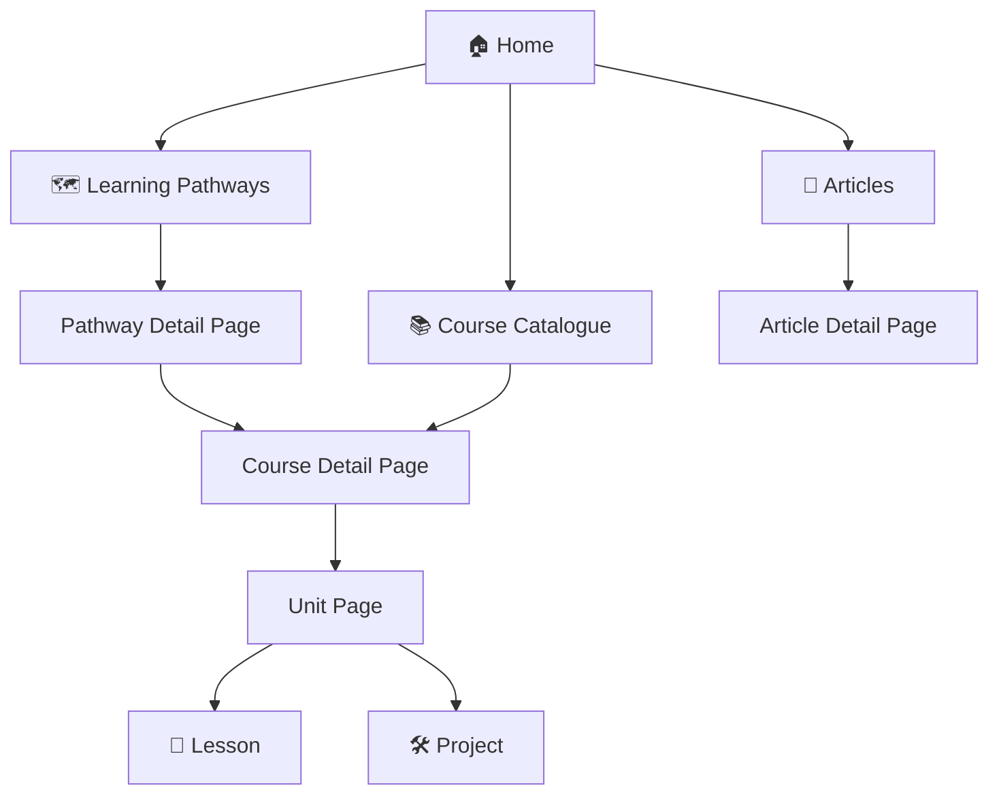
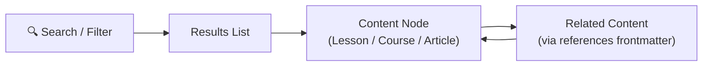

# UX — Wireframes & User Flows

> All wireframes and user flow diagrams for IT EDU SITE are stored in this directory.
> **Constraint:** Use Mermaid.js or SVG only — no image files, no Figma embeds.

---

## Site-Level User Flow

---

## Content Discovery Flow

---

## File Naming Convention

`<feature_slug>_wireframe.md` — e.g., `search_wireframe.md`, `pathway_detail_wireframe.md`

---

*Source of truth: [[.designs/]] | Vision: [[.objectives/vision.md]]*
