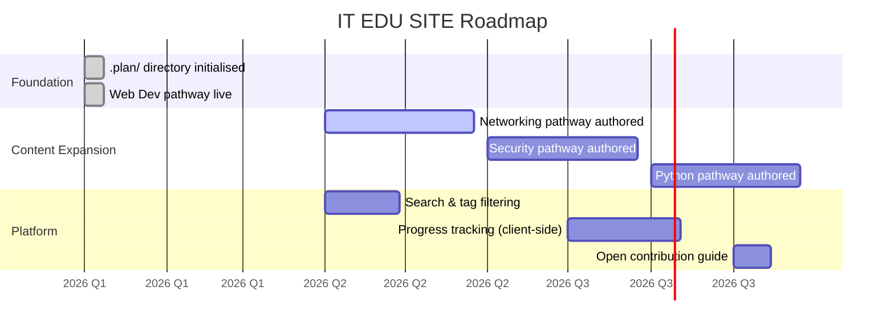

# Roadmap — Milestones & Quarterly Objectives

> Links back to: [[.objectives/vision.md]] | Tracked in: [[.tasks/tasks.md]]

---

## Milestone Map

---

## Milestone Definitions

### M-00 — Foundation ✅
**Goal:** Repo structure, authoring standards, and first pathway live.
**Done when:** Front-End Basics (web) pathway is published and passes content checklist.
**Success Metrics:**
- Front-End Basics (web) pathway has ≥4 units with complete lessons
- All frontmatter fields validated against [[.skills/edu_content_authoring.md]]

---

### M-01 — Networking Pathway 🔲
**Goal:** Author and publish a complete Networking pathway.
**Kanban Tasks:** TASK-002, TASK-003
**Done when:** Networking pathway is live, includes capstone project.
**Success Metrics:**
- ≥4 units (OSI model, TCP/IP, DNS, subnetting)
- Capstone: learner configures a small simulated network
- Passes peer review checklist

---

### M-02 — Security Pathway 🔲
**Goal:** Author and publish a Security pathway building on Networking.
**Kanban Tasks:** TASK-004
**Done when:** Security pathway is live, references Networking units as prerequisites.
**Success Metrics:**
- ≥4 units (CIA triad, threats, defensive tools, incident response)
- Capstone: learner completes a CTF-style challenge

---

### M-03 — Python Pathway 🔲
**Goal:** Author and publish a Python pathway (automation & scripting focus).
**Kanban Tasks:** TASK-005
**Done when:** Python pathway is live with a scripting capstone.
**Success Metrics:**
- ≥4 units (syntax, data structures, file I/O, APIs)
- Capstone: learner ships a small CLI automation tool

---

### P-01 — Search & Tag Filtering 🔲
**Goal:** Learners can search and filter all content by tag, type, and difficulty.
**Kanban Tasks:** TASK-006
**PRD:** [[.prds/PRD_search.md]] *(to be created)*
**Done when:** `CatalogSearch` component extended to support multi-tag filter; all content pages indexed.

---

## Quarterly Objectives

| Quarter | Primary Objective | Key Results |
|---------|-------------------|-------------|
| Q1 2026 | Stabilise foundation | .plan/ live, Front-End Basics (web) reviewed, authoring guide v1 |
| Q2 2026 | Networking pathway | M-01 shipped, search MVP |
| Q3 2026 | Security + Python pathways | M-02 & M-03 shipped |
| Q4 2026 | Platform features | Progress tracking, contribution guide, performance audit |

---

*Last updated: 2026-04-14 | Source of truth: [[.objectives/milestones.md]]*
