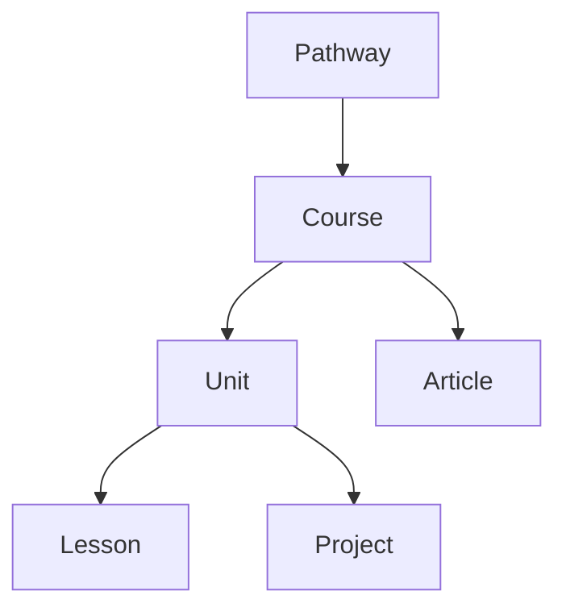

# Vision: IT EDU SITE — Master Product Vision

> **North Star:** Become the go-to free, open-source IT education platform that takes anyone from zero knowledge to job-ready skills through structured, self-paced learning paths.

---

## 1. Problem Statement

Learners entering the IT field face a fragmented ecosystem: tutorials are shallow, bootcamps are expensive, and university curricula are slow to update. There is no single free resource that combines opinionated learning sequences, production-quality content, and a clear path to employment.

## 2. Product Strategy

IT EDU SITE solves this by providing:

1. **Structured Learning Pathways** — opinionated, end-to-end sequences removing all "what should I study next?" friction.
2. **Layered Content Graph** — content modelled as `pathway → course → unit → lesson/project/article`, making every piece of content composable and reusable.
3. **Practical, Employable Outcomes** — every pathway culminates in a real, deployable portfolio artefact the learner can show to employers.
4. **Open, Extensible Architecture** — Docusaurus-based site served from a `Content/` directory; authored in Markdown with typed frontmatter enabling future tooling.

## 3. Current State (synthesised from codebase)

| Dimension | Status |
|-----------|--------|
| Front-End Basics (web) pathway | ✅ Launched (`webdev_beginner`) — ~60 hrs, HTML/CSS/JS + Capstone |
| Networking pathway | 🔲 Planned |
| Security pathway | 🔲 Planned |
| Python pathway | 🔲 Planned |
| CMS / authoring UI | 🔲 Not started |
| User accounts / progress tracking | 🔲 Not started |
| Search & discovery | ✅ `CatalogSearch` component shipped |

*Source: [[Content/Pathways/index.mdx]], [[Content/Pathways/webdev_beginner]], [[.skills/edu_content_authoring.md]]*

## 4. Content Graph Model

Each node carries typed frontmatter (`type`, `references`, `difficulty`, `estimated_hours`, `tags`) enabling programmatic catalogue generation and future adaptive learning features.

*Source: [[.skills/edu_content_authoring.md]]*

## 5. North Star Goals

| # | Goal | Success Signal |
|---|------|----------------|
| G-01 | Cover the four planned pathways (Web, Networking, Security, Python) | All four pathways published and linked from the catalogue |
| G-02 | Learner employability | ≥1 deployable portfolio project per pathway |
| G-03 | Content quality | Each lesson passes peer review checklist before publishing |
| G-04 | Discovery | Full-text and tag-based search across all content types |
| G-05 | Community | Open contribution model with clearly documented authoring standards |

## 6. Guiding Principles

- **Opinionated over exhaustive** — tell learners exactly what to do; don't overwhelm with choices.
- **Practical over theoretical** — every concept is paired with a hands-on exercise or project.
- **Open first** — no paywalls; monetisation (if any) must never gate learning content.
- **Graph-native content** — every document is a node; relationships are explicit in frontmatter, not implied by folder depth.

## 7. Out of Scope (v1)

- Video content hosting
- Live coding environments (e.g., embedded REPLs)
- User authentication / progress persistence
- Paid tiers

---

*Last updated: 2026-04-14 | Owner: Project Execution Lead*
