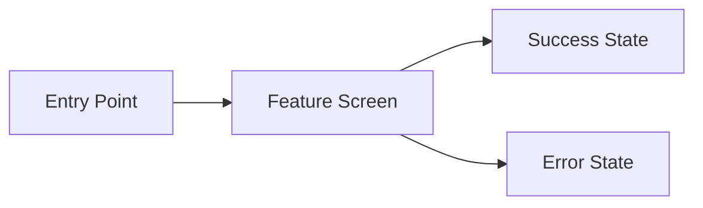

# PRD Template

> Copy this file and rename it `PRD_<FEATURE_SLUG>.md`. Fill in every section before writing a single line of code. Link the completed PRD to its Kanban task in [[.tasks/tasks.md]].

---

## Metadata

| Field | Value |
|-------|-------|
| **PRD ID** | PRD-XXX |
| **Feature Name** | _Short human-readable title_ |
| **Kanban Task** | TASK-XXX |
| **Author** | _Agent or human_ |
| **Status** | DRAFT \| REVIEW \| APPROVED \| SHIPPED |
| **Created** | YYYY-MM-DD |
| **Last Updated** | YYYY-MM-DD |

---

## 1. Problem Statement

> In one paragraph, describe the problem this feature solves. Who is affected? What is the current pain? Why does it matter now?

_TODO_

---

## 2. Goals & Success Metrics

| Goal | Metric | Target |
|------|--------|--------|
| _e.g., Improve discoverability_ | _e.g., Search result click-through rate_ | _e.g., ≥40%_ |

---

## 3. User Stories

> Format: **As a** [persona], **I want** [action], **so that** [outcome].

- [ ] **US-01:** As a ___, I want ___, so that ___.
- [ ] **US-02:** As a ___, I want ___, so that ___.
- [ ] **US-03:** As a ___, I want ___, so that ___.

---

## 4. Functional Requirements

| ID | Requirement | Priority (P0/P1/P2) | Notes |
|----|-------------|---------------------|-------|
| FR-01 | | P0 | |
| FR-02 | | P1 | |

---

## 5. Non-Functional Requirements

| Category | Requirement |
|----------|-------------|
| Performance | _e.g., Page load < 2 s on 3G_ |
| Accessibility | _e.g., WCAG 2.1 AA_ |
| SEO | _e.g., All content pages must have unique `<title>` and meta description_ |
| Browser Support | _e.g., Last 2 versions of Chrome, Firefox, Safari, Edge_ |
| Content Standards | _e.g., All frontmatter fields required per [[.skills/edu_content_authoring.md]]_ |

---

## 6. Technical Constraints

- Framework: Docusaurus (React/MDX); content served from `Content/` at route `/courses`
- Assets served from `Assets/` via `staticDirectories`
- All new UI components live in `site/src/components/`
- No new npm packages without advisory-database security check
- Content graph frontmatter schema must not be broken: `type`, `references`, `tags`, `difficulty`, `estimated_hours`

*See: [[.skills/edu_content_authoring.md]], [[site/docusaurus.config.ts]]*

---

## 7. UX / Wireframes

> Render wireframes in Mermaid.js or SVG only. Link to the UX file in [[.designs/]].

*Full wireframes: [[.designs/<feature_slug>_wireframe.md]]*

---

## 8. Dependencies

| Dependency | Type | Blocking? |
|------------|------|-----------|
| _TASK-XXX_ | Internal task | Yes / No |
| _Content pathway X_ | Content | Yes / No |

---

## 9. Out of Scope

- _List anything explicitly excluded from this feature to prevent scope creep._

---

## 10. Open Questions

| # | Question | Owner | Due |
|---|----------|-------|-----|
| Q-01 | | | |

---

## 11. Revision History

| Version | Date | Author | Summary |
|---------|------|--------|---------|
| 0.1 | YYYY-MM-DD | | Initial draft |

---

*Template version: 1.0 | Source of truth: [[.prds/PRD_TEMPLATE.md]]*
