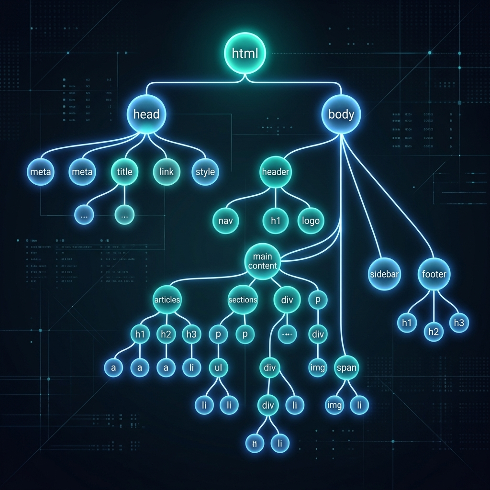

# The DOM — Your Working Model

> **Lesson Summary:** When the browser reads an HTML file, it does not keep it as raw text. It builds a tree of objects — the DOM. Understanding the DOM is not optional; it is the single most important mental model in web development. CSS targets it. JavaScript reads and rewrites it. Everything you learn in this course — and beyond — makes more sense once you have this picture clear.



## The Browser Does Not Display HTML

This is worth stating plainly before anything else: **the browser does not render your HTML file.** It reads it, discards it as text, and builds something new from it.

That something new is the **DOM** — the Document Object Model.

The DOM is a **live, in-memory tree of objects** that represents the structure and content of your document. Once it exists, the HTML file is no longer involved. CSS is applied to the DOM. JavaScript reads and modifies the DOM. The rendering engine uses the DOM to decide what to paint.

If you change the HTML file on disk, nothing updates until the browser re-parses it. But if JavaScript adds a `<div>` to the DOM at runtime, the page updates instantly — because the DOM is what is actually live.

---

## HTML → DOM

The browser builds the DOM by parsing your HTML top to bottom. Each element becomes a **node**. Nesting in your HTML becomes parent-child relationships in the tree.

**Input — your HTML file:**

```html
<!DOCTYPE html>
<html lang="en">
  <head>
    <title>My Page</title>
  </head>
  <body>
    <h1>Welcome</h1>
    <p>This is a <strong>paragraph</strong>.</p>
  </body>
</html>
```

**Output — the DOM tree:**

```
Document
└── html
    ├── head
    │   └── title
    │       └── "My Page"  [text node]
    └── body
        ├── h1
        │   └── "Welcome"  [text node]
        └── p
            ├── "This is a "  [text node]
            ├── strong
            │   └── "paragraph"  [text node]
            └── "."  [text node]
```

Notice the **text nodes** — the actual text content becomes leaf nodes in the tree. Even a full stop inside a `<p>` is a node.

---

## Node Types

The DOM has four node types you will encounter:

| Node Type | What it represents | Example |
| :--- | :--- | :--- |
| **Document node** | The root of the entire tree | `document` |
| **Element node** | An HTML tag | `<p>`, `<h1>`, `<div>` |
| **Text node** | Text content inside an element | `"Hello"` |
| **Comment node** | An HTML comment | `<!-- note -->` |

Element nodes are what you will interact with most of the time.

---

## Relationships Between Nodes

Every node in the DOM has relationships with other nodes:

- **Parent** — the node directly above it in the tree
- **Children** — nodes directly below it
- **Siblings** — nodes at the same level, sharing the same parent
- **Ancestor** — any node above it (parent, grandparent, etc.)
- **Descendant** — any node below it (child, grandchild, etc.)

```
body                   ← parent of h1 and p
├── h1                 ← child of body, sibling of p
└── p                  ← child of body, sibling of h1
    ├── "This is a "   ← child of p
    ├── strong         ← child of p, sibling of text nodes
    └── "."            ← child of p
```

This vocabulary matters because CSS selectors and JavaScript methods use it constantly. A CSS rule like `p > strong` means: "a `<strong>` that is a **direct child** of a `<p>`." You cannot read that without the concept of parent-child relationships.

---

## The DOM Is Live

The DOM is not a static snapshot — it updates in real time:

- When JavaScript runs `document.createElement('div')` and appends it, a new node appears in the tree immediately.
- When JavaScript sets `element.textContent = 'Hello'`, the text node changes immediately.
- CSS rules re-apply to the new state automatically.

This is how modern web apps work — frameworks like React, Vue, and Angular are, at their core, sophisticated machines for updating the DOM efficiently. Understanding the DOM means you understand what every framework is actually doing beneath its abstractions.

---

## DevTools: Your Window into the DOM

Open **DevTools** in any browser (press `F12` or `Cmd+Option+I`) and click the **Elements** tab. What you are looking at is not the HTML source — it is a live **view of the DOM**.

Try this right now:
1. Open any web page
2. Open DevTools → Elements tab
3. Find any element and double-click its text
4. Edit the text and press Enter

You just modified the DOM directly. The page updated instantly. The HTML file on the server was not changed.

> **💡 Tip:** Right-clicking any element on a page and choosing **Inspect** jumps directly to that element's DOM node in DevTools. This is one of the most useful debugging habits you will develop.

---

## Why This Mental Model Matters

Everything in web development connects back to the DOM:

| Technology | Its relationship to the DOM |
| :--- | :--- |
| **HTML** | The input used to build the DOM |
| **CSS** | Selects DOM nodes and applies visual rules to them |
| **JavaScript** | Reads, creates, modifies, and deletes DOM nodes |
| **React / Vue / Angular** | Manages the DOM on your behalf, efficiently |
| **Accessibility tools** | Read the DOM tree to present content to users |
| **Search engine crawlers** | Parse the DOM to understand page content |

When a CSS rule "isn't working", the first question is: did the DOM actually parse the way you think it did? When JavaScript "can't find an element", the question is: does that element exist in the DOM at the moment the script runs?

---

## Key Takeaways

- The browser converts HTML into the **DOM** — a live, in-memory tree of objects. The HTML file is not the page.
- Each HTML element becomes an **element node**; text content becomes **text nodes**.
- Nodes have relationships: parent, children, siblings, ancestors, descendants.
- The DOM is **live** — CSS and JavaScript interact with it in real time.
- **DevTools → Elements** shows you the live DOM, not the source HTML.
- Every framework — React, Vue, Angular — is, fundamentally, a system for managing the DOM.

## Research Questions

> **🔬 Research Question:** What is the difference between `innerHTML` and `textContent` in JavaScript? When would choosing the wrong one be a security vulnerability?
>
> *Hint: Search "XSS innerHTML textContent" and "cross-site scripting DOM".*

> **🔬 Research Question:** What is the "virtual DOM" that React uses? Why does React use it instead of writing directly to the real DOM?
>
> *Hint: Search "React virtual DOM reconciliation" and "DOM manipulation performance".*
