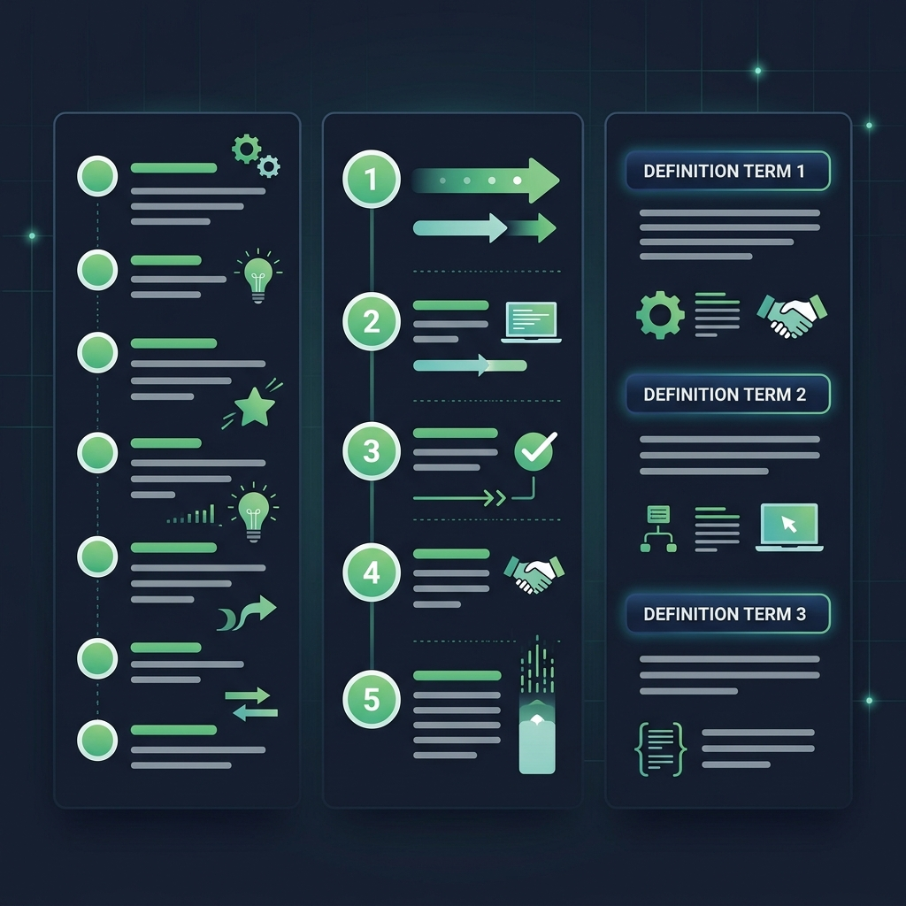

# Lists

> **Lesson Summary:** Lists are one of the most frequently used structures on the web — navigation menus, search results, article feeds, feature bullet points, and step-by-step instructions are all lists underneath their CSS. HTML provides three list types, each with a specific semantic meaning. Choosing the right one is not a stylistic decision — it is a structural one.



## The Three List Types

| Element | Type | Use when |
| :--- | :--- | :--- |
| `<ul>` | **Unordered list** | Order doesn't matter |
| `<ol>` | **Ordered list** | Order matters |
| `<dl>` | **Description list** | Term–definition pairs |

---

## `<ul>` — Unordered List

Use when the items are a collection where **order is irrelevant**:

```html
<ul>
  <li>HTML</li>
  <li>CSS</li>
  <li>JavaScript</li>
</ul>
```

Renders as a bulleted list by default. The bullets are visual only — CSS can change or remove them.

**Good uses:** Navigation links, feature lists, tag clouds, ingredient lists, any grouping where sequence does not convey meaning.

---

## `<ol>` — Ordered List

Use when the items have a **meaningful sequence** — order changes the meaning:

```html
<ol>
  <li>Open DevTools (<kbd>F12</kbd>)</li>
  <li>Navigate to the Network tab</li>
  <li>Reload the page</li>
  <li>Click the first request to inspect headers</li>
</ol>
```

Renders as a numbered list by default (1, 2, 3…). The numbers are generated by the browser — you do not write them in HTML.

**Good uses:** Step-by-step instructions, ranked results, recipes, procedures, any sequence where step 3 depends on completing step 2.

### `<ol>` Attributes

```html
<!-- Start counting from a different number -->
<ol start="5">
  <li>Fifth item</li>
  <li>Sixth item</li>
</ol>

<!-- Count backwards -->
<ol reversed>
  <li>First written, but numbered last</li>
  <li>Second written, but numbered second-to-last</li>
</ol>
```

---

## `<li>` — List Item

`<li>` is valid only as a direct child of `<ul>` or `<ol>`. It contains the content of a single item.

```html
<ul>
  <li>Simple text</li>
  <li>
    <!-- List items can contain block elements too -->
    <h3>Item with a heading</h3>
    <p>And a description paragraph.</p>
  </li>
</ul>
```

---

## Nesting Lists

Lists can be nested inside `<li>` elements:

```html
<ul>
  <li>
    Front-end
    <ul>
      <li>HTML</li>
      <li>CSS</li>
      <li>JavaScript</li>
    </ul>
  </li>
  <li>
    Back-end
    <ul>
      <li>Node.js</li>
      <li>Python</li>
    </ul>
  </li>
</ul>
```

> **⚠️ Warning:** The nested `<ul>` must be *inside* the `<li>`, not after it. An `<ul>` placed directly after a closing `</li>` is not a child of that item — it is a sibling of the outer list, which is invalid.

---

## `<dl>` — Description List

Use for **term–definition pairs**: glossaries, metadata, key-value information:

```html
<dl>
  <dt>DOM</dt>
  <dd>Document Object Model — the browser's live, in-memory tree of a document.</dd>

  <dt>HTTP</dt>
  <dd>HyperText Transfer Protocol — the request-response protocol of the web.</dd>

  <dt>DNS</dt>
  <dd>Domain Name System — translates domain names into IP addresses.</dd>
</dl>
```

| Element | Role |
| :--- | :--- |
| `<dl>` | Description list container |
| `<dt>` | Description term |
| `<dd>` | Description definition (indented by default) |

One `<dt>` can have multiple `<dd>` elements (multiple definitions). Multiple `<dt>` elements can share one `<dd>` (synonyms with a shared definition).

**Good uses:** Glossaries, FAQ pages, product specifications, metadata panels (article author/date/tags).

---

## Common Misuse

### Misuse 1 — Using `<ul>` for visual indentation

```html
<!-- ❌ Wrong — not a list of items, just indented text -->
<ul>
  <li>This text is indented using a list.</li>
</ul>
```

Use CSS `padding` or `margin` for indentation. The `<ul>` communicates "this is a group of related items."

### Misuse 2 — Putting non-`<li>` elements directly inside `<ul>` or `<ol>`

```html
<!-- ❌ Wrong — <p> is not a valid direct child of <ul> -->
<ul>
  <p>This is not a list item.</p>
</ul>

<!-- ✅ Correct -->
<ul>
  <li>This is a list item.</li>
</ul>
```

The only valid direct children of `<ul>` and `<ol>` are `<li>` elements (and `<script>`/`<template>`).

---

## Key Takeaways

- Use `<ul>` when order doesn't matter, `<ol>` when it does, and `<dl>` for term–definition pairs.
- `<li>` is a direct child of `<ul>` or `<ol>` only.
- Bullets and numbers are visual defaults — CSS can change them completely.
- Lists can be nested by placing a child `<ul>` or `<ol>` *inside* an `<li>`.
- Do not use `<ul>` for visual indentation. Use CSS.

## Research Questions

> **🔬 Research Question:** Navigation menus on the web are almost universally built with `<ul>` + `<li>` + `<a>`. Why? What does the `<ul>` structure add over a flat sequence of `<a>` elements?
>
> *Hint: Search "HTML navigation list semantic reasons accessibility" and "WAI-ARIA navigation landmark".*

> **🔬 Research Question:** CSS `list-style-type` controls bullet style. What values can it take? How do you remove bullets from a list entirely — and what accessibility side effect does removing them have in some screen readers?
>
> *Hint: Search "list-style-type MDN" and "VoiceOver list none workaround".*
