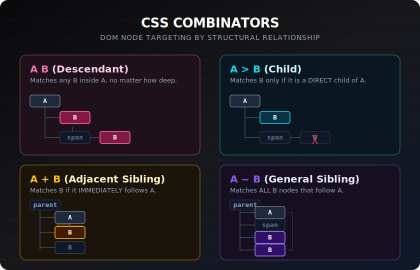

# Combinators

> **Lesson Summary:** Combinators let you target elements based on their relationship to other elements in the DOM tree — not just what they are, but *where* they are. The four CSS combinators map directly to the parent-child-sibling relationships you learned in the DOM lesson.



## The Four Combinators

### Descendant Combinator ` ` (space)

Targets any element that is a **descendant** (child, grandchild, etc.) of the first element:

```css
/* Any <a> anywhere inside a <nav> */
nav a {
  text-decoration: none;
  color: #f8fafc;
}

/* Any <li> anywhere inside a <ul> with class .menu */
.menu li {
  padding: 0.5rem 0;
}
```

**Most frequently used combinator.** The implicit relationship: "element B, found anywhere inside element A."

---

### Child Combinator `>` 

Targets elements that are **direct children** only — not grandchildren:

```css
/* Only direct <li> children of <ul> — not nested <li>s */
ul > li {
  list-style: disc;
}

/* Only direct <p> children of .card — not paragraphs inside a nested .card */
.card > p {
  margin-bottom: 0;
}
```

**Use when:** You need to avoid accidentally styling deeply nested elements of the same type.

```html
<ul>
  <li>Direct child ← targeted by ul > li</li>
  <li>
    Direct child ← targeted
    <ul>
      <li>Grandchild ← NOT targeted by ul > li</li>
    </ul>
  </li>
</ul>
```

---

### Adjacent Sibling Combinator `+`

Targets an element that is **immediately after** a specified sibling in the DOM:

```css
/* The <p> immediately following an <h2> */
h2 + p {
  font-size: 1.125rem;
  color: #6b7280;
}

/* A label immediately after a checked checkbox */
input[type="checkbox"]:checked + label {
  font-weight: bold;
  color: #16a34a;
}
```

Both elements must share the same parent. Only the element immediately adjacent (no elements between them) is targeted.

---

### General Sibling Combinator `~`

Targets **all siblings** that come after the specified element (not just the immediately adjacent one):

```css
/* All <p> elements that come after an <h2> in the same parent */
h2 ~ p {
  color: #374151;
}

/* The trick for toggling panels without JavaScript */
input[type="checkbox"]:checked ~ .panel {
  display: block;
}
```

---

## Combining Combinators

Combinators can be chained:

```css
/* A <span> inside a <p> that is a direct child of .card */
.card > p span {
  font-weight: bold;
}

/* An <a> that immediately follows a <li> inside .nav */
.nav li + li > a {
  border-left: 1px solid #e5e7eb;
}
```

> **⚠️ Warning:** Long chains of combinators are a maintenance problem. `.sidebar > nav > ul > li > a` is brittle — it breaks if you ever add a wrapper element. If you need to target something that deeply nested, give it a class instead. Combinators are most useful as short, two-part selectors.

---

## Combinator Specificity

Combinators themselves contribute **zero** to specificity. The score is the sum of the selectors on either side:

| Selector | Score |
| :--- | :--- |
| `nav a` | 0-0-2 (two type selectors) |
| `.menu li` | 0-1-1 (one class + one type) |
| `.card > p` | 0-1-1 |
| `h2 + p` | 0-0-2 |
| `#nav a` | 1-0-1 |

---

## Key Takeaways

- **` ` (descendant)** — element B anywhere inside element A. Most common.
- **`>` (child)** — element B as a *direct* child of element A only.
- **`+` (adjacent sibling)** — element B immediately after element A, same parent.
- **`~` (general sibling)** — all element Bs after element A, same parent.
- Combinators contribute zero to specificity.
- Avoid long combinator chains — give deeply nested elements a class instead.

## Research Questions

> **🔬 Research Question:** CSS has a `:has()` relational pseudo-class. How does it behave like a "parent selector" — something CSS didn't have for decades? Give a practical example.
>
> *Hint: Search "CSS :has() parent selector MDN" and "CSS :has() browser support".*

> **🔬 Research Question:** What is the `:scope` pseudo-class? How does it interact with combinators in the context of `querySelectorAll()` in JavaScript?
>
> *Hint: Search "CSS :scope pseudo-class MDN" and ":scope querySelectorAll".*
