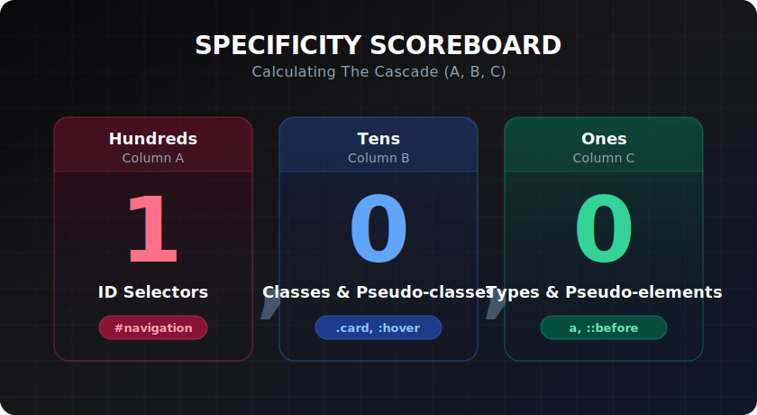

# Specificity

> **Lesson Summary:** Specificity is the scoring system CSS uses to decide which rule wins when two rules target the same element. Understanding it means you can predict exactly which style will apply — and fix the inevitable "why isn't my rule working?" without resorting to `!important`.



## The Specificity Score

Specificity is a three-column score: **(A, B, C)**.

| Column | What it counts | Selector types |
| :--- | :--- | :--- |
| **A** (hundreds) | ID selectors | `#hero`, `#nav` |
| **B** (tens) | Class, attribute, pseudo-class selectors | `.card`, `[type]`, `:hover` |
| **C** (ones) | Type and pseudo-element selectors | `p`, `h1`, `::before` |

**Comparison rule:** Compare column by column, left to right. The first column that differs determines the winner. A higher A column always beats a higher B column — even if B is 100 and A is 1.

---

## Calculating Specificity

Work through each selector, counting into the right column:

```
p                     →  (0, 0, 1)    one type
.card                 →  (0, 1, 0)    one class
p.card                →  (0, 1, 1)    one class + one type
#hero                 →  (1, 0, 0)    one ID
#hero p               →  (1, 0, 1)    one ID + one type
nav > ul li:first-child →  (0, 1, 3)  one pseudo-class + three types
.card:hover::before   →  (0, 2, 1)   two (class + pseudo-class) + one pseudo-element
```

> **💡 Tip:** The universal selector `*` contributes **(0, 0, 0)** — zero specificity. Combinators (space, `>`, `+`, `~`) also contribute nothing.

---

## Worked Examples

```css
/* Rule A */ p              { color: red; }   /* (0,0,1) */
/* Rule B */ .intro         { color: blue; }  /* (0,1,0) */
/* Rule C */ p.intro        { color: green; } /* (0,1,1) */
/* Rule D */ #hero p.intro  { color: gold; }  /* (1,1,1) */
```

For `<p class="intro">` inside `<section id="hero">`:
- All four rules match
- Highest A wins → Rule D: `gold`

For `<p class="intro">` **outside** `#hero`:
- Rules A, B, C match (D doesn't match — not inside `#hero`)
- C wins: `green`

For `<p>` with no class, not inside `#hero`:
- Only Rule A matches: `red`

---

## `!important` — Overriding the Score

`!important` breaks the specificity calculation:

```css
p { color: red !important; }   /* Wins over everything, regardless of score */
#hero p { color: blue; }       /* Loses to the !important rule above */
```

When two `!important` rules conflict, specificity is applied *between them*:

```css
p { color: red !important; }         /* (0,0,1) + !important */
#hero p { color: blue !important; }  /* (1,0,1) + !important — this wins */
```

> **⚠️ Warning:** `!important` is not a solution — it is a deferred problem. The next developer who needs to override your `!important` rule must use their own `!important`, creating a cascade of overrides that becomes impossible to debug. Fix the selector specificity instead.

---

## Inline Styles

Inline styles beat all stylesheet rules (with or without `!important` in the stylesheet):

```html
<p style="color: purple;">Text</p>
<!-- purple wins over any stylesheet rule, regardless of specificity -->
```

Only a stylesheet `!important` rule can override an inline style — and that should never be your goal.

---

## Specificity in Practice — Low Specificity Architecture

The goal of maintainable CSS is to keep specificity **as low as possible, as consistently as possible**:

```css
/* ✅ Low specificity — easy to override anywhere */
.card { background: white; }
.card-featured { background: #eff6ff; }

/* ❌ High specificity — hard to override */
section#main .card { background: white; }
```

**Practical rules:**
1. Build with classes. Avoid chaining more than two selectors.
2. Never use ID selectors in CSS.
3. Never use `!important` except for utility classes or third-party overrides.
4. If you're adding a selector to win a specificity battle — you've already lost. Refactor instead.

---

## DevTools: Inspecting Specificity

1. Open DevTools → **Elements** tab
2. Select any element
3. Look at the **Styles** panel
4. Overridden rules appear with a **strikethrough**
5. Hover over any selector to see its specificity score

This is your real-time specificity calculator.

---

## Key Takeaways

- Specificity is a **(A, B, C)** score: IDs, Classes+attributes+pseudo-classes, Types+pseudo-elements.
- Compare left to right — a higher A always beats a higher B, even if B is 100.
- `!important` overrides specificity — and breaks the cascade for everyone downstream.
- Inline styles beat all stylesheet rules.
- The correct strategy: **keep specificity low and consistent**. Use classes. Avoid IDs in CSS.

## Research Questions

> **🔬 Research Question:** CSS `@layer` creates explicit cascade layers with a defined priority order. How does `@layer` interact with specificity — can a low-specificity rule in a high-priority layer beat a high-specificity rule in a low-priority layer?
>
> *Hint: Search "CSS @layer cascade specificity" and "CSS cascade layers order".*

> **🔬 Research Question:** What is CSS custom properties specificity? If you declare `--color: red` in two different rules targeting the same element, how is the conflict resolved?
>
> *Hint: Search "CSS custom properties specificity cascade" and "CSS variables inheritance".*
