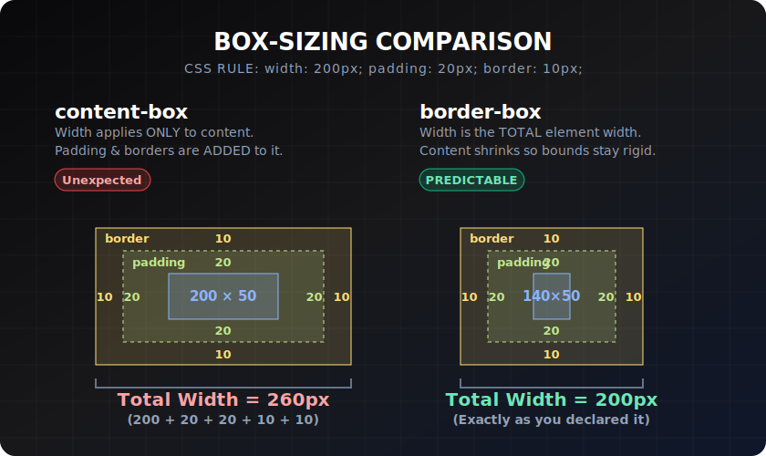

# `box-sizing`

> **Lesson Summary:** `box-sizing` is the single most impactful CSS property you will set exactly once, globally, and then forget. The difference between `content-box` (the default) and `border-box` (the universal standard) determines whether padding and border *add to* or *shrink within* your element's declared width. Get this wrong and your layouts will never add up.




## The Problem: `content-box`

The CSS spec default is `box-sizing: content-box`. Under this model:

```
Total width = width + padding-left + padding-right + border-left + border-right
```

Example:

```css
.box {
  width: 300px;
  padding: 20px;
  border: 5px solid black;
}
/* Actual rendered width: 300 + 40 + 10 = 350px */
```

This is **counterintuitive**. You said `width: 300px`. You got 350px.

It makes percentage-based layouts especially painful:

```css
/* Two columns, side by side */
.col {
  width: 50%;     /* Each takes half the container */
  padding: 20px;  /* Now each is 50% + 40px wide — they don't fit */
}
```

---

## The Solution: `border-box`

With `box-sizing: border-box`:

```
Total width = width (padding and border shrink the content area inward)
```

```css
.box {
  box-sizing: border-box;
  width: 300px;
  padding: 20px;
  border: 5px solid black;
}
/* Actual rendered width: 300px exactly */
/* Content area: 300 - 40 - 10 = 250px */
```

You said `width: 300px`. You got 300px. Layouts now add up as expected.

---

## The Universal Reset — Apply This to Every Project

This is the first thing in almost every production stylesheet:

```css
*, *::before, *::after {
  box-sizing: border-box;
}
```

`*` applies it to all elements. `*::before` and `*::after` apply it to generated content nodes (which are separate from their parent elements).

> **💡 Tip:** This single rule prevents entire categories of layout bugs. It is not a hack — it is correcting a spec decision that most browsers and developers consider a mistake.

---

## `content-box` vs `border-box` at a Glance

| | `content-box` | `border-box` |
| :--- | :--- | :--- |
| `width` applies to | Content area only | Total including padding + border |
| Padding effect | Adds to total width | Shrinks content inward |
| Border effect | Adds to total width | Shrinks content inward |
| Layout arithmetic | Confusing | Predictable |
| Industry standard | Legacy | ✅ Modern standard |

---

## Does This Affect `height`?

Yes — `box-sizing: border-box` applies to both `width` and `height`. Setting `height: 100px` with padding and border will keep the rendered height at exactly 100px, with the content area shrinking inward.

---

## A Gotcha: Third-Party Components

If you embed a third-party widget or UI library that was built with `content-box` assumptions, your global `border-box` reset may break it. The solution is to scope it:

```css
/* Safe pattern — third-party components can override if needed */
*, *::before, *::after {
  box-sizing: border-box;
}

/* If a library needs content-box */
.legacy-widget, .legacy-widget * {
  box-sizing: content-box;
}
```

---

## Key Takeaways

- `content-box` (default): `width` = content only; padding and border *add* to the total.
- `border-box`: `width` = total; padding and border *shrink* the content area.
- Apply `*, *::before, *::after { box-sizing: border-box; }` to every project — always, first.
- `border-box` is the industry standard because layout arithmetic becomes predictable.

## Research Questions

> **🔬 Research Question:** Why did the CSS specification default to `content-box` rather than `border-box`? What historical reasoning led to this decision, and why do most developers today override it immediately?
>
> *Hint: Search "CSS box-sizing history content-box default" and "Paul Irish box-sizing border-box".*

> **🔬 Research Question:** The `box-sizing` property does not include `margin` in either model — margin is always *outside* the box. What is the `margin` property equivalent that *does* affect the rendered boundary? (Think about `outline`.)
>
> *Hint: Search "CSS margin not included box-sizing" and "CSS box model layers".*
