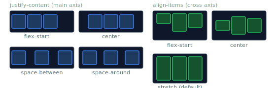

# Alignment

> **Lesson Summary:** Flexbox's alignment system is what makes it so powerful for UI layout. Six properties — three on the container and one on individual items — give you precise, axis-aware control over how items are positioned within their container. This lesson covers all of them and when to use each.



## The Axis Model — Revisited

Alignment in Flexbox is always axis-relative:

- **`justify-content`** — positions items along the **main axis** (the direction of `flex-direction`)
- **`align-items`** — positions items along the **cross axis** (perpendicular to main)
- **`align-content`** — positions *rows* along the cross axis (only relevant when wrapping)

---

## `justify-content` — Main Axis Distribution

```css
justify-content: flex-start;     /* Default — pack at the start */
justify-content: flex-end;       /* Pack at the end */
justify-content: center;         /* Centre all items */
justify-content: space-between;  /* First item at start, last at end, equal gaps between */
justify-content: space-around;   /* Equal space around each item (half at edges) */
justify-content: space-evenly;   /* Equal space between all items including edges */
```

**`space-between` vs `space-evenly`:**
- `space-between`: no space at the edges — items touch the container walls
- `space-evenly`: equal spacing everywhere, including before the first and after the last item

---

## `align-items` — Cross Axis Alignment (Single Line)

```css
align-items: stretch;      /* Default — items stretch to fill cross axis */
align-items: flex-start;   /* Items align to the start of the cross axis */
align-items: flex-end;     /* Items align to the end */
align-items: center;       /* Items centre on the cross axis */
align-items: baseline;     /* Items align by their text baseline */
```

**`baseline` alignment** — useful for navbars mixing text sizes: all items' text baselines align to a common horizontal line, giving a visually consistent row.

---

## `align-content` — Cross Axis for Multiple Rows

Only applies when `flex-wrap: wrap` is set and the items have wrapped into multiple rows:

```css
align-content: flex-start;    /* Rows pushed to start */
align-content: flex-end;      /* Rows pushed to end */
align-content: center;        /* Rows centred in container */
align-content: space-between; /* Rows spread with space between */
align-content: space-evenly;  /* Equal space between rows including edges */
align-content: stretch;       /* Default — rows stretch to fill container height */
```

> **⚠️ Warning:** `align-content` has no effect on a single-line flex container (`flex-wrap: nowrap`). If `align-content` isn't working, check whether your items are actually wrapping.

---

## `align-self` — Per-Item Cross Axis Override

Set on individual flex items to override `align-items` for that one item:

```css
.container { align-items: center; }

.pinned-bottom {
  align-self: flex-end;  /* This item goes to the bottom while siblings are centred */
}

.stretched {
  align-self: stretch;   /* Stretches to fill the container cross axis */
}
```

---

## Perfect Centring — The Classic Use Case

```css
.centred {
  display: flex;
  justify-content: center;
  align-items: center;
}
```

Two lines. Anything inside `.centred` is perfectly centred both horizontally and vertically. This was nearly impossible in CSS before Flexbox.

---

## The `gap` + Alignment Combination

`gap` and `justify-content` are complementary — not alternatives:

- `gap` creates a **fixed** gap between items
- `justify-content: space-between` creates **flexible** spacing that fills the container

When you want fixed spacing plus centring, use `gap` + `justify-content: center`:

```css
.nav {
  display: flex;
  justify-content: center;
  gap: 2rem;
}
```

---

## Alignment Summary Table

| Property | Axis | Applies to |
| :--- | :--- | :--- |
| `justify-content` | Main | Container — distributes items |
| `align-items` | Cross | Container — aligns items in one row |
| `align-content` | Cross | Container — distributes multiple rows |
| `align-self` | Cross | Item — overrides `align-items` for one item |
| `justify-self` | Main | Not supported in Flexbox (use margins) |

> **💡 Tip:** `justify-self` does not exist in Flexbox (it does in Grid). To push one item to the end on the main axis, use `margin-left: auto` or `margin-right: auto` on that item.

---

## Key Takeaways

- `justify-content` distributes items along the **main axis**.
- `align-items` aligns items on the **cross axis** within a single row.
- `align-content` distributes **rows** on the cross axis (only when wrapping).
- `align-self` overrides `align-items` for one individual item.
- `justify-content: center` + `align-items: center` = perfect two-dimensional centering.
- Push a single item to the end using `margin-left: auto`.

## Research Questions

> **🔬 Research Question:** What is `place-content` and `place-items`? How do they relate to the separate `justify-*` and `align-*` properties?
>
> *Hint: Search "CSS place-content place-items shorthand MDN".*

> **🔬 Research Question:** Flexbox does not support `justify-self`. What is the `margin: auto` trick for pushing a single flex item to the far end of the main axis, and why does it work?
>
> *Hint: Search "CSS flexbox margin auto trick justify-self".*
