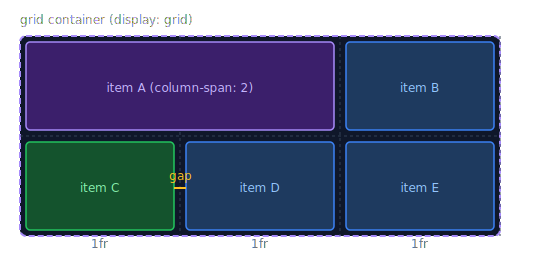

# The Grid Container

> **Lesson Summary:** `display: grid` turns an element into a grid container. You then define how many columns and rows you want, how wide they are, and how much space between them. The browser places items automatically — or you can place them manually. This lesson covers defining the grid structure.



## Activating Grid

```css
.container {
  display: grid;
}
```

Unlike Flexbox, a basic `display: grid` with no other properties doesn't do much visually — items still stack vertically. You must also define the column/row structure.

---

## `grid-template-columns`

Defines the number and width of columns:

```css
/* Three equal columns of 200px each */
grid-template-columns: 200px 200px 200px;

/* Three equal fractional columns */
grid-template-columns: 1fr 1fr 1fr;

/* Equivalent shorthand */
grid-template-columns: repeat(3, 1fr);

/* Mixed: fixed sidebar + flexible content */
grid-template-columns: 260px 1fr;

/* Three columns: fixed | flexible | fixed */
grid-template-columns: 200px 1fr 200px;

/* Named columns */
grid-template-columns: [sidebar-start] 260px [sidebar-end main-start] 1fr [main-end];
```

---

## The `fr` Unit

`fr` stands for **fraction of available space**. It's exclusive to Grid and is the primary tool for flexible column/row sizing:

```css
grid-template-columns: 1fr 2fr 1fr;
/* 25% | 50% | 25% — but responsive to the container, not % of viewport */
```

`fr` distributes space **after** fixed-width and `auto` columns have claimed their share:

```css
grid-template-columns: 260px 1fr;
/* 260px is fixed; 1fr gets everything else */
```

---

## `grid-template-rows`

Same syntax as columns, for rows:

```css
grid-template-rows: 80px 1fr 60px; /* header | content | footer */
```

Often left implicit — rows are created automatically (`auto` height based on content) as items are placed.

---

## `gap`

Same as Flexbox — space between grid tracks:

```css
gap: 1rem;           /* All gaps */
gap: 1rem 2rem;      /* Row gap | Column gap */
row-gap: 1rem;
column-gap: 2rem;
```

---

## `repeat()` and `auto-fill` / `auto-fit`

Powerful shorthands for responsive grids without media queries:

```css
/* Fixed number of columns, responsive: */
grid-template-columns: repeat(3, 1fr);

/* Auto-fill: creates as many 200px columns as will fit */
grid-template-columns: repeat(auto-fill, 200px);

/* auto-fill + minmax: responsive with minimum and maximum column width */
grid-template-columns: repeat(auto-fill, minmax(200px, 1fr));

/* auto-fit: same as auto-fill but collapses empty columns */
grid-template-columns: repeat(auto-fit, minmax(200px, 1fr));
```

`repeat(auto-fill, minmax(200px, 1fr))` is one of the most powerful responsive patterns in CSS — columns are at least 200px wide, grow to fill space, and wrap automatically. No media queries required.

---

## Container Summary Table

| Property | What it sets |
| :--- | :--- |
| `display: grid` | Activates grid layout |
| `grid-template-columns` | Number and width of columns |
| `grid-template-rows` | Number and height of rows |
| `gap` | Space between columns and rows |
| `repeat()` | Shorthand for repeating track definitions |
| `fr` | Fractional unit — share of available space |
| `minmax()` | Min and max track size |
| `auto-fill` / `auto-fit` | Auto-generate tracks to fill available space |

---

## Key Takeaways

- `display: grid` alone does nothing visible — you must also define `grid-template-columns`.
- `fr` is the fraction unit exclusive to Grid — distributes remaining space after fixed tracks.
- `repeat(N, 1fr)` creates N equal columns.
- `repeat(auto-fill, minmax(200px, 1fr))` — the most powerful responsive column pattern in CSS.
- `gap` works identically to Flexbox — space between tracks, not at edges.

## Research Questions

> **🔬 Research Question:** What is the difference between `auto-fill` and `auto-fit` in `repeat()`? Create an example with only two items in a four-column grid — what does each do differently?
>
> *Hint: Search "CSS grid auto-fill vs auto-fit MDN" and "auto-fill auto-fit visual comparison".*

> **🔬 Research Question:** Grid has implicit tracks — rows (and columns) that the browser creates automatically when items overflow the explicitly defined grid. How do `grid-auto-rows` and `grid-auto-columns` control their sizing?
>
> *Hint: Search "CSS grid implicit explicit tracks" and "grid-auto-rows MDN".*
