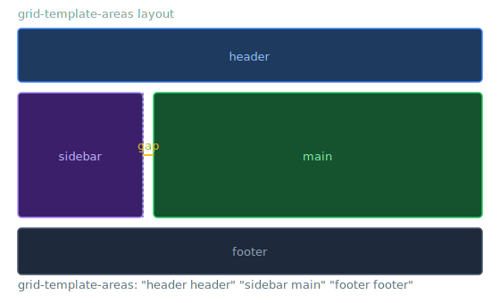

# Template Areas

> **Lesson Summary:** `grid-template-areas` lets you design your page layout as a visual ASCII-style map — except instead of characters, you use area names. Each named area corresponds to one or more grid cells, and grid items are assigned to those areas by name. The result is layout code that reads like a diagram of the page.



## The Concept

Instead of giving every item a line number, you:

1. Name areas in the container with `grid-template-areas`
2. Assign items to areas with `grid-area` (the named version)

```css
.page {
  display: grid;
  grid-template-columns: 260px 1fr;
  grid-template-rows: auto 1fr auto;
  grid-template-areas:
    "header  header"
    "sidebar main"
    "footer  footer";
  min-height: 100vh;
  gap: 0;
}
```

Each string is a row. Each word in a string is a cell. Matching words = one named area.

---

## Assigning Items to Areas

```css
.page-header  { grid-area: header; }
.page-sidebar { grid-area: sidebar; }
.page-main    { grid-area: main; }
.page-footer  { grid-area: footer; }
```

```html
<div class="page">
  <header class="page-header">…</header>
  <aside class="page-sidebar">…</aside>
  <main class="page-main">…</main>
  <footer class="page-footer">…</footer>
</div>
```

The `grid-area` name corresponds exactly to the string used in `grid-template-areas`.

---

## Rules for Template Areas

- Every row must have the **same number of cells** (words per string)
- A named area must be **rectangular** — L-shapes are not allowed
- Use `.` (period) for an **empty cell** — a gap you intentionally leave blank

```css
grid-template-areas:
  "header  header  header"
  "sidebar main    main"
  ".       footer  footer";   /* First column of last row is empty */
```

---

## Changing the Layout with Media Queries

Named areas make responsive redesigns clean — you redefine the map, not individual item positions:

```css
/* Mobile — single column */
.page {
  grid-template-columns: 1fr;
  grid-template-areas:
    "header"
    "main"
    "sidebar"
    "footer";
}

/* Desktop — two columns */
@media (min-width: 768px) {
  .page {
    grid-template-columns: 260px 1fr;
    grid-template-areas:
      "header  header"
      "sidebar main"
      "footer  footer";
  }
}
```

The item-level CSS (`grid-area` assignments) doesn't change at all — only the container layout map changes. This is the main advantage of named areas over line numbers.

---

## `grid-template` Shorthand

Combines `grid-template-rows`, `grid-template-columns`, and `grid-template-areas`:

```css
.page {
  grid-template:
    "header  header"  80px
    "sidebar main"    1fr
    "footer  footer"  60px
    / 260px 1fr;      /* — column track sizes */
}
```

The values after `/` are column widths; the values before them (after each string) are row heights.

---

## Key Takeaways

- `grid-template-areas` names regions of the grid as a visual map.
- `grid-area: name` assigns an item to a named region.
- Every area must be rectangular — no L-shapes.
- Use `.` for intentionally empty cells.
- Responsive redesigns change only the container map — item assignments stay the same.

## Research Questions

> **🔬 Research Question:** Can `grid-area` be used both to assign a named area *and* to set explicit line numbers? What is the full shorthand it represents?
>
> *Hint: Search "CSS grid-area shorthand MDN" and "grid-area row-start column-start".*

> **🔬 Research Question:** CSS Grid has a `subgrid` feature. What problem does it solve — specifically, how does it allow nested grids to align to the parent grid's tracks?
>
> *Hint: Search "CSS grid subgrid MDN 2024" and "CSS subgrid alignment use case".*
