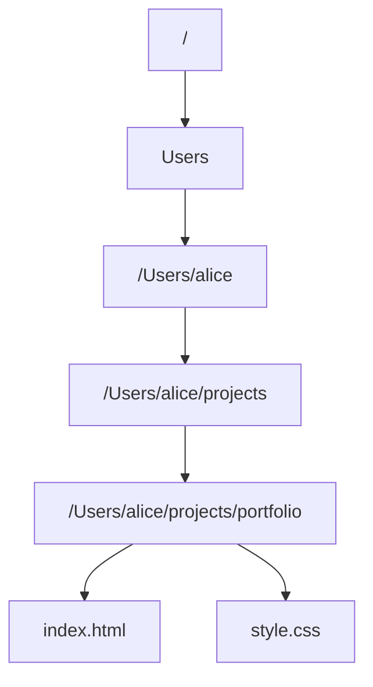

# The Terminal

> **Lesson Summary:** The terminal is a text-based interface for giving instructions to your computer. Instead of clicking icons, you type commands. In this lesson you will learn the essential commands for navigating your file system and managing files — the foundation of every developer workflow.

---

## Why the Terminal?

Every modern development tool — Git, Node.js, npm, build tools like Vite — is operated primarily through the terminal. GUI wrappers exist for some of them, but they hide what is actually happening and break down in edge cases. Learning the terminal means you understand your tools completely.

> **💡 Tip:** On macOS, open the **Terminal** app (or install **iTerm2**). On Windows, install **Git Bash** (comes with Git for Windows) or use **Windows Subsystem for Linux (WSL)** — both give you a bash-compatible shell.

---

## The Shell

**The shell** is the program interpreting your commands. The most common shells are:

| Shell | Default On | Notes |
| :--- | :--- | :--- |
| `bash` | Linux, older macOS | Bourne Again Shell; universal |
| `zsh` | macOS (since Catalina) | Superset of bash; default on modern Macs |
| PowerShell | Windows | Different syntax; avoid for web dev |
| Git Bash | Windows (manual install) | Bash on Windows — use this |

All commands in this lesson work identically in bash and zsh.

---

## The Prompt

When the terminal is ready for input, it shows a **prompt**:

```
alice@macbook:~/projects $
```

The prompt tells you:
- **`alice`** — current user
- **`macbook`** — machine name
- **`~/projects`** — current working directory (`~` is shorthand for your home folder)
- **`$`** — ready for input (`#` means you are the root user — be careful)

You type after the `$`. Press **Enter** to run the command.

---

## Navigating the File System

### Where Am I? — `pwd`

**`pwd`** (print working directory) shows your current location:

```bash
pwd
# /Users/alice/projects
```

### What Is Here? — `ls`

**`ls`** lists the contents of the current directory:

```bash
ls
# assets  index.html  style.css  app.js
```

Useful flags:
- `ls -l` — long format (shows permissions, size, date)
- `ls -a` — show hidden files (files starting with `.`)
- `ls -la` — both together

### Move Around — `cd`

**`cd`** (change directory) moves to a different folder:

```bash
cd projects          # move into a subfolder named 'projects'
cd ..                # move up one level (to the parent folder)
cd ../assets         # move up one level, then into 'assets'
cd ~                 # jump straight to your home folder
cd -                 # return to the previous directory
```

---

## Paths: Absolute vs. Relative

Every file and folder has an **address** called a **path**.



### Absolute Paths

An **absolute path** starts from the root (`/`) and specifies the full location:

```
/Users/alice/projects/portfolio/index.html
```

An absolute path works from anywhere — it never depends on where you currently are.

### Relative Paths

A **relative path** starts from your current working directory:

```
portfolio/index.html      # subfolder then file
./style.css               # ./ means "this folder" (explicit but optional)
../README.md              # ../ means "go up one level"
../../assets/logo.svg     # go up two levels, then into assets
```

> **⚠️ Warning:** Forgetting the difference between absolute and relative paths is responsible for a huge number of "file not found" errors. When something doesn't load, the path is the first thing to check.

---

## Managing Files and Directories

### Create a Directory — `mkdir`

```bash
mkdir portfolio              # create a single folder
mkdir -p projects/portfolio  # create nested folders (-p creates parent dirs too)
```

### Create a File — `touch`

```bash
touch index.html             # create an empty file
touch style.css app.js       # create multiple files at once
```

### Copy — `cp`

```bash
cp index.html backup.html          # copy a file
cp -r assets/ assets_backup/       # copy a directory (-r = recursive)
```

### Move / Rename — `mv`

```bash
mv old-name.html new-name.html     # rename a file
mv style.css css/style.css         # move a file into a folder
```

### Delete — `rm`

```bash
rm backup.html                     # delete a single file
rm -r old-project/                 # delete a directory and all its contents
```

> **🚨 Alert:** `rm` is permanent. There is no trash can. Files deleted with `rm` are gone. Double-check before running `rm -r` on any folder.

---

## Opening Editors from the Terminal

```bash
code .                # open Visual Studio Code in the current directory
code index.html       # open a specific file in VS Code
```

> **💡 Tip:** The `code` command requires installing the "Shell Command: Install 'code' command in PATH" option from inside VS Code: **Cmd+Shift+P → Shell Command: Install 'code' command in PATH**.

---

## Useful Shortcuts

| Shortcut | Effect |
| :--- | :--- |
| **Tab** | Autocomplete file/directory names |
| **↑ / ↓ arrow** | Cycle through command history |
| **Ctrl+C** | Cancel the running command |
| **Ctrl+L** or `clear` | Clear the terminal screen |
| **Ctrl+A** | Move cursor to beginning of line |
| **Ctrl+E** | Move cursor to end of line |

> **💡 Tip:** Tab completion is the single most useful terminal habit. Type the first few letters of a command or path, then press **Tab**. If there is only one match, it completes. If there are multiple matches, press **Tab** twice to see all options.

---

## Key Takeaways

- The terminal gives you direct, scriptable control over your computer — use it every day.
- `pwd` shows where you are; `ls` shows what is here; `cd` moves you around.
- Absolute paths start from `/`; relative paths start from your current location.
- `mkdir`, `touch`, `cp`, `mv`, `rm` are the five file-management primitives.
- **Tab completion** saves time and prevents typos — use it constantly.

---

## Challenge: Build Your Project Structure

Using only the terminal (no file explorer):

1. Create a directory `~/projects/my-site` (use `mkdir -p` for nested directories)
2. Navigate into it
3. Create `index.html`, `style.css`, and `app.js`
4. Create a subdirectory `assets/images/`
5. Run `ls -la` and verify your structure matches:
   ```
   my-site/
   ├── assets/
   │   └── images/
   ├── app.js
   ├── index.html
   └── style.css
   ```
6. Open the directory in VS Code with `code .`

---

## Research Questions

> **🔬 Research Question:** What does the `~` symbol represent in a path? Run `echo ~` in your terminal to confirm. Then run `echo $HOME`. What do you find?

> **🔬 Research Question:** What is the difference between `rm -rf folder/` and `rm -r folder/`? What does the `-f` flag do, and when is it dangerous?

## Optional Resources

- [The Unix command line crash course — Learn Enough](https://www.learnenough.com/command-line-tutorial) — Free, well-paced introduction
- [Explain Shell](https://explainshell.com/) — Paste any shell command and get a breakdown of every flag and argument
