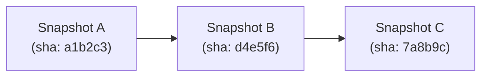
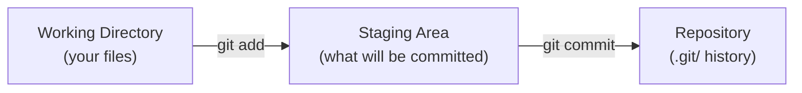

# Git Fundamentals

> **Lesson Summary:** Git is a version control system that tracks changes to your files over time. It lets you save named snapshots, revert mistakes, and collaborate with others without overwriting each other's work. This lesson covers the local Git workflow: init, status, add, commit, and log.

---

## What Is Version Control?

Imagine working on a project and accidentally deleting a function that was working. Without version control, you try to remember what it said. With Git, you type one command and it is back.

**Version control** (also called **source control**) is a system that records changes to files so you can:
- Recall any earlier version of any file
- See exactly what changed between any two points in time
- Work on experimental features without breaking working code
- Collaborate with others who are changing the same files simultaneously

Git is the dominant version control system in the industry — used by virtually every software team in the world.

---

## Installing Git

```bash
git --version
# git version 2.43.0  (if installed)
```

If not installed:
- **macOS:** `xcode-select --install` or `brew install git`
- **Windows:** Download [Git for Windows](https://git-scm.com/download/win) — installs Git Bash too
- **Linux:** `sudo apt install git` (Ubuntu/Debian) or `sudo dnf install git` (Fedora)

### First-Time Configuration

Git attaches your name and email to every commit:

```bash
git config --global user.name "Alice Smith"
git config --global user.email "alice@example.com"
git config --global core.editor "code --wait"  # use VS Code as the editor
```

The `--global` flag applies these settings to all repositories on your machine.

---

## The Core Concept: Snapshots, Not Diffs

Many version control systems track file differences. Git stores **snapshots** — a complete picture of all tracked files at a given moment, identified by a unique hash.



Each snapshot is a **commit**. The chain of commits is the project's **history**.

---

## Initializing a Repository

```bash
mkdir my-project
cd my-project
git init
```

`git init` creates a hidden `.git/` folder inside the directory. This folder is the entire repository — the history, the configuration, everything. Never delete or manually edit `.git/`.

```bash
ls -a
# .  ..  .git
```

---

## The Three Zones

Understanding these three zones is the key to understanding Git:



| Zone | What it is |
| :--- | :--- |
| **Working directory** | Your actual files — the ones you edit in VS Code |
| **Staging area** | A "draft" of your next commit — you explicitly choose what goes in |
| **Repository** | The permanent history; every commit is stored here forever |

---

## Checking Status — `git status`

`git status` is your most-used Git command. Run it constantly:

```bash
git status
```

It tells you:
- Which branch you are on
- Which files have changed but are not yet staged
- Which files are staged and ready to commit
- Which files are untracked (new files Git has never seen)

---

## Staging Changes — `git add`

**Staging** means selecting which changes to include in the next commit:

```bash
git add index.html              # stage a single file
git add style.css app.js        # stage multiple files
git add .                       # stage all changes in the current directory
git add -p                      # interactive: review each change chunk-by-chunk
```

> **💡 Tip:** `git add .` is fast but indiscriminate. `git add -p` (patch mode) lets you review every change before staging it — a useful habit for writing clean commits.

---

## Committing — `git commit`

A **commit** saves the staged snapshot permanently:

```bash
git commit -m "feat: add navigation bar"
```

The `-m` flag provides the commit message inline. Without it, Git opens your configured editor.

### Writing Good Commit Messages

A good commit message finishes the sentence: *"If applied, this commit will..."*

| Pattern | Example |
| :--- | :--- |
| `feat: <description>` | `feat: add contact form validation` |
| `fix: <description>` | `fix: correct off-by-one in pagination` |
| `style: <description>` | `style: apply consistent indentation` |
| `docs: <description>` | `docs: update README with setup steps` |
| `refactor: <description>` | `refactor: extract fetchUser into utility module` |

This pattern is called **Conventional Commits** and is used by most professional teams.

> **⚠️ Warning:** `"WIP"`, `"stuff"`, `"fix"`, and `"asdfgh"` are not commit messages — they are noise. When you look at this repository in six months, you want to understand what changed and why without reading every line of code.

---

## Viewing History — `git log`

```bash
git log                    # full history with author, date, and message
git log --oneline          # compact view: one commit per line
git log --oneline --graph  # visual branch graph (useful with multiple branches)
```

```bash
git log --oneline
# 7a8b9c (HEAD -> main) feat: add contact form
# d4e5f6 style: center hero section
# a1b2c3 feat: initial project structure
```

**`HEAD`** is a pointer to the current commit — the snapshot currently checked out.

---

## The `.gitignore` File

Some files should never be committed: secrets, build outputs, OS metadata, and `node_modules/`.

Create a `.gitignore` file in the root of your project:

```
# Dependencies
node_modules/

# Build output
dist/
build/

# Environment variables (secrets!)
.env
.env.local

# OS files
.DS_Store        # macOS
Thumbs.db        # Windows
```

Git ignores files matching these patterns — they will not appear in `git status` or be committed.

> **🚨 Alert:** Never commit a `.env` file containing real API keys, passwords, or tokens. Once a secret is in Git history, it is extremely difficult to truly remove. If you accidentally commit a secret, treat it as compromised and rotate it immediately.

---

## Key Takeaways

- `git init` creates a new repository in the current directory.
- The three zones: working directory → staging area (`git add`) → repository (`git commit`).
- `git status` is your compass — run it constantly.
- Commits are permanent snapshots; write messages that explain *why* a change was made.
- `.gitignore` keeps secrets, build output, and `node_modules/` out of version history.

---

## Challenge

Initialize a local Git repository for the project folder you created in Lesson 1:

1. `cd ~/projects/my-site`
2. `git init`
3. Create a `.gitignore` file with `node_modules/`, `.env`, and `.DS_Store`
4. Stage and commit all files: `git add . && git commit -m "feat: initial project structure"`
5. Add some HTML content to `index.html`
6. Run `git status` — confirm the file appears as modified
7. Stage and commit with a meaningful message
8. Run `git log --oneline` — verify both commits appear

---

## Research Questions

> **🔬 Research Question:** What does `git diff` show? What is the difference between `git diff` (unstaged changes) and `git diff --staged` (staged changes)? Try both after making a change.

> **🔬 Research Question:** What happens when you run `git commit --amend`? When is it useful, and when is it dangerous?

## Optional Resources

- [Git — the simple guide](https://rogerdudler.github.io/git-guide/) — One-page visual quick reference
- [Conventional Commits specification](https://www.conventionalcommits.org/en/v1.0.0/) — The commit message convention used by professional teams
