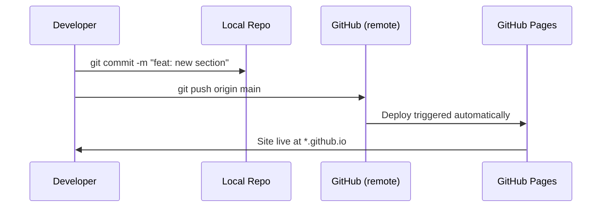

# Remotes & GitHub

> **Lesson Summary:** A remote is a copy of your repository hosted on a server. GitHub is the most widely used remote hosting service. This lesson teaches you to link your local repository to GitHub, push your code there, pull changes down, and deploy a static site to GitHub Pages.

---

## What Is a Remote?

Your local repository (the `.git/` folder) lives only on your machine. A **remote** is a hosted copy — typically on a service like GitHub — that is accessible over the internet.

Remotes enable:
- **Backup:** Your code is safe even if your machine is destroyed
- **Collaboration:** Multiple people push to and pull from the same remote
- **Deployment:** Many hosting platforms (GitHub Pages, Netlify, Vercel) deploy directly from a GitHub remote

---

## Creating a Repository on GitHub

1. Go to [github.com](https://github.com) and sign in
2. Click the **+** icon → **New repository**
3. Name it (e.g., `my-site`); choose **Public**
4. **Do not** check "Initialize this repository" — you already have a local repo
5. Click **Create repository**

GitHub shows you the commands to connect your existing local repo. Copy the **HTTPS** or **SSH** URL.

---

## Connecting a Remote — `git remote add`

```bash
git remote add origin https://github.com/alice/my-site.git
```

- **`origin`** is the conventional name for the primary remote. It is just an alias — you could name it anything.
- After this command, `origin` refers to the GitHub URL.

Verify the remote was added:

```bash
git remote -v
# origin  https://github.com/alice/my-site.git (fetch)
# origin  https://github.com/alice/my-site.git (push)
```

---

## Pushing — `git push`

**Pushing** uploads your local commits to the remote:

```bash
git push -u origin main
```

- **`-u`** (upstream) links the local `main` branch to the remote `origin/main`. After running this once, you can just type `git push` for future pushes on the same branch.
- **`origin`** — the remote name
- **`main`** — the branch to push

### Authentication

GitHub requires authentication when pushing:
- **HTTPS:** GitHub prompts for your username and a Personal Access Token (not your password). Create a token at *Settings → Developer settings → Personal access tokens*.
- **SSH:** Configure an SSH key once (`ssh-keygen`) and push without any prompts. Preferred for frequent use.

> **💡 Tip:** Use SSH keys for daily development. The one-time setup takes 5 minutes and eliminates authentication prompts permanently. Guide: [Connecting to GitHub with SSH](https://docs.github.com/en/authentication/connecting-to-github-with-ssh).

---

## Pulling — `git pull`

**Pulling** downloads and merges remote commits into your current branch:

```bash
git pull
```

`git pull` is shorthand for `git fetch` (download) + `git merge` (integrate). Run it before starting any new work to ensure you are up to date with what others have pushed.

---

## Cloning an Existing Repository — `git clone`

**Cloning** downloads an entire remote repository to your machine:

```bash
git clone https://github.com/alice/my-site.git
# Creates a new folder 'my-site/' with the full history
```

Cloning automatically sets up the `origin` remote pointing to the cloned URL.

---

## Deploying with GitHub Pages

**GitHub Pages** serves static HTML/CSS/JS files from a repository directly as a public website.

### Deployment Steps

1. Ensure your `index.html` is in the root of the `main` branch
2. Go to your repository on GitHub
3. Click **Settings** → **Pages** (in the left sidebar)
4. Under "Source," select **Deploy from a branch**
5. Choose **`main`** branch and **`/ (root)`** directory
6. Click **Save**

Within 1–2 minutes your site is live at:
```
https://<your-username>.github.io/<repository-name>/
```

### The Deploy Workflow

After GitHub Pages is enabled, every `git push` to `main` triggers a redeploy:



---

## Common Git Remote Commands

| Command | What it does |
| :--- | :--- |
| `git remote -v` | List all configured remotes |
| `git remote add <name> <url>` | Add a new remote |
| `git remote remove <name>` | Remove a remote |
| `git push -u origin main` | Push and set upstream tracking |
| `git push` | Push current branch (after upstream is set) |
| `git pull` | Fetch and merge from remote |
| `git fetch` | Download remote changes without merging |
| `git clone <url>` | Clone a remote repository locally |

---

## Key Takeaways

- A remote is a hosted copy of your repository; `origin` is the standard name for the primary remote.
- `git push` uploads local commits; `git pull` downloads and merges remote commits.
- `git clone` downloads an existing remote repository, including all history.
- GitHub Pages deploys static sites directly from a repository with zero configuration.
- Push your work every time you finish a meaningful change — remotes are your backup.

---

## Challenge

Deploy the `my-site` project to GitHub Pages:

1. Create a new public repository on GitHub named `my-site` (no README)
2. Connect your local repo: `git remote add origin <url>`
3. Push: `git push -u origin main`
4. Enable GitHub Pages from the repository Settings
5. Wait 1 minute, then visit `https://<your-username>.github.io/my-site/`
6. Make a visible change to `index.html` (change the `<h1>` text)
7. Commit and push the change
8. Verify the live site updates

---

## Research Questions

> **🔬 Research Question:** What is the difference between `git fetch` and `git pull`? In what situation would you prefer `git fetch` followed by manual inspection before merging?

> **🔬 Research Question:** GitHub Pages is one static hosting option. Research Netlify and Vercel. What do they offer beyond GitHub Pages, and when would you choose one over the others?

## Optional Resources

- [GitHub Docs — Getting started with GitHub Pages](https://docs.github.com/en/pages/getting-started-with-github-pages)
- [GitHub Docs — Connecting to GitHub with SSH](https://docs.github.com/en/authentication/connecting-to-github-with-ssh)
