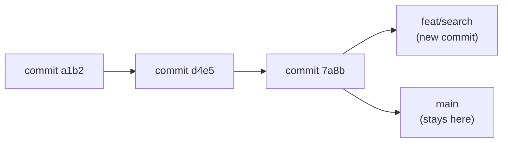
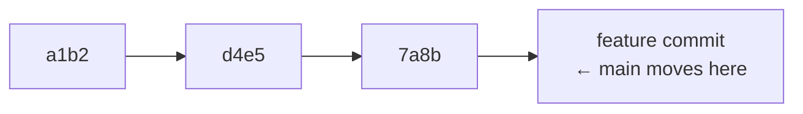
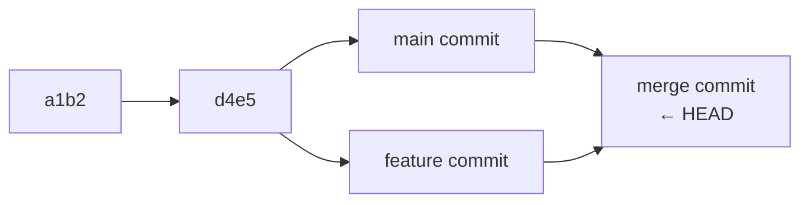

# Branching & Merging

> **Lesson Summary:** A branch is an independent line of development. Branches let you work on a feature or fix without disturbing the stable `main` branch. When the work is ready, you merge the branch back. This is how every professional development team works.

---

## What Is a Branch?

Every Git repository starts with one branch: **`main`** (or `master` in older repos). Think of `main` as the official, stable version of your project.

A **branch** is a movable pointer to a specific commit. Creating a branch creates a new pointer — the history is shared until you make a new commit on the branch.



Changes made on `feat/search` do not exist on `main` until you merge them.

---

## Why Branch?

| Scenario | Without branching | With branching |
| :--- | :--- | :--- |
| Working on a new feature while a bug needs fixing | Stop, commit unfinished work, fix bug, restart feature | Stash or commit feature branch; switch to `fix/nav-bug` branch; fix; merge; return to feature |
| Multiple developers on the same project | Constant conflicts and overwriting | Each developer works on their own branch; merge only when ready |
| Experimental change that might not work | Risk breaking `main` | Try it on a branch; throw away the branch if it fails |

---

## Creating and Switching Branches

```bash
# Modern syntax (Git 2.23+) — recommended
git switch -c feature/search       # create AND switch to new branch
git switch main                     # switch to an existing branch
git switch -                        # switch back to the previous branch

# Classic syntax (older, still works)
git checkout -b feature/search      # create AND switch
git checkout main                   # switch
```

See all branches:

```bash
git branch                          # local branches (* = current)
git branch -a                       # local + remote branches
```

Delete a branch (after merging):

```bash
git branch -d feature/search        # safe delete (fails if unmerged)
git branch -D feature/search        # force delete
```

### Branch Naming Conventions

| Prefix | Use for |
| :--- | :--- |
| `feature/` | New features: `feature/user-login` |
| `fix/` | Bug fixes: `fix/nav-overflow` |
| `docs/` | Documentation: `docs/update-readme` |
| `refactor/` | Code cleanup: `refactor/extract-api-module` |
| `chore/` | Build / tooling: `chore/update-dependencies` |

---

## Merging

**Merging** integrates the history of one branch into another.

### Fast-Forward Merge

If `main` has not changed since you branched, Git simply moves the `main` pointer forward:

```bash
git switch main
git merge feature/search
# Fast-forward — no new merge commit created
```



### Three-Way Merge

If both branches have diverged, Git creates a new **merge commit** combining both histories:

```bash
git switch main
git merge feature/search
# Creates a merge commit
```



---

## Merge Conflicts

A **merge conflict** occurs when both branches modified the same lines of the same file. Git cannot decide which version to keep — it asks you to resolve it.

```bash
git merge feature/search
# CONFLICT (content): Merge conflict in index.html
# Automatic merge failed; fix conflicts and then commit the result.
```

Git marks the conflict in the file:

```html
<<<<<<< HEAD
<nav class="navbar">
=======
<nav class="navbar sticky">
>>>>>>> feature/search
```

- Everything between `<<<<<<< HEAD` and `=======` is the current branch's version
- Everything between `=======` and `>>>>>>>` is the incoming branch's version

**To resolve:** Edit the file to keep the correct content, remove all conflict markers, then:

```bash
git add index.html
git commit   # Git auto-populates the merge commit message
```

> **💡 Tip:** VS Code shows conflict markers with colored "Accept Current Change / Accept Incoming Change" buttons. This makes resolution much faster.

---

## The Pull Request Workflow

A **Pull Request (PR)** is a GitHub interface for proposing that a branch be merged into another branch. It is how teams review code before it reaches `main`.

```mermaid
sequenceDiagram
  participant Dev as Developer
  participant GH as GitHub
  participant Reviewer

  Dev->>GH: git push origin feature/search
  Dev->>GH: Open Pull Request (feature/search → main)
  GH->>Reviewer: Notify reviewer
  Reviewer->>GH: Review code; leave comments
  Dev->>GH: Push fixes in response to comments
  Reviewer->>GH: Approve PR
  Dev->>GH: Merge PR
  GH->>GH: feature/search merged into main
```

Even on solo projects, using PRs trains you in the habit. Writing a PR description forces you to articulate what the change does — a valuable skill.

---

## Key Takeaways

- Branches isolate work so `main` stays stable and deployable at all times.
- `git switch -c <name>` creates and switches to a new branch.
- `git merge <branch>` integrates the branch into the current branch.
- Merge conflicts occur when both branches edited the same lines; resolve them by editing the file and committing.
- Pull Requests are GitHub's interface for code review before merging.

---

## Challenge

Simulate a real feature-branch workflow:

1. On your `my-site` repository, create a branch: `git switch -c feature/about-section`
2. Add an About section to `index.html` and commit it
3. Push the branch: `git push -u origin feature/about-section`
4. On GitHub, open a Pull Request from `feature/about-section` → `main`
5. Review your own PR — add a comment describing the change
6. Merge the PR on GitHub
7. Back in your terminal: `git switch main && git pull` to sync your local `main`
8. Delete the feature branch locally: `git branch -d feature/about-section`

---

## Research Questions

> **🔬 Research Question:** What is `git rebase`? How does it differ from `git merge`? When do teams prefer rebase over merge, and when does rebase become dangerous?

> **🔬 Research Question:** What does `git stash` do? When is it useful compared to committing partially done work to a branch?

## Optional Resources

- [Learn Git Branching](https://learngitbranching.js.org/) — Interactive visual tutorial; the best way to build intuition for branching
- [GitHub Docs — About pull requests](https://docs.github.com/en/pull-requests/collaborating-with-pull-requests/proposing-changes-to-your-work-with-pull-requests/about-pull-requests)
