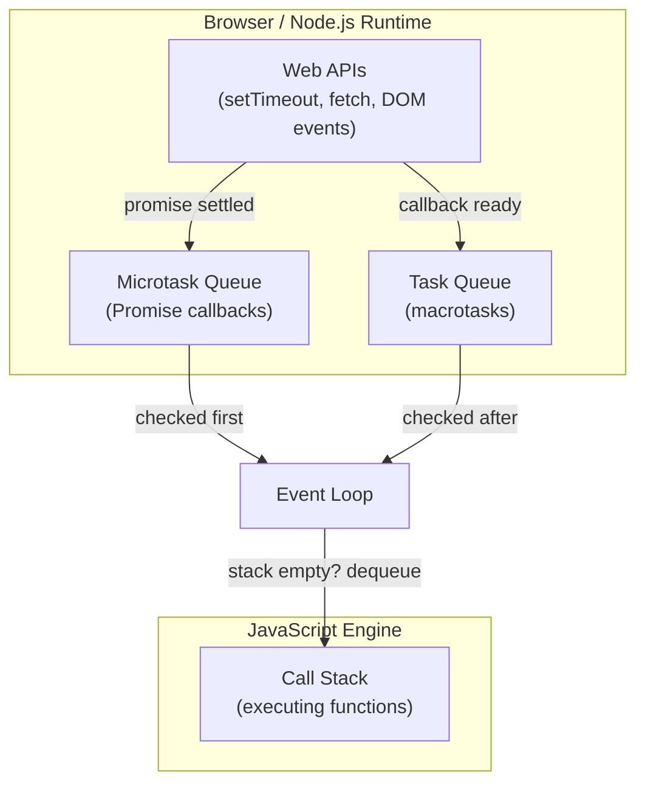

# The Event Loop

> **Lesson Summary:** JavaScript is single-threaded — it can only execute one piece of code at a time. Yet browsers do many things simultaneously: running animations, listening for clicks, and fetching data. The event loop is the mechanism that makes this possible. Understanding it is the foundation of all asynchronous programming.

---

## The Problem: One Thread

JavaScript runs on a single thread. This means only one function can execute at any given moment. If a function takes a long time, everything else waits.

Imagine asking JavaScript to sleep for 5 seconds:

```js
// This is NOT how JavaScript actually pauses, but imagine it did:
function slowOperation() {
  blockForFiveSeconds(); // freezes everything — no clicks, no rendering
  return 'done';
}
```

This would freeze the browser — no scrolling, no clicking, no rendering — for five seconds. Real programs cannot work this way.

The solution is **asynchronous programming**: starting an operation and continuing with other work while waiting for the result.

---

## The Three Components

JavaScript's runtime consists of three components working together:



---

## The Call Stack

The **call stack** is a last-in, first-out (LIFO) data structure that tracks which function is currently executing.

When a function is called, a **stack frame** is pushed. When it returns, the frame is popped.

```js
function greet(name) {
  return `Hello, ${name}`;
}

function main() {
  const msg = greet('Alice');
  console.log(msg);
}

main();
```

Execution order:
1. `main()` pushed → stack: `[main]`
2. `greet('Alice')` pushed → stack: `[main, greet]`
3. `greet` returns → stack: `[main]`
4. `console.log` pushed → stack: `[main, console.log]`
5. `console.log` returns → stack: `[main]`
6. `main` returns → stack: `[]` (empty)

When the stack is empty, the event loop checks the queues.

---

## Web APIs and Callbacks

Functions like `setTimeout`, `fetch`, and DOM event listeners are not part of the JavaScript language — they are **Web APIs** provided by the browser.

When you call `setTimeout(fn, 1000)`, the browser starts a timer. The JavaScript engine continues executing. When the timer expires, the browser puts `fn` into the **task queue**.

```js
console.log('start');

setTimeout(() => {
  console.log('timeout');
}, 1000);

console.log('end');

// Output:
// start
// end
// (1 second later) timeout
```

`'end'` prints before `'timeout'` because `setTimeout` delegates to the browser — the callback is placed in the queue, not called immediately.

---

## The Task Queue (Macrotask Queue)

The **task queue** holds callbacks from:
- `setTimeout` and `setInterval`
- DOM events (click, input, scroll)
- I/O operations

The event loop checks this queue only after the call stack is completely empty.

---

## The Microtask Queue

The **microtask queue** holds callbacks from:
- Resolved Promise handlers (`.then()`, `.catch()`, `.finally()`)
- `queueMicrotask()`
- `await` expressions in async functions

**The microtask queue is always fully drained before the next macrotask runs.**

This is why Promise callbacks execute before `setTimeout` callbacks — even if the `setTimeout` delay is `0`:

```js
console.log('1');

setTimeout(() => console.log('2 - setTimeout'), 0);

Promise.resolve().then(() => console.log('3 - promise'));

console.log('4');

// Output:
// 1
// 4
// 3 - promise   ← microtask queue (before any macrotask)
// 2 - setTimeout ← task queue
```

---

## The Event Loop Algorithm

The event loop runs continuously:

```
1. Execute all synchronous code (call stack until empty)
2. Drain the microtask queue completely
3. Render the UI (if needed)
4. Take ONE task from the task queue and execute it
5. Go to step 2
```

---

## Why This Matters for You

This model explains behaviors that confuse beginners:

- **Why `setTimeout(fn, 0)` is not actually instant** — `fn` runs after the current synchronous code and all microtasks
- **Why Promise `.then()` callbacks never run synchronously** — they always go through the microtask queue
- **Why long synchronous operations freeze the page** — nothing else can run while the call stack is occupied

> **⚠️ Warning:** Never run long synchronous computations (e.g., sorting a million items) on the main thread. The UI freezes. Offload heavy work to a **Web Worker** (a separate background thread with no access to the DOM).

---

## Key Takeaways

- JavaScript is single-threaded: one function executes at a time on the call stack.
- The browser's Web APIs handle async operations (timers, network, events) off the main thread.
- The task queue (macrotasks) holds callbacks from timers and DOM events.
- The microtask queue (Promise callbacks) is always fully drained before the next macrotask.
- The event loop cycles: synchronous code → microtasks → render → one macrotask → repeat.

---

## Challenge: Predict the Output

Without running it, predict the output order and explain why:

```js
console.log('A');

setTimeout(() => console.log('B'), 0);

Promise.resolve().then(() => {
  console.log('C');
  return Promise.resolve();
}).then(() => console.log('D'));

setTimeout(() => console.log('E'), 0);

console.log('F');
```

After predicting, run the code in your browser console and verify.

---

## Research Questions

> **🔬 Research Question:** What is a **Web Worker**? How does it solve the "long computation freezes the page" problem, and what restrictions does it have compared to the main thread?

> **🔬 Research Question:** What does `queueMicrotask(fn)` do? When would you use it instead of `Promise.resolve().then(fn)`?

## Optional Resources

- [Jake Archibald — Tasks, microtasks, queues and schedules](https://jakearchibald.com/2015/tasks-microtasks-queues-and-schedules/) — The definitive visual explanation with animated diagrams
- [Loupe — Event loop visualizer](http://latentflip.com/loupe/) — Interactive tool showing the call stack, task queue, and event loop in real time
