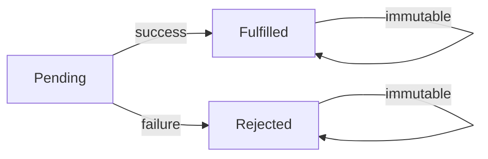

# Promises

> **Lesson Summary:** A Promise is an object representing a value that will be available in the future. It replaces callback hell with a flat, chainable syntax for sequential async operations and provides clean error propagation. This lesson covers the Promise lifecycle, chaining, and the combinator methods `Promise.all`, `Promise.race`, and `Promise.allSettled`.

---

## The Promise Object

A **Promise** is an object that represents the eventual result of an asynchronous operation. It is always in one of three states:

| State | Meaning |
| :--- | :--- |
| **Pending** | The operation has started but not yet completed |
| **Fulfilled** | The operation succeeded; the Promise has a result value |
| **Rejected** | The operation failed; the Promise has a reason (error) |

Once a Promise transitions from `pending` to either `fulfilled` or `rejected`, it is **settled** — it never changes state again.



---

## Creating a Promise

The `Promise` constructor takes a function (called the **executor**) with two parameters: `resolve` and `reject`.

```js
const myPromise = new Promise(function (resolve, reject) {
  setTimeout(function () {
    const success = true;
    if (success) {
      resolve('Operation succeeded!'); // fulfill with a value
    } else {
      reject(new Error('Something went wrong')); // reject with an error
    }
  }, 1000);
});
```

Call `resolve(value)` to fulfill the Promise. Call `reject(error)` to reject it.

> **💡 Tip:** In practice, you rarely construct Promises from scratch. Most APIs (like `fetch`) already return Promises. You construct Promises when wrapping older callback-based APIs.

---

## Consuming Promises: `.then()` and `.catch()`

`.then()` registers a callback to run when the Promise is fulfilled:

```js
myPromise.then(function (value) {
  console.log(value); // 'Operation succeeded!'
});
```

`.catch()` registers a callback for rejection:

```js
myPromise.catch(function (error) {
  console.error(error.message); // 'Something went wrong'
});
```

Use both together:

```js
myPromise
  .then(function (value) {
    console.log(value);
  })
  .catch(function (error) {
    console.error(error.message);
  });
```

---

## Chaining `.then()`

The power of Promises is **chaining**: each `.then()` returns a new Promise.

```js
fetch('/api/users/1')          // returns Promise<Response>
  .then(response => response.json())   // returns Promise<data>
  .then(user => {
    console.log(user.name);
    return fetch(`/api/posts/${user.id}`); // return another Promise
  })
  .then(response => response.json())
  .then(posts => {
    console.log(posts);
  })
  .catch(error => {
    console.error('Something failed:', error);
  });
```

Key rules for chaining:
- If you return a value from `.then()`, the next `.then()` receives it as its argument
- If you return a *Promise* from `.then()`, the chain waits for that Promise to settle
- A single `.catch()` at the end handles any rejection from any step in the chain

---

## `.finally()`

`.finally()` runs a callback regardless of whether the Promise fulfilled or rejected — useful for cleanup:

```js
showLoadingSpinner();

fetch('/api/data')
  .then(response => response.json())
  .then(data => render(data))
  .catch(error => showError(error))
  .finally(() => hideLoadingSpinner()); // always runs
```

---

## Promise Combinators

### `Promise.all()` — All Must Succeed

Runs multiple Promises in parallel and waits for all of them to fulfill. If any one rejects, the whole thing rejects:

```js
const [user, posts, settings] = await Promise.all([
  fetch('/api/users/1').then(r => r.json()),
  fetch('/api/posts?userId=1').then(r => r.json()),
  fetch('/api/settings').then(r => r.json()),
]);
```

Use `Promise.all` when all operations are independent and you need all results.

### `Promise.race()` — First One Wins

Settles (fulfills or rejects) as soon as the first Promise settles:

```js
const result = await Promise.race([
  fetch('/api/fast-server'),
  timeout(5000), // custom Promise that rejects after 5s
]);
```

Use `Promise.race` for timeouts and "whichever responds first" patterns.

### `Promise.allSettled()` — All Complete, Regardless of Outcome

Waits for all Promises to settle (succeed or fail) and returns an array of result objects:

```js
const results = await Promise.allSettled([
  fetch('/api/endpoint-1'),
  fetch('/api/endpoint-2'),
  fetch('/api/endpoint-3'),
]);

results.forEach(result => {
  if (result.status === 'fulfilled') {
    console.log('Success:', result.value);
  } else {
    console.log('Failed:', result.reason);
  }
});
```

Use `Promise.allSettled` when you want to run multiple operations and process all results — even if some fail.

---

## Creating Instantly Settled Promises

```js
Promise.resolve('immediate value') // fulfilled immediately
  .then(val => console.log(val));

Promise.reject(new Error('instant failure')) // rejected immediately
  .catch(err => console.error(err.message));
```

Useful for testing and for wrapping non-Promise values in Promise-based APIs.

---

## Key Takeaways

- A Promise has three states: pending, fulfilled, rejected. Once settled, it never changes.
- `.then(onFulfilled)` registers a fulfillment handler and returns a new Promise.
- `.catch(onRejected)` catches rejections from the current Promise or any earlier step in the chain.
- `.finally(callback)` runs regardless of the outcome — ideal for cleanup.
- `Promise.all` waits for all; `Promise.race` resolves with the first; `Promise.allSettled` waits for all and never rejects.

---

## Challenge: Promise Chain

Without using `async/await`, build a Promise chain that:

1. Fetches a random user from `https://randomuser.me/api/`
2. Extracts the user's name (first + last) and country from the response JSON
3. Fetches the country's details from `https://restcountries.com/v3.1/name/{country}`
4. Logs the country's capital and population
5. Catches and logs any error in a single `.catch()` at the end

---

## Research Questions

> **🔬 Research Question:** What happens when you throw an error inside a `.then()` callback? Does it propagate to the `.catch()` at the end of the chain?

> **🔬 Research Question:** What is `Promise.any()`? How does it differ from `Promise.race()` and `Promise.all()`?

## Optional Resources

- [MDN — Using Promises](https://developer.mozilla.org/en-US/docs/Web/JavaScript/Guide/Using_promises)
- [MDN — Promise](https://developer.mozilla.org/en-US/docs/Web/JavaScript/Reference/Global_Objects/Promise)
