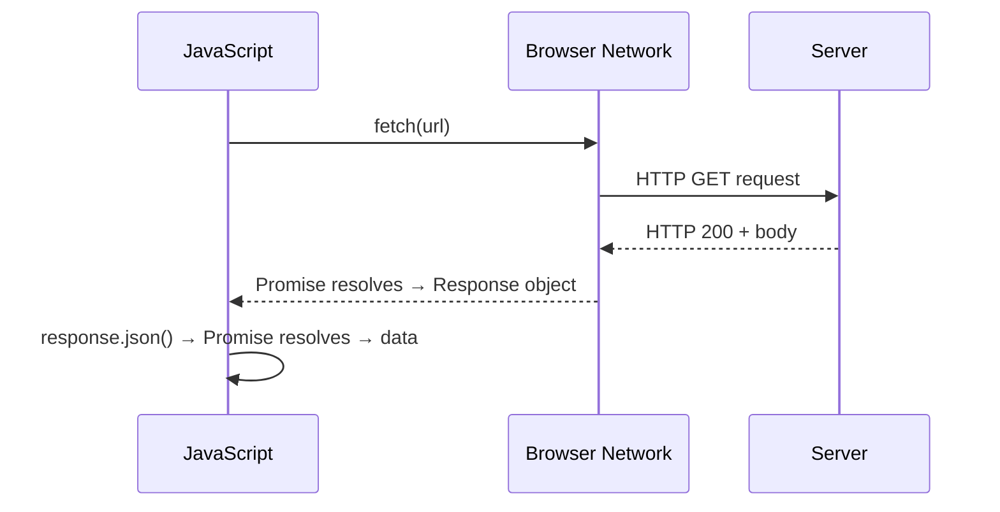

# The Fetch API

> **Lesson Summary:** `fetch()` is the browser's built-in API for making HTTP requests. It returns a Promise that resolves to a Response object. This lesson covers how to make GET and POST requests, read responses, handle errors correctly, and understand CORS.

---

## What Is the Fetch API?

Before `fetch()`, making HTTP requests in the browser required a complex API called `XMLHttpRequest` (XHR). The Fetch API replaced it with a clean, Promise-based interface.

```js
// The simplest possible fetch
const response = await fetch('https://api.example.com/users');
const users = await response.json();
console.log(users);
```

No setup, no callbacks, no event listeners — just a Promise.

---

## How fetch() Works

`fetch(url)` initiates an HTTP request and returns a Promise that resolves to a **`Response`** object when the server responds:



Notice: **`fetch()` always resolves** (as long as there's a network connection). It only rejects on network failure — not on HTTP error status codes like 404 or 500.

---

## The Response Object

The `Response` object is not the actual data — it is a representation of the HTTP response, including headers and a body stream.

| Property / Method | Description |
| :--- | :--- |
| `response.ok` | `true` if status is 200–299; `false` otherwise |
| `response.status` | The HTTP status code (200, 404, 500, etc.) |
| `response.statusText` | The text associated with the status (e.g., `"OK"`, `"Not Found"`) |
| `response.headers` | A `Headers` object; use `.get('Content-Type')` to read a header |
| `response.json()` | Parses the body as JSON; returns a Promise |
| `response.text()` | Reads the body as a plain string; returns a Promise |
| `response.blob()` | Reads the body as a binary Blob (for images, files); returns a Promise |

---

## Making a GET Request

```js
async function getUser(id) {
  const response = await fetch(`https://jsonplaceholder.typicode.com/users/${id}`);

  if (!response.ok) {
    throw new Error(`User not found: HTTP ${response.status}`);
  }

  const user = await response.json();
  return user;
}

try {
  const user = await getUser(1);
  console.log(user.name); // 'Leanne Graham'
} catch (error) {
  console.error(error.message);
}
```

Always check `response.ok` before calling `.json()`. A 404 response still has a body — parsing it would give you an error object, not data.

---

## Making a POST Request

To send data, pass a configuration object as the second argument to `fetch()`:

```js
async function createPost(title, body) {
  const response = await fetch('https://jsonplaceholder.typicode.com/posts', {
    method: 'POST',
    headers: {
      'Content-Type': 'application/json',
    },
    body: JSON.stringify({ title, body, userId: 1 }),
  });

  if (!response.ok) {
    throw new Error(`Failed to create post: HTTP ${response.status}`);
  }

  const post = await response.json();
  return post;
}
```

Key parts of the config object:
- **`method`** — `'GET'` (default), `'POST'`, `'PUT'`, `'PATCH'`, `'DELETE'`
- **`headers`** — An object of HTTP headers; for JSON data, always include `'Content-Type': 'application/json'`
- **`body`** — The request body; use `JSON.stringify(data)` for JSON

---

## Sending Authorization Headers

Many APIs require authentication tokens:

```js
const response = await fetch('https://api.example.com/protected', {
  headers: {
    'Authorization': `Bearer ${userToken}`,
    'Content-Type': 'application/json',
  },
});
```

> **🚨 Alert:** Never hard-code real API keys in client-side JavaScript. The browser source is visible to everyone. Use environment variables at build time for public keys, and route sensitive requests through your own backend.

---

## Error Handling: The Two Types of Failure

```js
async function fetchData(url) {
  try {
    const response = await fetch(url); // may throw on network error

    if (!response.ok) {
      // HTTP error: server responded, but with a failure status
      throw new Error(`HTTP ${response.status}: ${response.statusText}`);
    }

    return await response.json(); // may throw on invalid JSON

  } catch (error) {
    if (error instanceof TypeError) {
      // TypeError from fetch() = network failure (offline, CORS, bad URL)
      console.error('Network error:', error.message);
    } else {
      // HTTP error or JSON parse error
      console.error('Request failed:', error.message);
    }
    throw error; // re-throw if the caller needs to handle it
  }
}
```

| Error type | When it occurs | How to detect |
| :--- | :--- | :--- |
| Network failure | No internet, DNS failure, bad URL | `fetch()` rejects with `TypeError` |
| HTTP error | Server responds 4xx or 5xx | `response.ok === false` |
| Parse error | Response body is not valid JSON | `response.json()` rejects |

---

## CORS (Cross-Origin Resource Sharing)

When your JavaScript on `https://myapp.com` fetches from `https://api.differentdomain.com`, the browser enforces the **Same-Origin Policy** — it blocks cross-origin requests by default.

**CORS** is the mechanism that allows servers to opt in to cross-origin requests by including headers like:

```
Access-Control-Allow-Origin: https://myapp.com
```

If the server does not include the correct CORS headers, the browser blocks the response and `fetch()` throws a `TypeError` — even though the request may have reached the server.

> **⚠️ Warning:** CORS errors are a server-side configuration issue, not something you fix in your JavaScript. If you are getting CORS errors against your own API, add `Access-Control-Allow-Origin` headers on the server. If hitting a third-party API that blocks CORS, route the request through your own backend.

---

## Key Takeaways

- `fetch(url)` returns a Promise resolving to a `Response` — not to the data directly.
- `fetch()` only rejects on network failure. Check `response.ok` for HTTP errors.
- The `Response` body must be read with `.json()`, `.text()`, or `.blob()` — each returns a Promise.
- POST requests need `method`, `headers` (`Content-Type: application/json`), and `body` (JSON-stringified).
- CORS errors are server configuration issues — not fixable in client JavaScript.

---

## Challenge: Build a Search UI

Using the GitHub Jobs API (`https://jsonplaceholder.typicode.com/posts` as a stand-in — use the filter `?userId=1` as a search parameter):

1. Create an input + button
2. On submit, `fetch()` the posts filtered by `userId` (use the input value)
3. Display the post titles in a list
4. Show a loading state while fetching
5. Show an error message for non-ok responses and network failures

---

## Research Questions

> **🔬 Research Question:** What is the `AbortController` API? How do you use it to cancel an in-flight `fetch()` request — for example, when a user types in a search box and you want to cancel the previous request before making a new one?

> **🔬 Research Question:** What is the difference between `fetch` with `mode: 'cors'`, `mode: 'same-origin'`, and `mode: 'no-cors'`? What does `no-cors` actually give you back?

## Optional Resources

- [MDN — Fetch API](https://developer.mozilla.org/en-US/docs/Web/API/Fetch_API)
- [MDN — Using Fetch](https://developer.mozilla.org/en-US/docs/Web/API/Fetch_API/Using_Fetch)
- [JSONPlaceholder](https://jsonplaceholder.typicode.com/) — Free fake REST API for testing fetch calls
