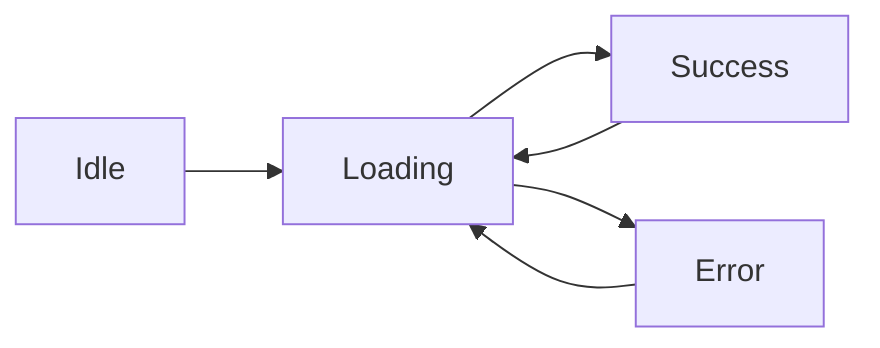

# Consuming a REST API

> **Lesson Summary:** Most web apps display data from an API you did not build. This lesson teaches you to read API documentation, construct correct request URLs, handle authentication, paginate through large result sets, and build a complete UI that correctly handles loading, success, and error states.

---

## Reading API Documentation

Before writing a single line of code, read the API documentation. Good docs tell you:

1. **Base URL** — `https://api.example.com/v1`
2. **Authentication** — is an API key, Bearer token, or OAuth needed?
3. **Endpoints** — what resources exist and what HTTP method each uses
4. **Query parameters** — what filters, sorting, and pagination options exist
5. **Response shape** — what fields does the JSON response include?
6. **Rate limits** — how many requests per hour/minute are allowed?
7. **Error format** — what does an error response look like?

> **💡 Tip:** The best way to understand an API before coding is to try it manually. Use **[Hoppscotch](https://hoppscotch.io/)** (free, browser-based) or **Postman** (desktop app) to make requests and inspect responses without writing JavaScript.

---

## Constructing Request URLs

### Base URL and Path

```js
const BASE_URL = 'https://api.github.com';

const response = await fetch(`${BASE_URL}/users/torvalds`);
```

### Query Parameters

Query parameters filter, sort, and paginate results. Build them with `URLSearchParams`:

```js
const params = new URLSearchParams({
  q: 'javascript',     // search term
  language: 'js',      // filter
  sort: 'stars',       // sort field
  per_page: 10,        // pagination
  page: 1,
});

const url = `https://api.github.com/search/repositories?${params}`;
// https://api.github.com/search/repositories?q=javascript&language=js&sort=stars&per_page=10&page=1

const response = await fetch(url);
```

---

## Authentication Patterns

### API Key in Header

```js
const response = await fetch('https://api.example.com/data', {
  headers: {
    'X-API-Key': 'your-api-key-here',
  },
});
```

### Bearer Token in Authorization Header

```js
const response = await fetch('https://api.example.com/private/data', {
  headers: {
    'Authorization': `Bearer ${accessToken}`,
  },
});
```

### API Key in Query Parameter (less secure — avoid for sensitive APIs)

```js
const url = `https://api.example.com/data?api_key=${API_KEY}`;
```

> **🚨 Alert:** API keys embedded in client-side JavaScript are visible to anyone who opens the browser's source view. For public read-only APIs this is often acceptable. For APIs with write access or billing, route requests through your own backend server that holds the key securely.

---

## Handling Pagination

Most APIs with large datasets paginate results — they return a subset and tell you how to get the next page.

### Offset-Based Pagination

```js
async function fetchAllPosts(userId) {
  const allPosts = [];
  let page = 1;
  const perPage = 10;

  while (true) {
    const params = new URLSearchParams({ userId, page, _limit: perPage });
    const response = await fetch(`https://jsonplaceholder.typicode.com/posts?${params}`);
    const posts = await response.json();

    allPosts.push(...posts);

    if (posts.length < perPage) break; // last page
    page++;
  }

  return allPosts;
}
```

### Link Header Pagination (GitHub API style)

Some APIs provide a `Link` response header containing the next-page URL:

```
Link: <https://api.github.com/repos/...?page=2>; rel="next"
```

```js
async function fetchPage(url) {
  const response = await fetch(url);
  const data = await response.json();
  const nextUrl = parseLinkHeader(response.headers.get('link'))?.next;
  return { data, nextUrl };
}
```

---

## Building a Complete Data-Driven UI

A production-quality API consumer handles three states:



```js
const container = document.getElementById('results');
const errorEl = document.getElementById('error');
const loadingEl = document.getElementById('loading');

async function search(query) {
  // 1. Reset UI to loading state
  container.innerHTML = '';
  errorEl.textContent = '';
  loadingEl.hidden = false;

  try {
    const params = new URLSearchParams({ q: `${query}+language:javascript`, sort: 'stars' });
    const response = await fetch(`https://api.github.com/search/repositories?${params}`, {
      headers: { Accept: 'application/vnd.github.v3+json' },
    });

    if (!response.ok) {
      throw new Error(`GitHub API error: ${response.status}`);
    }

    const { items } = await response.json();

    // 2. Render success state
    if (items.length === 0) {
      container.innerHTML = '<p>No results found.</p>';
      return;
    }

    container.innerHTML = items
      .map(repo => `
        <article class="repo-card">
          <h2><a href="${repo.html_url}" target="_blank">${repo.full_name}</a></h2>
          <p>${repo.description ?? 'No description'}</p>
          <p>⭐ ${repo.stargazers_count.toLocaleString()}</p>
        </article>
      `)
      .join('');

  } catch (error) {
    // 3. Render error state
    errorEl.textContent = `Error: ${error.message}`;
  } finally {
    loadingEl.hidden = true;
  }
}

// Wire up the search form
document.getElementById('search-form').addEventListener('submit', e => {
  e.preventDefault();
  const query = document.getElementById('search-input').value.trim();
  if (query) search(query);
});
```

---

## Rate Limiting

APIs limit how many requests you can make per unit of time. The GitHub API allows 60 unauthenticated requests per hour per IP address.

When rate-limited, APIs typically respond with:
- HTTP `429 Too Many Requests`
- Headers like `X-RateLimit-Remaining: 0` and `X-RateLimit-Reset: <timestamp>`

```js
if (response.status === 429) {
  const resetTime = response.headers.get('X-RateLimit-Reset');
  const resetDate = new Date(resetTime * 1000);
  throw new Error(`Rate limited. Try again at ${resetDate.toLocaleTimeString()}`);
}
```

---

## Key Takeaways

- Read the API documentation before writing any code — understand the base URL, authentication, endpoints, and response shape.
- Use `URLSearchParams` to safely build query strings.
- Always handle three UI states: loading, success, and error.
- Bearer token authentication uses the `Authorization: Bearer <token>` header.
- Most APIs rate-limit requests; handle `429` responses gracefully.

---

## Challenge: GitHub Repository Search

Build a complete GitHub repository search UI:

**Requirements:**
- Search input and form that calls `https://api.github.com/search/repositories?q=<query>`
- Display repo name (linked to GitHub), description, star count, language, and last-updated date
- Loading skeleton or spinner while fetching
- Error message for failed requests and rate limit hits
- "Load more" button that fetches the next page and appends results (no full-page reload)

**Success criteria:**
- [ ] Loading, success, and error states are all handled
- [ ] The "Load more" button fetches page 2, 3, etc. and appends to existing results
- [ ] `response.ok` is checked before parsing JSON
- [ ] Repo cards are built with `innerHTML` and include all five required fields

---

## Research Questions

> **🔬 Research Question:** What is **debouncing**? How would you debounce the search input so the API is only called when the user stops typing (after 300ms of inactivity), rather than on every keystroke?

> **🔬 Research Question:** The GitHub search API is rate-limited to 10 requests per minute for unauthenticated users. What is a Personal Access Token (PAT) in GitHub? How would you include one in your fetch requests to increase the rate limit to 30 requests per minute?

## Optional Resources

- [GitHub REST API documentation](https://docs.github.com/en/rest)
- [Hoppscotch — free API tester](https://hoppscotch.io/) — Test any API in the browser before writing code
- [Public APIs list](https://github.com/public-apis/public-apis) — Hundreds of free APIs to practice with
