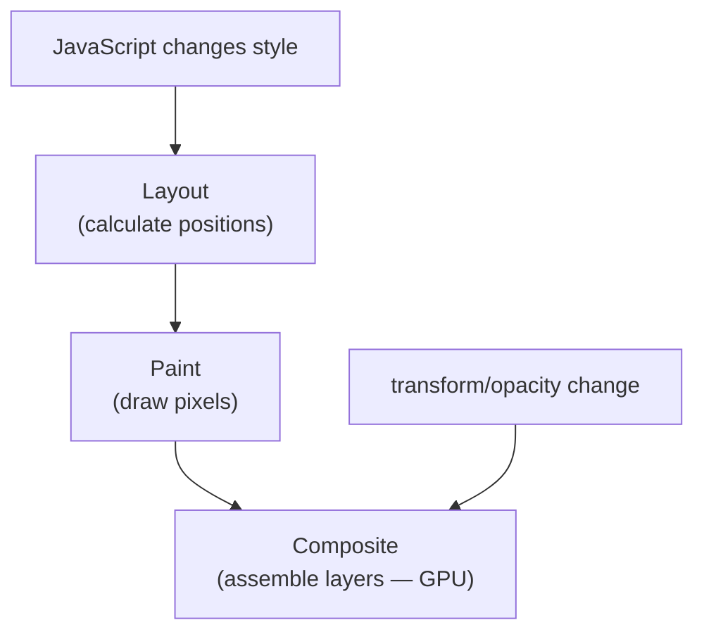

# CSS Transforms

> **Lesson Summary:** The CSS `transform` property applies geometric transformations — moving, scaling, rotating, and skewing — to an element without affecting document flow. Transforms run on the GPU compositor layer, making them the most performant way to animate position and size. This lesson covers the transform functions, combining multiple transforms, and `transform-origin`.

---

## What `transform` Does

`transform` visually moves, scales, or rotates an element without affecting layout — neighboring elements do not shift.

```css
.icon {
  transform: rotate(45deg);
}
/* The icon appears rotated but its space in the layout is unchanged */
```

This is fundamentally different from changing `margin`, `top`, or `width` — those trigger layout recalculation.

---

## The Transform Functions

### `translate()` — Move

```css
transform: translateX(20px);     /* move right 20px */
transform: translateY(-10px);    /* move up 10px */
transform: translate(20px, -10px); /* move right 20px, up 10px */
transform: translateX(50%);      /* move right by 50% of the element's own width */
```

> **💡 Tip:** `translate(50%, 50%)` moves an element by 50% of *its own* width and height — not the parent's. This is the key to perfect centering: `transform: translate(-50%, -50%)` combined with `top: 50%; left: 50%` centers any element regardless of its dimensions.

```css
.centered {
  position: absolute;
  top: 50%;
  left: 50%;
  transform: translate(-50%, -50%);
}
```

### `scale()` — Resize

```css
transform: scale(1.1);       /* scale up 10% in both dimensions */
transform: scale(0.9);       /* scale down 10% */
transform: scaleX(1.5);      /* scale only horizontally */
transform: scaleY(0.5);      /* scale only vertically */
transform: scale(1.2, 0.8);  /* different X and Y values */
```

### `rotate()` — Spin

```css
transform: rotate(45deg);    /* clockwise 45 degrees */
transform: rotate(-90deg);   /* counter-clockwise 90 degrees */
transform: rotate(0.25turn); /* quarter turn (same as 90deg) */
transform: rotate(1.5708rad); /* in radians */
```

### `skew()` — Shear

```css
transform: skewX(15deg);    /* tilt along X axis */
transform: skewY(10deg);    /* tilt along Y axis */
```

Skew is less commonly used in UI than the others.

---

## Combining Multiple Transforms

Combine transforms in a single `transform` declaration — space-separated:

```css
.card:hover {
  transform: translateY(-4px) scale(1.02);
}
```

> **⚠️ Warning:** The order of transforms matters — transforms are applied right-to-left. `translate(100px, 0) rotate(45deg)` produces a different result than `rotate(45deg) translate(100px, 0)`. The rotation affects the coordinate system used by the subsequent translation.

---

## `transform-origin` — The Pivot Point

`transform-origin` sets the point around which rotations and scales are applied. Default is the element's center (`50% 50%`).

```css
.icon {
  transform-origin: center center; /* default */
}

.badge {
  transform-origin: top right; /* scale/rotate from the top-right corner */
}

.needle {
  transform-origin: bottom center; /* like a compass needle on a pin */
}
```

```css
/* A caret icon that rotates around its bottom */
.caret {
  transform-origin: 50% 75%;
  transition: transform 0.2s ease;
}

.accordion.is-open .caret {
  transform: rotate(180deg);
}
```

---

## GPU Compositing

When you apply `transform` to an element, the browser promotes it to its own **compositor layer** — a separate layer processed by the GPU. Changes to this layer (rotating, scaling, moving) do not require the CPU to recalculate layout or repaint other elements.

This is why `transform` animations are smooth even at 60fps, while animating `left`, `top`, or `width` can cause jank — those properties trigger a full layout-paint-composite cycle on every frame.



Transforms skip directly to the compositing step — no layout or paint required.

---

## Common Patterns

### Hover Pop

```css
.button {
  transition: transform 0.15s ease-out;
}
.button:hover {
  transform: scale(1.05);
}
.button:active {
  transform: scale(0.98); /* feels like a physical press */
}
```

### Spinning Loader (with transform)

```css
.spinner {
  width: 24px;
  height: 24px;
  border: 3px solid #e5e7eb;
  border-top-color: #3b82f6;
  border-radius: 50%;
  animation: spin 0.8s linear infinite;
}

@keyframes spin {
  to { transform: rotate(360deg); }
}
```

### Chevron Toggle

```css
.chevron {
  display: inline-block;
  transition: transform 0.2s ease;
}

.accordion.is-open .chevron {
  transform: rotate(180deg);
}
```

---

## Key Takeaways

- `translate()` — move without affecting layout; `translateX/Y/Z` for single axis.
- `scale()` — resize; `scaleX/Y` for single axis.
- `rotate()` — spin; accepts `deg`, `turn`, `rad`.
- Combine transforms space-separated: `transform: translateY(-4px) scale(1.02)`.
- Transform order matters — applied right-to-left.
- `transform-origin` sets the pivot point for rotations and scales (default: center).
- Transforms are GPU-composited — the most performant property to animate.

---

## Challenge: Transform Gallery

Build a card grid where:

1. Cards have a `:hover` state that lifts (`translateY(-6px)`) and slightly scales up (`scale(1.02)`)
2. Each card has an icon that rotates 360° on card hover
3. Cards have a checkmark badge in the top-right corner that scales from 0 to 1 when the card gets a `.selected` class (added by a click handler in JavaScript)
4. The `transform-origin` for the badge scale is `top right`

---

## Research Questions

> **🔬 Research Question:** What is `transform: perspective(500px) rotateY(20deg)`? What is the `perspective` CSS property, and how does it create a 3D tilt effect? Build a card that tilts toward the mouse cursor using JavaScript `mousemove` events.

> **🔬 Research Question:** What does `translateZ()` do? Why would you use `translate3d(x, y, z)` with `z: 0` as a performance hack, and does this hack still matter in modern browsers?

## Optional Resources

- [MDN — transform](https://developer.mozilla.org/en-US/docs/Web/CSS/transform)
- [CSS Tricks — Transform](https://css-tricks.com/almanac/properties/t/transform/)
