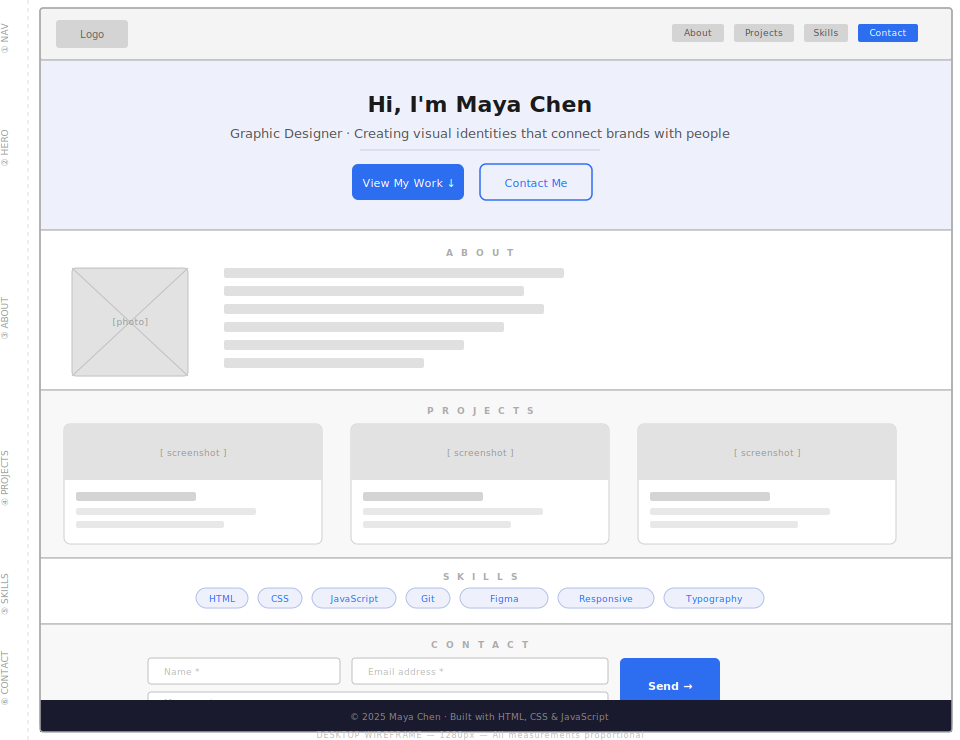
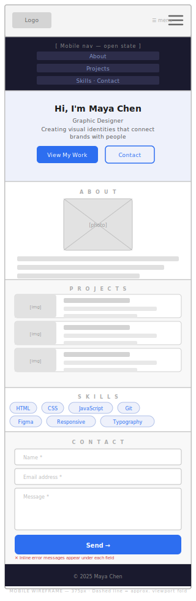

# Client Brief & Wireframes

> This document is your assignment. Read it the way a real developer reads a client brief — carefully, completely, and before writing any code.

---

## The Client

**Name:** Maya Chen  
**Profession:** Freelance Graphic Designer  
**Location:** Toronto, ON  
**Contact (simulated):** maya.chen@portfolio-brief.dev

---

## 📨 The Email

> **From:** Maya Chen \<maya.chen@portfolio-brief.dev\>  
> **Subject:** Website brief — personal portfolio  
> **Date:** Monday, 9:14 AM

Hi,

I'm a freelance graphic designer and I need a personal portfolio website. Right now I only have a Behance page, which isn't professional enough for the kind of clients I want to attract.

I need a clean, modern, single-page site that shows off my work and makes it easy for potential clients to get in touch.

Here is what I need on the site:

1. **Navigation** — My name or a logo on the left, links to each section on the right. On mobile phones, the links should collapse into a hamburger menu that opens and closes when clicked.

2. **Hero section** — A big, confident headline with my name, a short tagline describing what I do, and two buttons: one to scroll down to my projects, one to jump to the contact form.

3. **About section** — A photo of me (I'll send you the actual photo later — use a placeholder for now) alongside a short paragraph about my background.

4. **Projects section** — Three of my best projects displayed as cards. Each card should have a screenshot image (placeholder for now), the project title, a one-sentence description, and a link to view it.

5. **Skills section** — A list of my skills displayed as clean tag-style badges. Skills: HTML, CSS, JavaScript, Git, Figma, Responsive Design, Typography, Colour Theory.

6. **Contact section** — A simple form with Name, Email, and Message fields. When someone clicks Send, check that all fields are filled in and that the email address looks valid. If something is wrong, show them what to fix. If everything is correct, show a success message instead of the form.

7. **Footer** — My name and the year. Nothing fancy.

I don't want any templates, WordPress, or Squarespace. I want it coded by hand in HTML, CSS, and JavaScript only — no frameworks.

The site must look good on both desktop and mobile.

Let me know if you have questions.

— Maya

---

## User Stories

The following user stories represent the goals of the people who will visit Maya's portfolio. Your build must satisfy all of them.

| # | As a… | I want to… | So that… |
| :-- | :-- | :-- | :-- |
| US-01 | Potential client | Find the navigation wherever I am on the page | I can jump to any section at any time |
| US-02 | Mobile user | Tap a hamburger icon to open/close the nav | I can navigate without the links taking up the whole screen |
| US-03 | Visitor | Read a clear, confident headline in the hero | I immediately understand who Maya is and what she does |
| US-04 | Visitor | Click "View My Work" | The page scrolls smoothly down to the Projects section |
| US-05 | Visitor | Click "Contact Me" | The page scrolls smoothly down to the Contact form |
| US-06 | Potential client | View Maya's photo and bio in the About section | I feel like I know who I would be working with |
| US-07 | Potential client | Browse Maya's project cards | I can quickly assess the quality and range of her work |
| US-08 | Potential client | Click a link on a project card | The project opens in a new tab |
| US-09 | Visitor | See Maya's skill set as tags | I can quickly confirm she has the skills I need |
| US-10 | Potential client | Fill in the contact form and click Send | I can reach out to Maya directly from her site |
| US-11 | Potential client | See a clear error message if I forget a field | I know exactly what to fix before I resubmit |
| US-12 | Potential client | See a success message after sending | I know my message was received |

---

## Wireframes

These wireframes show the **layout** of the page — not the final visual design. Your colours, fonts, and spacing are your creative choices. The wireframes define what must be present and where.

### Desktop (≥ 1024px)

**Section annotations:**

| # | Section | Key layout notes |
| :-- | :-- | :-- |
| ① Nav | Full-width bar | Logo left · nav links right · sticky (stays at top on scroll) |
| ② Hero | Full-width, centred text | Large name · tagline · two side-by-side buttons |
| ③ About | Two-column | Photo left · bio text right |
| ④ Projects | Three-column grid | Card = image + title + description + "View project →" link |
| ⑤ Skills | Single row of tags | Pill/badge style — wraps on smaller screens |
| ⑥ Contact | Centred form | Name · Email on same row · Message below · Send button |
| Footer | Full-width dark bar | Copyright text centred |

---

### Mobile (≤ 768px)

**Key differences from desktop:**

| Element | Desktop | Mobile |
| :-- | :-- | :-- |
| Navigation | Links visible in nav bar | Links hidden · hamburger icon shown · clicking opens full-width dropdown |
| About | Two-column (photo + text side by side) | Photo centred above text |
| Projects | Three-column card grid | Cards stack vertically (one per row) |
| Skills | Single row (may wrap) | Wraps naturally |
| Contact form | Name + Email on one row | Name and Email each on their own row |

---

## Design Constraints

Maya did not specify colours or typography. Those decisions are yours. However:

- The site must feel **professional** — clean typography, consistent spacing, intentional use of colour
- There must be sufficient colour contrast for text (WCAG AA minimum: 4.5:1 for body text)
- The design must feel **cohesive** — pick a colour palette and stick to it

> **💡 Suggested starting point:** Pick one accent colour, one neutral background, and keep body text near-black (`#111` or `#1a1a1a`). Two-colour palettes are easier to execute well than five-colour ones.
