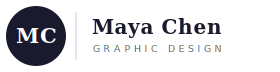
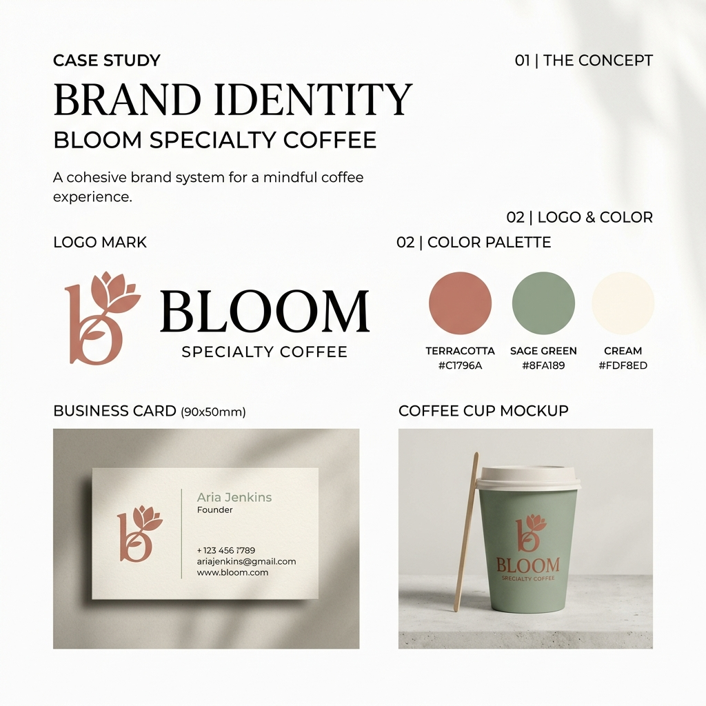
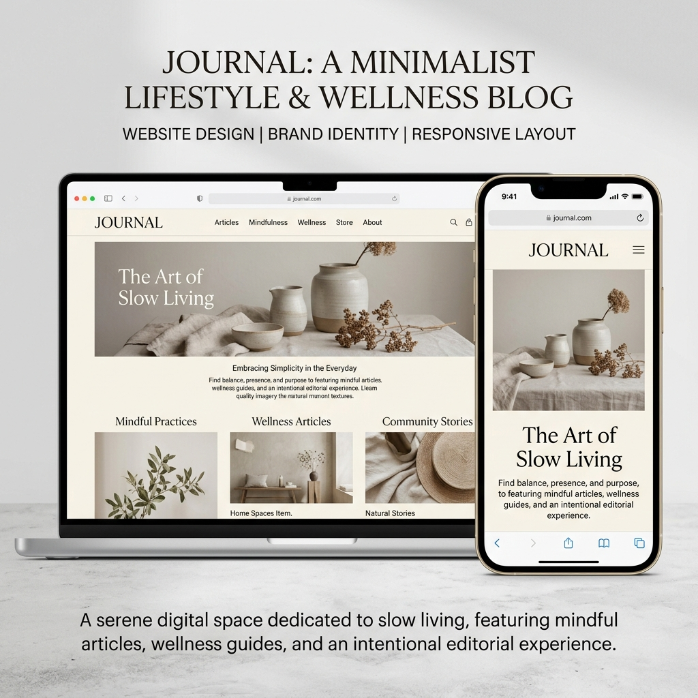
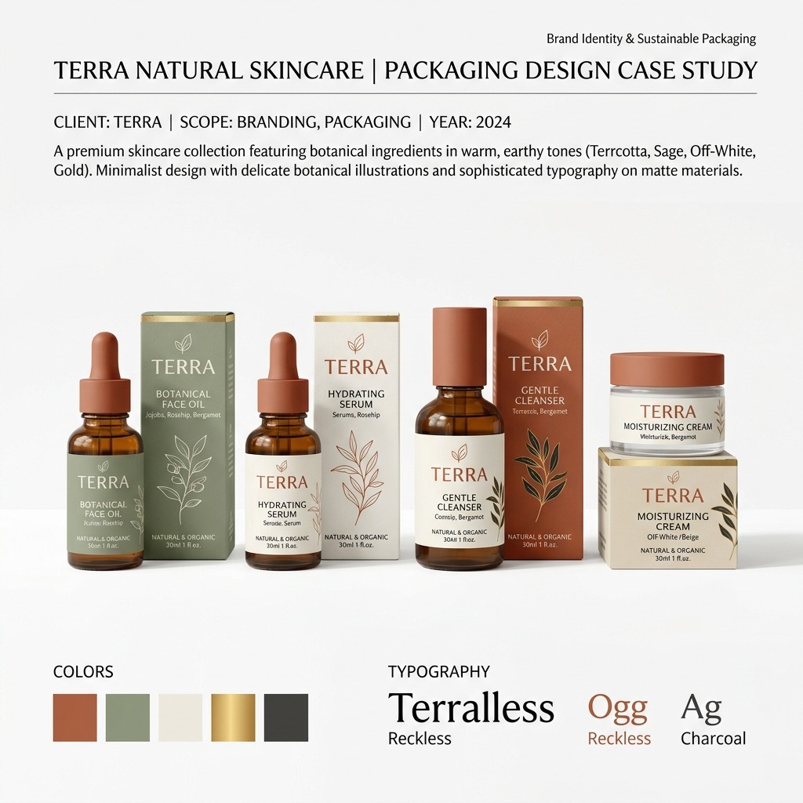

# Client Asset Pack

> This is everything Maya sent you. Real clients rarely deliver perfectly organised assets — this is already cleaner than most. Save all files, read the copy carefully, and use it as-is in your build.

---

## 📨 Maya's Follow-Up Email

> **From:** Maya Chen \<maya.chen@portfolio-brief.dev\>  
> **Subject:** Re: Website — assets as promised  
> **Date:** Wednesday, 11:42 AM

Hi,

Here are everything you asked for. I've done my best to write the bio and project blurbs myself — feel free to tighten the wording but please don't change the meaning.

For the projects, I've linked to the live/published versions where they exist. For the ones that only exist as PDFs I've left a `#` — just link to `#` for now and we can update them later.

I haven't used a specific font before but I love clean serif + sans-serif combinations. Something like **Playfair Display + Inter** would be perfect. For colours, I've attached a small swatch guide at the bottom of this email.

Everything you need should be here. Let me know if I've forgotten anything!

— Maya

---

## Files Included

| File | What it is | Use it for |
| :-- | :-- | :-- |
| `logo.svg` | My logo (vector) | `<header>` nav logo |
| `maya-chen.png` | My headshot | About section photo |
| `project-01-bloom.png` | Bloom Branding case study | Project card 1 image |
| `project-02-journal.png` | Journal Web Design case study | Project card 2 image |
| `project-03-terra.png` | Terra Packaging case study | Project card 3 image |

---

## Logo



**Download path:** `Assets/Starter/capstone/logo.svg`

> **Usage note:** The logo is an SVG, so it scales perfectly at any size. Use it as an `` tag in your nav: ``. The height will scale automatically.

---

## Maya's Photo


**Download path:** `Assets/Starter/capstone/maya-chen.png`

> **Usage note:** Crop and style this with CSS. For the wireframe's circular crop on mobile, use `border-radius: 50%` with a fixed width and height. The `alt` text should describe the image for screen readers.

---

## Bio Copy

Use this verbatim in the About section. It is already written for the web (short sentences, scannable).

---

*Hi, I'm Maya — a Toronto-based graphic designer with over five years of experience building visual identities for small businesses and independent brands.*

*I specialise in brand identity, print design, and digital design. My process starts with listening: understanding what a business stands for before I put pen to paper. The result is design that feels genuinely right — not just aesthetically pleasing, but strategically aligned.*

*When I'm not designing, you'll find me at the farmers' market, hunting for inspiration in texture and colour, or deep in a new book on type history.*

---

## Projects

### Project 1 — Bloom Branding



| Field | Content |
| :-- | :-- |
| **Title** | Bloom — Brand Identity |
| **Description** | A full brand identity for a specialty coffee shop in Vancouver. Logo, colour palette, stationery, and signage. |
| **Tags** | Branding · Print · Identity |
| **Link** | `#` *(live version not available — link to `#`)* |

---

### Project 2 — Journal Web Design



| Field | Content |
| :-- | :-- |
| **Title** | Journal — Website Design |
| **Description** | UI design for a minimalist wellness and lifestyle blog. Designed for readability and calm — editorial typography, generous white space. |
| **Tags** | UI Design · Web · Typography |
| **Link** | `https://journal-by-maya.example.com` *(use this as a placeholder URL)* |

---

### Project 3 — Terra Packaging



| Field | Content |
| :-- | :-- |
| **Title** | Terra — Packaging Design |
| **Description** | Packaging design for a natural skincare brand. Earth-toned labels and box design with minimal botanical illustration. |
| **Tags** | Packaging · Print · Illustration |
| **Link** | `#` *(live version not available — link to `#`)* |

---

## Skills List

Use these exactly as your skill badges:

```
HTML · CSS · JavaScript · Git · Figma · Responsive Design · Typography · Colour Theory
```

---

## Brand Preferences

Maya included a quick note on her brand. Use this when choosing your colours and fonts.

### Typography

| Role | Font | Where to get it |
| :-- | :-- | :-- |
| **Headings** | Playfair Display | [Google Fonts](https://fonts.google.com/specimen/Playfair+Display) |
| **Body / UI** | Inter | [Google Fonts](https://fonts.google.com/specimen/Inter) |

```html
<!-- Paste this into your <head> -->
<link rel="preconnect" href="https://fonts.googleapis.com">
<link rel="preconnect" href="https://fonts.gstatic.com" crossorigin>
<link href="https://fonts.googleapis.com/css2?family=Inter:wght@400;500;600&family=Playfair+Display:wght@700&display=swap" rel="stylesheet">
```

```css
/* In your :root or body */
--font-heading: 'Playfair Display', Georgia, serif;
--font-body:    'Inter', system-ui, sans-serif;
```

---

### Colour Palette

Maya's palette is inspired by the warm, minimal aesthetic across all three projects.

| Role | Name | Hex | Use for |
| :-- | :-- | :-- | :-- |
| **Primary dark** | Midnight | `#1a1a2e` | Nav background, headings, footer |
| **Accent** | Terracotta | `#c0633a` | Buttons, links, highlights |
| **Background** | Linen | `#faf8f5` | Page background |
| **Surface** | Cloud | `#f0eeeb` | Card backgrounds, alt sections |
| **Body text** | Graphite | `#3d3d3d` | Paragraph text |
| **Subtle text** | Pebble | `#8a8a8a` | Labels, captions, placeholders |

```css
/* Paste into :root in style.css */
:root {
  --color-primary:    #1a1a2e;
  --color-accent:     #c0633a;
  --color-bg:         #faf8f5;
  --color-surface:    #f0eeeb;
  --color-text:       #3d3d3d;
  --color-text-muted: #8a8a8a;
  --color-white:      #ffffff;
}
```

> **You are not required to use this palette.** These are Maya's preferences — you can adapt them. But starting here gives you a coherent, professional-looking result without spending hours picking colours.

---

## How to Set Up Your Project

1. Create your project folder:
   ```
   portfolio/
   ├── index.html
   ├── style.css
   ├── app.js
   ├── README.md
   └── assets/
       ├── logo.svg
       ├── maya-chen.png
       ├── project-01-bloom.png
       ├── project-02-journal.png
       └── project-03-terra.png
   ```

2. Right-click each image above and **Save image as…** into your `portfolio/assets/` folder. Save the logo as `logo.svg` (right-click → Copy image → save, or copy the SVG code directly).

3. Reference images with relative paths from your HTML:
   ```html
   
   
   ```

4. Copy the bio text and project descriptions directly from this page into your HTML.

5. Copy the `:root` CSS variables into your `style.css`.

6. Add the Google Fonts `<link>` tags to your `<head>`.

You now have everything Maya would send you. The rest is your job.

> **Good luck.** Remember: every professional developer has their first project. This is yours.
