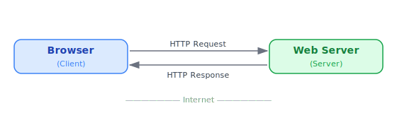
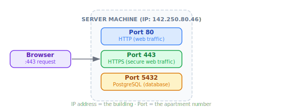

# The Internet

> **Lesson Summary:** The Internet is the global network that lets a browser on your laptop talk to a server on the other side of the world. This lesson covers what web developers need to know about it — no networking degree required.

## What Is the Internet?

The **Internet** is a global network of interconnected computers. Any computer connected to it can, in principle, send data to any other computer also connected to it.

That's it at its core. Everything else — websites, apps, streaming video — is built *on top* of that basic ability: computers talking to computers.

> **💡 Tip:** The Internet is often confused with the Web. They are not the same thing. The Internet is the infrastructure (the roads). The Web is one system that uses those roads. Email, online gaming, and video calls also use the Internet — but they are not the Web.

## The Client-Server Model

The most important mental model in web development is the **client-server model**. Almost everything you build will follow this pattern.

### The Client

A **client** is any device or program that *requests* a resource. In web development, the client is almost always a **web browser** — Chrome, Firefox, Safari, or Edge running on someone's device.

The client initiates every exchange. Servers do not reach out unsolicited; they wait to be asked.

### The Server

A **server** is a computer that *listens* for requests and *responds* to them. A web server's job is to receive a request for a resource (like an HTML file) and send it back.

A server is just a computer running special software. Your own laptop could be a server — and during development, it often is.

> **Example — Development Server:**
> When you run `npm run dev` or `python -m http.server`, you are turning your own computer into a server. Your browser (the client) sends a request to `http://localhost:3000`, and your machine (the server) responds with your project files. The Internet is not involved — client and server are on the same machine.

### The Exchange

Every web interaction is a **request** from a client followed by a **response** from a server. This back-and-forth is called the **request-response cycle** and is covered in depth in the [HTTP lesson](./06_http.md).

## IP Addresses

For two computers to talk, they need to find each other. On the Internet, every connected device is identified by an **IP address** — a unique numerical label.

You can think of an IP address like a postal address for a computer. Without it, a response would have nowhere to go.

**IPv4** addresses look like this: `142.250.80.46`
**IPv6** addresses look like this: `2607:f8b0:4004:c09::8a`

As a web developer, you rarely type IP addresses manually. **DNS** (covered in [lesson 07](./07_dns.md)) translates human-readable domain names like `google.com` into the IP address the network uses to route your request.

> **⚠️ Warning:** `localhost` and `127.0.0.1` are the same thing — both refer to your own machine. When your dev server says "listening on localhost:3000", your computer is acting as both client and server. No data leaves your machine.

## Ports

An IP address gets a request to the right *machine*. A **port** determines which *service* on that machine should handle it.

Think of it this way: the IP address is the building's street address, and the port is the apartment number inside.

| Port | Service |
| :--- | :--- |
| `80` | HTTP (unencrypted web traffic) |
| `443` | HTTPS (encrypted web traffic) |
| `3000` | Common default for local dev servers |
| `8080` | Common alternative for local dev servers |
| `5432` | PostgreSQL database |

Browsers handle ports `80` and `443` silently — you never type `https://google.com:443` because the browser assumes it. But the moment you spin up a local dev server, ports become visible: `http://localhost:3000`.

> **💡 Tip:** If two services try to use the same port on the same machine, one will fail to start. This is the cause of the common dev error: "Port 3000 is already in use."

## What Web Developers Need to Care About

- The **client-server model** is the foundation of everything you build.
- Every request comes from a **client**; every response comes from a **server**.
- Servers are found by **IP address**; services on that server are found by **port**.
- During development, your own machine plays both roles via `localhost`.

## What Web Developers Don't Need to Care About (Yet)

- *How* data physically travels across the network (cables, routers, packets)
- The difference between TCP and UDP
- Network topology or routing algorithms

These topics live in the **Networking** domain. Understanding them is valuable eventually — but none of it is required to build web applications.

## Key Takeaways

- The Internet is a global network that allows computers to communicate.
- Web development follows the **client-server model**: a client requests, a server responds.
- Every device on the Internet has an **IP address**; every service on a device has a **port**.
- `localhost` (`127.0.0.1`) is your own machine — no Internet required.
- Domain names (e.g., `google.com`) are human-friendly aliases for IP addresses, resolved by DNS.

## Research Questions

> **🔬 Research Question:** What is the difference between a *public* IP address and a *private* IP address? When you look up "what is my IP" in a browser, what are you actually seeing?
>
> *Hint: Search for "NAT" and "private IP ranges (RFC 1918)".*

> **🔬 Research Question:** `localhost` resolves to `127.0.0.1` — but how does your computer know that without asking a DNS server? Where is that mapping stored?
>
> *Hint: Look up the `hosts` file on your operating system.*
