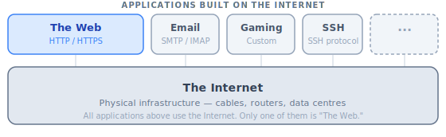
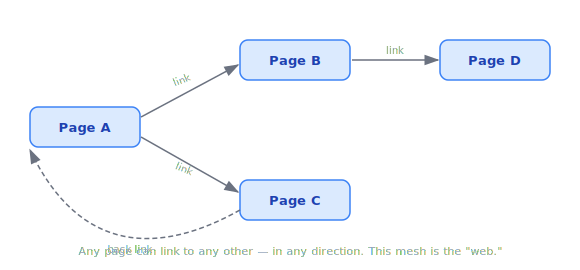

# The World Wide Web

> **Lesson Summary:** The Web is an information system built *on top of* the Internet. Understanding what the Web actually is — and what it isn't — gives you the right mental model before touching a single line of code.

## The Internet vs. The Web

These two terms are used interchangeably in everyday conversation, but they describe entirely different things.

| | The Internet | The World Wide Web |
| :--- | :--- | :--- |
| **What it is** | A global network of connected computers | An information system of linked documents |
| **Layer** | Infrastructure (the pipes) | Application (what flows through the pipes) |
| **Invented** | ~1960s (ARPANET) | 1989, by Tim Berners-Lee |
| **Required for the other?** | No — the Internet existed before the Web | Yes — the Web runs on top of the Internet |

Think of it this way: the Internet is the global highway system. The Web is one thing you can *do* on those highways — like a postal service that runs trucks on those roads. Email, online gaming, and video calls also use the highways, but they are not the postal service.

## What Makes It a "Web"?

### Hypertext

The Web is built on a concept called **hypertext** — text that contains links to other text. Unlike a book, which you read from front to back, hypertext lets you jump between related pieces of information in any order.

This is not a new idea — the word was coined in 1963 — but Tim Berners-Lee's insight was to apply it *across a global network*: documents on different computers, all linked together.

> **💡 Tip:** The "HT" in **HTML** stands for **HyperText**. HyperText Markup Language is literally the language used to write hypertext documents for the Web. The name is not arbitrary — it reveals exactly what the Web is built from.

### Hyperlinks

A **hyperlink** (or just "link") is the mechanism that connects one hypertext document to another. It is a reference that, when activated, navigates the browser to a different resource — whether on the same server or a server on the other side of the world.

This network of documents, all cross-linking to each other, is what creates the "web" shape the system is named after.

No single page is the "start." Any document can link to any other. The result is a mesh — a web.

## What the Web Is Not

Several common technologies use the Internet but are *not* part of the Web:

| Technology | Uses Internet? | Uses the Web? | Why Not the Web? |
| :--- | :---: | :---: | :--- |
| Email (SMTP) | ✅ | ❌ | Uses its own protocol, not HTTP |
| SSH (remote terminal) | ✅ | ❌ | Not a document system, uses SSH protocol |
| Online gaming | ✅ | ❌ | Real-time data, custom protocols |
| FTP (file transfer) | ✅ | ❌ | Predates the Web, uses FTP protocol |
| A website | ✅ | ✅ | Documents served over HTTP, linked by URLs |

> **⚠️ Warning:** Saying "I'm not connected to the Internet, but I can open a local HTML file in my browser" is more accurate than it sounds. The browser can render a web page without any Internet connection at all — it just reads a local file. The Web protocol (HTTP) was not involved. This proves that "viewing a web page" and "using the Internet" are not the same operation.

## Key Takeaways

- The **Internet** is the infrastructure. The **Web** is one application built on top of it.
- The Web is a system of **hypertext** documents connected by **hyperlinks**, served over HTTP.
- The **"HT" in HTML** stands for HyperText — the technology the Web is built from.
- Many Internet services (email, gaming, SSH) are not part of the Web.
- You can render HTML in a browser with zero Internet connection — the Web and the Internet are separable.

## Research Questions

> **🔬 Research Question:** Tim Berners-Lee invented the Web while working at CERN in 1989. What problem was he originally trying to solve? How does his original proposal differ from the Web we use today?
>
> *Hint: Search for "Tim Berners-Lee Information Management: A Proposal 1989".*

> **🔬 Research Question:** The Web runs on HTTP. But what protocol does email run on, and how does it differ from HTTP's request-response model?
>
> *Hint: Look up "SMTP" and "IMAP" — and notice that email involves multiple protocols.*
