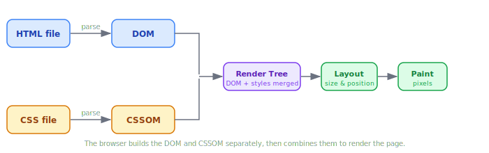

# Web Browsers

> **Lesson Summary:** A browser is more than a window to the web — it is a complex software platform that fetches, interprets, and renders code into the visual pages you see. Understanding what it does (and enforces) makes you a better developer.

## What a Browser Does

From a user's perspective, a browser "shows websites." From a developer's perspective, a browser does something far more specific:

1. Sends an HTTP request for a resource
2. Receives the response (usually an HTML file)
3. Reads and interprets that HTML
4. Fetches any additional resources the HTML references (CSS, JavaScript, images)
5. Builds internal data structures from the code
6. Uses those structures to paint pixels on the screen
7. Executes JavaScript, which can then change everything it just built

The browser is not a passive viewer. It is an **execution environment** — a full software platform that runs code.

## The Browser's Main Jobs

### 1. Fetching Resources

When you type a URL and press Enter, the browser sends an **HTTP request** to the server at that address. The server responds with a file — almost always an HTML document.

That HTML file typically *references* other files: a CSS stylesheet, JavaScript files, images, fonts. The browser reads those references and sends **additional HTTP requests** to fetch each one.

A single page load can trigger dozens — sometimes hundreds — of individual HTTP requests.

> **Example — Network Activity:**
> Open your browser's DevTools (F12), go to the **Network** tab, then visit any website. Every row in that list is a separate HTTP request the browser made to assemble that one page.

### 2. Parsing Code

**Parsing** is the process of reading raw text and converting it into a structured data format that a program can work with.

The browser parses two languages simultaneously:

- **HTML** is parsed into a tree of objects called the **DOM** (Document Object Model). Each element in your HTML — a heading, a paragraph, a button — becomes a node in this tree.
- **CSS** is parsed into a parallel structure called the **CSSOM** (CSS Object Model), which maps style rules onto those same nodes.

> **💡 Tip:** The **DOM** is one of the most important concepts in web development. You will interact with it constantly in JavaScript. For now, understand it as the browser's internal, living representation of your HTML — not the raw text file on disk.

### 3. Rendering the Page

Once the DOM and CSSOM are built, the browser combines them into a **Render Tree** — a structure containing only the visible elements and their computed styles.

The browser then performs two final steps:

- **Layout:** Calculates the exact size and position of every element on the screen.
- **Paint:** Draws the pixels.

This entire process — from HTML text to painted pixels — is called the **rendering pipeline**. It happens in milliseconds and can be triggered again whenever the page changes.

### 4. Running JavaScript

Alongside parsing HTML and CSS, the browser contains a **JavaScript engine** that executes JavaScript code. Chrome uses **V8**, Firefox uses **SpiderMonkey**, and Safari uses **JavaScriptCore**.

JavaScript can read and modify the DOM and CSSOM at any time — *after* the page loads, *in response to user events*, or even *while the page is still loading*. This is what makes web pages dynamic.

> **⚠️ Warning:** By default, a `<script>` tag in HTML **pauses** the parsing of the rest of the document until the script is downloaded and executed. A large or slow-loading script at the top of your HTML can delay the entire page from appearing. This is why script placement and the `defer`/`async` attributes matter — covered in detail in [How a Page Loads](./09_how_a_page_loads.md).

### 5. The Sandbox

The browser enforces a strict security model called the **sandbox**. JavaScript running inside a web page operates in a restricted environment — by design.

**What sandboxed JavaScript cannot do (by default):**
- Read or write files on your computer
- Access your camera or microphone
- Read data from a different website open in another tab
- Make requests to a different domain than the one that served the page

This last restriction — blocking cross-domain data access — is called the **Same-Origin Policy**. It is one of the web's most fundamental security mechanisms.

> **🚨 Alert:** The Same-Origin Policy is not optional and not a bug. It is what prevents a malicious website from reading your banking data if you have another tab open. You will encounter it as a developer when your frontend (e.g., `localhost:3000`) tries to fetch data from a backend on a different port or domain and receives a **CORS** error.

## Browser Engines

Not all browsers render pages the same way. Each browser uses a different **rendering engine** — the underlying software responsible for parsing and rendering.

| Browser | Rendering Engine | JavaScript Engine |
| :--- | :--- | :--- |
| Chrome, Edge, Opera | Blink | V8 |
| Firefox | Gecko | SpiderMonkey |
| Safari | WebKit | JavaScriptCore |

Differences between engines mean that the *same* HTML and CSS can render slightly differently across browsers. This is why **cross-browser testing** exists and why web standards bodies like the W3C matter — they define the rules all engines aim to follow.

## Browser DevTools

Every major browser ships with a built-in suite of developer tools, accessible by pressing **F12** (or right-clicking any element and choosing "Inspect").

| DevTools Panel | What It Shows |
| :--- | :--- |
| **Elements** | The live DOM tree; edit HTML and CSS in real time |
| **Console** | JavaScript output, errors, and a live JS prompt |
| **Network** | Every HTTP request made by the page |
| **Sources** | The raw files (HTML, CSS, JS) the browser received |
| **Performance** | A timeline of the rendering pipeline |
| **Application** | Cookies, localStorage, and cached resources |

> **💡 Tip:** DevTools is your most powerful debugging tool. Get comfortable with it early. A professional web developer has DevTools open more often than not.

> **📌 Coming Later:** The **Application** panel exposes browser storage — cookies, `localStorage`, and `sessionStorage`. These are covered after HTTP and JavaScript, where they become immediately practical rather than abstract.

## Key Takeaways

- A browser is a **software platform** that fetches, parses, renders, and executes code.
- HTML is parsed into the **DOM**; CSS is parsed into the **CSSOM**. Both are required to render a page.
- JavaScript runs inside a **sandbox** — it cannot access your filesystem or data from other origins.
- The **Same-Origin Policy** prevents cross-domain data access and causes CORS errors in development.
- Different browsers use different **rendering engines**, which is why cross-browser testing exists.
- **DevTools** (F12) is your primary development and debugging tool.

## Research Questions

> **🔬 Research Question:** What is CORS (Cross-Origin Resource Sharing)? How does a server "grant permission" to allow a request from a different origin?
>
> *Hint: Search for "CORS headers" and look at the `Access-Control-Allow-Origin` HTTP response header.*

> **🔬 Research Question:** Chrome's V8 JavaScript engine doesn't just interpret JavaScript line by line — it compiles it. What is JIT (Just-In-Time) compilation, and why does it make JavaScript fast?
>
> *Hint: Search for "V8 JIT compilation" or "how JavaScript engines work."*
