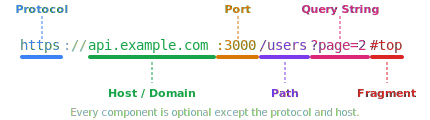

# URLs

> **Lesson Summary:** A URL is the precise, structured address of any resource on the web. Understanding every component of its anatomy gives you the ability to read, write, and debug any web address — and understand exactly what your browser is asking for.

## What Is a URL?

A **URL** (Uniform Resource Locator) is a string of text that identifies a resource and tells you exactly how to find it. Every web request starts with a URL.

The key word is *uniform*. URLs follow a strict, standardised structure so that any browser, in any country, can parse and use them consistently.

> **Example — A URL you might see:**
> `https://api.example.com:3000/users?page=2#top`
>
> At first glance it looks like a jumbled string. By the end of this lesson, every character in that URL will have a clear, understood purpose.

## Anatomy of a URL



### Protocol (Scheme)

The **protocol** (also called the **scheme**) tells the browser *how* to retrieve the resource — which set of rules to follow for the communication.

| Protocol | How the browser retrieves the resource |
| :--- | :--- |
| `https://` | Encrypted HTTP request over the Internet |
| `http://` | Unencrypted HTTP request (avoid on production) |
| `file://` | Reads a file directly from your local filesystem |
| `data:` | The data is encoded directly inside the URL itself |

> **💡 Tip:** The `://` after the protocol is a separator — not part of the protocol name itself. It signals that a host address follows.

### Host

The **host** identifies which server to send the request to. It is either:
- A **domain name** (e.g., `api.example.com`) that DNS resolves to an IP address
- A **raw IP address** (e.g., `192.168.1.50`) used occasionally in development

A domain name has up to three parts:
- `api` — **subdomain**: a named division of the domain
- `example` — **domain / second-level domain (SLD)**: the registered name
- `com` — **top-level domain (TLD)**: the category or country

> **⚠️ Warning:** `www` is just a subdomain — a convention, not a requirement. `www.example.com` and `example.com` are technically different addresses. Whether they return the same content depends on how the server is configured.

### Port

The **port** specifies which service on the host machine to connect to. It follows the host, separated by a colon: `:3000`.

When the port is omitted from a URL, the browser uses the default port for the protocol:
- `https://` defaults to port **443**
- `http://` defaults to port **80**

You will almost never type a port in a production URL. You will type one constantly in development: `http://localhost:3000`.

### Path

The **path** is the location of the specific resource on the server, separated by forward slashes.

```
/users/42/posts
```

- `/users` — the "users" resource collection
- `/42` — specifically user number 42
- `/posts` — that user's posts

On a **static server**, the path maps directly to a file on disk: `/images/logo.png` → the file at that location. On a **dynamic server**, the path is interpreted by the application code to decide what to return.

> **Example — Same Path, Different Outcomes:**
>
> A static server receiving `/about.html` opens and sends the file `about.html`.
> A dynamic API receiving `/users/42` queries a database for user 42 and returns JSON — no file with that name exists on disk.

### Query String

The **query string** begins with `?` and contains key-value pairs separated by `&`. It passes additional parameters to the server.

```
?page=2&sort=asc&filter=active
```

| Part | Meaning |
| :--- | :--- |
| `?` | Marks the start of the query string |
| `page=2` | Key `page` with value `2` |
| `&` | Separates additional parameters |
| `sort=asc` | Key `sort` with value `asc` |

Query strings are commonly used for pagination, search terms, filters, and tracking parameters.

> **⚠️ Warning:** Query strings are visible in the URL and in server logs. Never put passwords, API keys, or sensitive data in a query string.

### Fragment

The **fragment** begins with `#` and refers to a specific location *within* the resource, processed entirely by the browser. It is never sent to the server.

```
https://docs.example.com/guide#installation
```

The browser fetches the full page at `/guide`, then scrolls to the element with `id="installation"` on the page. The server never sees `#installation`.

> **💡 Tip:** In single-page applications (SPAs), fragments are sometimes used for client-side routing — the `#` prevents a new request to the server while still allowing navigation between "views."

## URLs vs. URIs

You will see **URI** (Uniform Resource Identifier) used alongside URL. The distinction is subtle:

| Term | What it identifies | Example |
| :--- | :--- | :--- |
| **URI** | Any resource, by name or location | `urn:isbn:0451450523` |
| **URL** | A resource by its *location* (how to find it) | `https://example.com/page` |

All URLs are URIs. Not all URIs are URLs. In practice, "URL" is the correct term for web addresses and the one you will use in everyday web development.

## Key Takeaways

- A URL has up to six components: **protocol**, **host**, **port**, **path**, **query string**, **fragment**.
- The **protocol** defines how to retrieve the resource; the **host** defines where.
- **Port** is almost always implicit (443 for HTTPS, 80 for HTTP) — but always present in `localhost` dev URLs.
- The **path** locates the resource on the server; the **query string** passes parameters to it.
- The **fragment** is processed by the browser — it is never sent to the server.
- All URLs are URIs. Use "URL" for web addresses.

## Research Questions

> **🔬 Research Question:** Some URLs use *percent-encoding* — for example, a space becomes `%20`. Why does this exist, and which characters require encoding? What is the rule for which characters are "safe" in a URL?
>
> *Hint: Search for "URL encoding RFC 3986" and look at the concept of "reserved" vs "unreserved" characters.*

> **🔬 Research Question:** What happens when you navigate to a URL in a SPA (like a React app) and then refresh the page? Why does the server sometimes return a 404, and how is this usually fixed?
>
> *Hint: Search for "SPA client-side routing 404 nginx" and look at the concept of "history API" vs "hash routing."*
