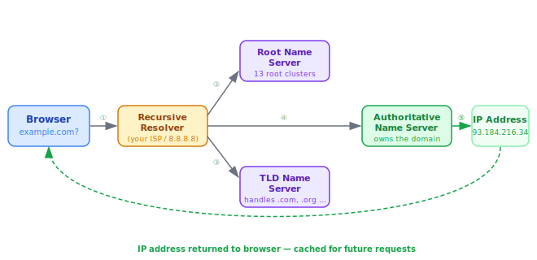

# DNS

> **Lesson Summary:** DNS (Domain Name System) translates human-readable domain names into the IP addresses computers use to find each other. Without DNS, every URL would be a string of numbers. Understanding DNS explains one of the most common sources of delays and failures on the web.


## The Problem DNS Solves

Servers are found by **IP address** — a numerical label like `93.184.216.34`. Humans are terrible at remembering numbers. We remember names.

DNS is the system that connects the two. You type `example.com`; DNS translates it to `93.184.216.34`; your browser connects to that address.

> **💡 Tip:** DNS is often called "the phone book of the Internet," but the analogy is imperfect — phone books were static. DNS is a distributed, real-time, hierarchical system that can update globally within minutes.

## The Resolution Chain

When your browser needs to resolve a domain name, it does not ask a single server. It follows a chain of servers, each one pointing to the next, until it reaches the authoritative source.



### Step 1 — Browser Cache

Before making any network request, the browser checks its own **DNS cache**. If it has recently resolved `example.com`, it already knows the IP address and skips all subsequent steps.

Your operating system also has its own DNS cache. The browser checks both before going to the network.

> **💡 Tip:** This is why DNS changes can take time to propagate to you even after they go live on the server — your browser or OS may be serving a cached (old) answer.

### Step 2 — Recursive Resolver

If no cache hit, the browser asks your configured **recursive resolver** — typically provided by your ISP or a public DNS service like Google (`8.8.8.8`) or Cloudflare (`1.1.1.1`).

The recursive resolver acts as your agent: it does the legwork of following the chain and returns the final answer to you.

### Step 3 — Root Name Servers

The resolver queries a **root name server** — one of 13 clusters distributed worldwide. The root server does not know the IP of `example.com`, but it knows which servers are responsible for `.com` domains and refers the resolver to them.

### Step 4 — TLD Name Servers

The resolver queries the **TLD (Top-Level Domain) name server** for `.com`. Again, it doesn't know `example.com`'s IP, but it knows which name server is *authoritative* for `example.com` and refers the resolver there.

### Step 5 — Authoritative Name Server

The **authoritative name server** is the final authority for a specific domain. It was configured when the domain was registered and holds the actual DNS records. It returns the IP address for `example.com`.

The resolver receives the IP, caches it, and returns it to your browser. Your browser connects.

## Common DNS Record Types

The authoritative name server stores **DNS records** — different types serve different purposes:

| Record | Purpose | Example |
| :--- | :--- | :--- |
| **A** | Maps a domain to an IPv4 address | `example.com → 93.184.216.34` |
| **AAAA** | Maps a domain to an IPv6 address | `example.com → 2606:2800:220:1::93` |
| **CNAME** | Points one domain to another (alias) | `www.example.com → example.com` |
| **MX** | Specifies mail servers for the domain | `example.com → mail.example.com` |
| **TXT** | Stores arbitrary text (used for verification) | `"v=spf1 include:..."` |
| **NS** | Declares which servers are authoritative | `example.com → ns1.registrar.com` |

> **Example — CNAME in Practice:**
> When you deploy a frontend to Netlify or Vercel, they often ask you to add a **CNAME record** pointing your custom domain (e.g., `app.mysite.com`) to their platform domain (e.g., `mysite.netlify.app`). This is DNS aliasing.

## TTL (Time to Live)

Every DNS record has a **TTL** — a number of seconds that tells resolvers (and browsers) how long to cache the record before fetching a fresh copy.

```
example.com   A   93.184.216.34   TTL 3600
```
This record will be cached for 3600 seconds (1 hour). After that, resolvers must re-query the authoritative server.

> **⚠️ Warning:** If you are about to change a domain's DNS records (e.g., migrating servers), lower the TTL well in advance — ideally to 60 seconds. This ensures the change propagates globally within a minute. Restoring a high TTL after the migration is complete reduces query load.

## Key Takeaways

- DNS translates **domain names** into **IP addresses** that computers use to connect.
- Resolution follows a chain: **browser cache → resolver → root NS → TLD NS → authoritative NS**.
- The **recursive resolver** does the legwork and caches the result.
- DNS **record types** serve different purposes: A (IPv4), AAAA (IPv6), CNAME (alias), MX (mail), TXT (verification).
- **TTL** controls how long a record is cached before a fresh lookup is required.

## Research Questions

> **🔬 Research Question:** What is DNSSEC? What attack does it protect against, and how does it use digital signatures to verify DNS responses?
>
> *Hint: Search for "DNS cache poisoning" and "DNSSEC explained."*

> **🔬 Research Question:** You can run `nslookup example.com` or `dig example.com` in your terminal. What does each command show, and how can you use them to debug DNS issues?
>
> *Try it: Open a terminal and run `nslookup google.com`. Identify the resolver address and the returned IP.*
