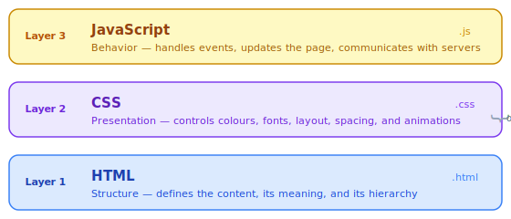

# Core Technologies: HTML, CSS & JavaScript

> **Lesson Summary:** Every web page is assembled from exactly three technologies, each with a distinct and non-overlapping job. This lesson introduces their roles — what each one *is* and *why* all three are needed — without syntax. Think of this as meeting three colleagues before learning what they can do.


## The Three Layers of a Web Page

A web page is not a single thing. It is three technologies layered on top of each other, each responsible for a different dimension of the experience.



| Technology | Job | File type |
| :--- | :--- | :--- |
| **HTML** | Structure — what content exists and what it means | `.html` |
| **CSS** | Presentation — how that content looks | `.css` |
| **JavaScript** | Behavior — how the page responds to interaction | `.js` |

The key insight: these are **separate concerns**. HTML does not decide how anything looks. CSS does not create content. JavaScript does not define structure. Each does one job.

## HTML — Structure

**HTML** (HyperText Markup Language) defines the content of a page and its meaning.

It does this through **elements** — pieces of content wrapped in descriptive tags:

```html
<h1>Getting Started</h1>
<p>This is the first paragraph.</p>
<button>Click me</button>
```

The tags are not displayed to the user. They are **meaning** — they tell the browser (and search engines, and screen readers) what kind of thing each piece of content is. `<h1>` means "this is the most important heading on the page." `<p>` means "this is a paragraph." `<button>` means "this is an interactive control."

HTML produces a page with raw, unstyled, functional content. No colours. No layout. Just content.

### Under the Hood: The DOM

When the browser reads an HTML file, it does not keep it as raw text. It builds a tree structure from it — a hierarchy of objects called the **DOM** (Document Object Model).

```
Document
└── html
    ├── head
    │   └── title
    └── body
        ├── h1 — "Getting Started"
        ├── p  — "This is the first paragraph."
        └── button — "Click me"
```

Every element becomes a **node** in this tree. Parent elements wrap child elements. The DOM is the browser's living, in-memory representation of the page — and it is what CSS and JavaScript interact with, not the original HTML file.

> **💡 Tip:** The "HT" in HTML stands for **HyperText** — the linking mechanism the entire web is built on. Every `<a href="...">` element is a hypertext link. These concepts connect.

## CSS — Presentation

**CSS** (Cascading Style Sheets) controls how elements look. Without CSS, every web page is black text on a white background — structurally correct, visually indistinguishable.

CSS works by targeting HTML elements with **selectors** and applying **properties**:

```css
h1 {
  color: #1e40af;
  font-size: 2rem;
}

button {
  background-color: #3b82f6;
  padding: 8px 16px;
  border-radius: 6px;
}
```

CSS controls: colour, typography, spacing, layout, animation, responsive behaviour across screen sizes — everything visual.

> **⚠️ Warning:** CSS applies to the **DOM**, not the HTML file. If JavaScript modifies the DOM (adds or removes elements), CSS rules immediately apply to the new state. This is why understanding the DOM is central to understanding how all three technologies interact.

## JavaScript — Behavior

**JavaScript** is a programming language that runs inside the browser. It makes pages dynamic — able to respond to user actions, update content without reloading, and communicate with servers.

Examples of what JavaScript does:
- Showing a dropdown menu when a button is clicked
- Validating a form before submission
- Fetching new data from an API and updating the page without a full refresh
- Animating elements in response to scrolling

JavaScript interacts with the page by reading and modifying the **DOM** — the same tree structure the browser built from the HTML. This is why learning JavaScript and learning the DOM are inseparable.

```js
// When the button is clicked, change the heading text
button.addEventListener('click', () => {
  document.querySelector('h1').textContent = 'You clicked me!';
});
```

## Separation of Concerns

The three languages are always kept in separate files by convention — `.html`, `.css`, `.js`. This principle is called **separation of concerns**.

**Why it matters:**
- A designer can change the entire visual appearance of a page by editing only the CSS — without touching the HTML or JavaScript.
- A developer can add new functionality in JavaScript without changing the structure or styles.
- A content editor can update HTML content without understanding the styling or scripting.

> **⚠️ Warning:** It is *possible* to write CSS and JavaScript directly inside an HTML file (using `<style>` and `<script>` tags). This works and is fine for small experiments. In any real project, keeping them in separate files is standard practice and significantly improves maintainability.

## Key Takeaways

- A web page is three technologies: **HTML** (structure), **CSS** (presentation), **JavaScript** (behavior).
- HTML defines what content exists and what it **means** via elements and tags.
- CSS controls everything **visual** — colour, layout, typography, animation.
- JavaScript makes pages **dynamic** — it responds to events and modifies the DOM.
- The browser converts HTML into a **DOM** tree; CSS and JavaScript both operate on the DOM, not the raw text file.
- Keeping the three in separate files is called **separation of concerns** — a core professional practice.

## Research Questions

> **🔬 Research Question:** CSS has a feature called the "cascade" — it's literally in the name. What does the cascade mean? When two CSS rules target the same element, how does the browser decide which one wins?
>
> *Hint: Search for "CSS specificity" and "CSS cascade order."*

> **🔬 Research Question:** JavaScript was originally designed to run only in browsers. How does Node.js allow JavaScript to run on a server? What did this change about web development?
>
> *Hint: Search for "Node.js V8 engine" and "JavaScript runtime."*
