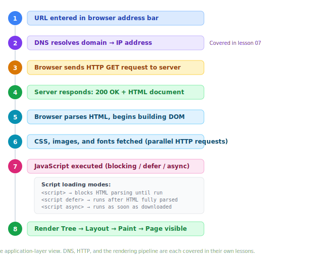

# How a Page Loads

> **Lesson Summary:** This is the capstone for the Web Foundations unit. Everything covered in previous lessons — DNS, HTTP, servers, browsers, URLs, and core technologies — converges here. By the end, you will have a complete mental model of what happens between typing a URL and seeing a page, and why each step matters to developers.

## The Full Journey

When you type a URL and press Enter, it feels instantaneous. Under the hood, your browser orchestrates a precise sequence of steps across multiple systems.



Let's walk through each step.

## Step 1 — URL Entered

You type `https://example.com/about` into the address bar and press Enter.

The browser immediately parses the URL, extracting:
- **Protocol**: `https` — use encrypted HTTP
- **Host**: `example.com` — this is who we are talking to
- **Path**: `/about` — this is what we are asking for

## Step 2 — DNS Resolution

The browser does not know the IP address of `example.com`. It needs to resolve the domain first.

It checks, in order:
1. Its own DNS cache
2. The operating system's DNS cache
3. The recursive resolver (your ISP or `8.8.8.8`)

If uncached, the resolver walks the DNS hierarchy (root → TLD → authoritative) and returns the IP address. The browser caches it.

→ *This is covered in depth in [Lesson 07: DNS](./07_dns.md).*

## Step 3 — HTTP Request

With an IP address in hand, the browser opens a connection to the server on port `443` (HTTPS) and sends an HTTP GET request:

```
GET /about HTTP/1.1
Host: example.com
Accept: text/html
User-Agent: Mozilla/5.0 ...
```

→ *This is covered in depth in [Lesson 06: HTTP](./06_http.md).*

## Step 4 — Server Responds

The server receives the request and decides how to respond. At this step, **two entirely different things can happen**, depending on the type of server:

### Static Server

The server maps `/about` directly to a file on disk — `about.html` — and sends it back:

```
HTTP/1.1 200 OK
Content-Type: text/html

<!DOCTYPE html>
<html>...
```

No processing involved. The file goes out as-is. This is fast and highly cacheable.

### Dynamic Server (Server-Side Rendering)

The server maps `/about` to application code. The code runs, queries a database, builds an HTML string, and sends it back. The response looks identical to a static response, but the HTML was assembled at request time.

**Server-Side Rendering (SSR)** describes any arrangement where the server assembles the final HTML *before* sending it. The browser receives a complete document and can display it immediately.

## Step 5 — Parsing HTML, Building the DOM

The browser receives the HTML and begins **parsing** it from top to bottom — converting the text into the **DOM tree** it can work with.

```html
<html>
  <head>
    <link rel="stylesheet" href="/styles.css">
  </head>
  <body>
    <h1>About Us</h1>
    <p>We build things.</p>
    <script src="/app.js"></script>
  </body>
</html>
```

As the parser reads this, it builds:
```
Document
└── html
    ├── head
    │   └── link (stylesheet)
    └── body
        ├── h1
        ├── p
        └── script
```

The DOM is now a live, in-memory tree — not a text file.

## Step 6 — Sub-Resources Fetched

As the parser encounters references to external files, it dispatches **additional HTTP requests** for each one:

- `<link href="/styles.css">` → fetches the CSS file
- `` → fetches the image
- `<script src="/app.js">` → fetches the JavaScript file

Many of these requests happen **in parallel** — the browser does not wait for one to finish before starting the next.

While fetching CSS, the browser also parses it and builds the **CSSOM** (CSS Object Model) — the style equivalent of the DOM. Both trees must exist before the page can be rendered.

## Step 7 — JavaScript Execution

When the parser encounters a `<script>` tag, what happens depends on *how* the script tag is written:

### Default (Blocking)

```html
<script src="/app.js"></script>
```

The browser **pauses HTML parsing**, downloads the script, and executes it immediately. Nothing else happens until the script is done. This is why scripts placed at the top of a document can make pages load slowly — they block everything below them.

### `defer`

```html
<script src="/app.js" defer></script>
```

The browser downloads the script **in parallel** with HTML parsing, but only executes it after the DOM is fully built. Multiple `defer` scripts run in order.

**Best practice for most scripts** — use `defer` and place the script in `<head>`.

### `async`

```html
<script src="/app.js" async></script>
```

The browser downloads the script in parallel and executes it **as soon as it is downloaded**, regardless of where the parser is. If the script finishes downloading before the DOM is built, parsing will be interrupted.

Use `async` for scripts that are completely independent — analytics, ad scripts — where order does not matter.

| Attribute | Download | Execution | Preserves order |
| :--- | :--- | :--- | :--- |
| *(none)* | Blocks parsing | Immediately | Yes |
| `defer` | Parallel | After DOM built | Yes |
| `async` | Parallel | As soon as ready | No |

## Step 8 — Render Tree, Layout, Paint

With the DOM and CSSOM both built, the browser can produce the final page.

1. **Render Tree** — the DOM and CSSOM are combined into a render tree containing only the nodes that will be drawn (hidden elements are excluded).
2. **Layout** — the browser calculates the exact size and position of every visible node on screen.
3. **Paint** — pixels are drawn. Text, colours, borders, shadows — everything gets painted to the screen.

→ *This is covered in depth in [Lesson 03: Web Browsers](./03_web_browsers.md).*

The page is now visible to the user.

## Client-Side Rendering (CSR)

There is a second model that does not fully fit the flow above.

In **Client-Side Rendering**, the server returns a minimal HTML shell — often just `<div id="root"></div>` — then sends a large JavaScript bundle. The JavaScript runs in the browser and builds the entire DOM from scratch.

```html
<!-- What the server sends -->
<!DOCTYPE html>
<html>
  <head><title>My App</title></head>
  <body>
    <div id="root"></div>
    <script src="/bundle.js"></script>
  </body>
</html>
```

After the JavaScript runs, the `<div id="root">` is populated with the full page structure.

| | SSR | CSR |
| :--- | :--- | :--- |
| **HTML assembled by** | Server | Browser (JavaScript) |
| **Time to first meaningful content** | Faster | Slower (waits for JS) |
| **SEO** | Good (crawler sees full content) | Challenging (crawler may miss JS-rendered content) |
| **Subsequent navigation** | Full page reload (or server fetch) | Instant (JS handles it) |
| **Used by** | Traditional web apps, blogs, e-commerce | React/Vue/Angular SPAs |

Modern frameworks like **Next.js** and **Nuxt.js** blend both approaches — SSR for the first load, CSR for subsequent navigation.

## Key Takeaways

- Every page load follows the same fundamental sequence: **URL → DNS → HTTP request → response → parse → fetch sub-resources → execute scripts → render**.
- **SSR** means the server assembles the HTML; **CSR** means the browser's JavaScript does.
- The browser builds two trees: the **DOM** (from HTML) and the **CSSOM** (from CSS). Both are required to render.
- Script loading mode (`defer`, `async`, or default) determines *when* JavaScript runs relative to HTML parsing. **`defer` is the best practice for most scripts**.
- The final render pipeline is: **Render Tree → Layout → Paint**.

## Unit Challenge

> **🏆 Challenge:** Open a website — any website. Open DevTools (F12) → Network tab. Reload the page.
>
> 1. Find the very first request in the list. What is its status code? What file does it return?
> 2. How many total requests were made to load the full page?
> 3. Click on the first request and look at the Response Headers. Identify: `Content-Type`, `Content-Length`, and any caching headers.
> 4. Now click the "Initiator" tab for one of the CSS or JS requests. Where in the code triggered that request?
>
> *You have just traced a real-world page load, step by step.*

## Research Questions

> **🔬 Research Question:** What is the **Critical Rendering Path**? How can understanding it help a developer make pages load faster?
>
> *Hint: Search for "critical rendering path web.dev" for Google's authoritative explanation.*

> **🔬 Research Question:** What is **reflow** and **repaint**? If JavaScript modifies the DOM after the initial render, what triggers a reflow vs a repaint, and why does it matter for performance?
>
> *Hint: Search for "browser reflow repaint performance."*
