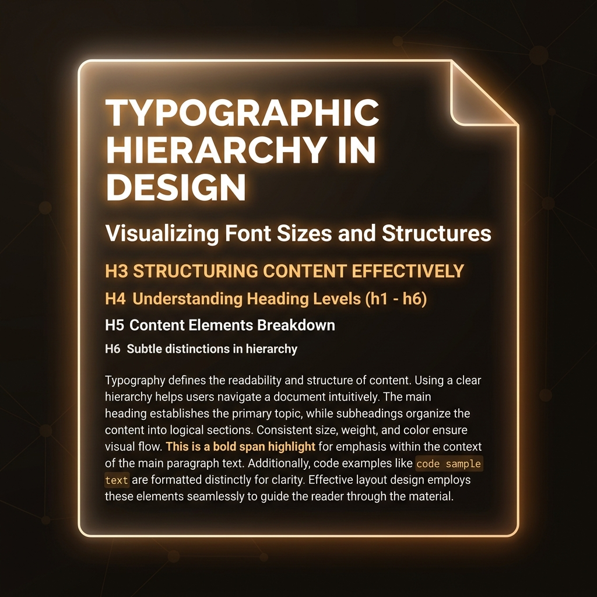

# Text Elements

> **Lesson Summary:** Most of what ends up on a web page is text. HTML provides a rich set of elements for marking up that text — not to control how it looks, but to communicate what it *means*. A heading is not large text; it is a statement about document structure. A `<strong>` tag is not bold text; it is a declaration of importance. Getting this distinction right is the foundation of semantic HTML.



## The Semantic Principle

Before introducing any specific element: understand the rule that governs all of them.

**HTML elements do not describe appearance. They describe meaning.**

A `<h1>` does not mean "make this text large and bold." It means "this is the most important heading on the page." Browsers happen to render it large and bold by default — but that default can be overridden entirely with CSS. The *meaning* cannot be overridden. The meaning is baked in.

This distinction matters because:
- Search engines use headings to understand page structure and topic hierarchy
- Screen readers announce headings to let users navigate the page by structure
- CSS relies on semantic elements to style things consistently

---

## Headings

HTML has **six heading levels**: `<h1>` through `<h6>`.

```html
<h1>Main Page Title</h1>
<h2>Section Heading</h2>
<h3>Subsection Heading</h3>
<h4>Sub-subsection</h4>
<h5>Rarely needed</h5>
<h6>Almost never needed</h6>
```

### The rules of headings

| Rule | Reason |
| :--- | :--- |
| **One `<h1>` per page** | It declares the page's primary topic — there can only be one. Search engines and screen readers treat it as the page title. |
| **Don't skip levels** | Going from `<h1>` to `<h3>` breaks the document outline and confuses screen reader navigation. |
| **Don't choose headings for size** | Use CSS to control size. Choose heading level based on your content's hierarchy. |

> **⚠️ Warning:** Using `<h3>` because you want medium-sized text is a semantic error. Pick the correct level for the content's position in the outline; then use CSS to make it look however you want.

---

## Paragraphs

`<p>` marks a block of text as a **paragraph** — a distinct unit of prose:

```html
<p>The browser parses HTML into the DOM. CSS is applied to the DOM. JavaScript modifies the DOM. All three technologies interact with the same underlying object model.</p>

<p>This is a second, separate paragraph. Each <p> creates its own block in the document flow.</p>
```

`<p>` is a **block element** — it starts on a new line and occupies the full width available by default. Two adjacent `<p>` elements render with space between them.

> **💡 Tip:** Never put block elements (`<h1>`, another `<p>`, `<div>`) inside a `<p>`. The HTML parser will close the `<p>` automatically — and the result will not be what you intended.

---

## Inline Text Elements

These elements wrap portions of text *within* a paragraph or heading without creating a new line.

### `<strong>` — Strong Importance

```html
<p>Never omit the <strong>alt attribute</strong> on images.</p>
```

Marks content as having **strong importance**. Screen readers may announce it with emphasis. Not to be confused with "make it bold" — that is CSS's job. `<strong>` conveys that the content is critically important.

### `<em>` — Emphasis

```html
<p>The DOM is <em>not</em> the HTML file.</p>
```

Marks content as **stressed emphasis** — a shift in meaning. Like italics in prose. Screen readers may alter their intonation. Again, the visual rendering is a side effect of the meaning.

### `<code>` — Inline Code

```html
<p>Use <code>console.log()</code> to debug in the browser.</p>
```

Marks content as a **fragment of computer code**. Browsers render it in a monospace font by default.

### `<kbd>` — Keyboard Input

```html
<p>Press <kbd>Ctrl</kbd> + <kbd>S</kbd> to save.</p>
```

Marks text as **keyboard input** — keys the user should press. Semantically distinct from `<code>`.

### `<mark>` — Highlighted Text

```html
<p>The key concept is <mark>separation of concerns</mark>.</p>
```

Marks text as **relevant or highlighted** — as if highlighted with a yellow marker. Commonly used to show search result matches.

### `<small>` — Side Comments

```html
<p><small>© 2025 My Site. All rights reserved.</small></p>
```

Marks **fine print, legal text, or side comments** — content that is secondary to the main text.

---

## Block Quotations

### `<blockquote>` — Extended Quotation

```html
<blockquote cite="https://www.w3.org/TR/html52/">
  <p>The Web's markup language, HTML, has always exposed you to the document object model.</p>
</blockquote>
```

Marks a **quotation from an external source**. The `cite` attribute holds the URL of the source (not displayed, but meaningful to tools). Inside a `<blockquote>`, use `<p>` for each paragraph of the quote.

> **⚠️ Warning:** Do not use `<blockquote>` to indent text. Use CSS for visual indentation. `<blockquote>` means "this content is quoted from somewhere else."

---

## Preformatted Text

### `<pre>` — Preformatted

```html
<pre>
  This text
    preserves
      its whitespace.
</pre>
```

Displays text with **whitespace preserved** — spaces and line breaks are rendered as-is. Used for ASCII art, code output, or any content where whitespace is significant.

For code blocks specifically, the convention is to combine them:

```html
<pre><code>
function greet(name) {
  return `Hello, ${name}!`;
}
</code></pre>
```

`<pre>` handles the whitespace preservation; `<code>` marks the content as code. Use both together.

---

## Line Break and Horizontal Rule

### `<br />` — Line Break

```html
<p>221B Baker Street<br />London<br />NW1 6XE</p>
```

Inserts a **single line break** within text. Not a paragraph separator — for that, use separate `<p>` elements. Use `<br />` for content where line breaks are *part of the content* (addresses, poetry).

> **⚠️ Warning:** Never use multiple `<br />` tags to add vertical space between elements. That is CSS's job. `<br />` for spacing is a semantic error.

### `<hr />` — Thematic Break

```html
<p>Section one content.</p>
<hr />
<p>Section two content — a thematic shift.</p>
```

Represents a **thematic break** between paragraphs — a shift in topic. Not "draw a horizontal line" — that's CSS. `<hr />` means "the topic is changing here."

---

## Key Takeaways

- HTML text elements communicate **meaning**, not appearance. Visual rendering is CSS's responsibility.
- Use exactly **one `<h1>`** per page; don't skip heading levels.
- `<strong>` = important; `<em>` = stressed; `<code>` = code; they are *not* shorthand for "bold", "italic", "monospace."
- `<blockquote>` is for quotations; `<pre>` preserves whitespace; `<br />` is for meaningful line breaks only.
- `<hr />` marks a thematic break — not a visual line.

## Research Questions

> **🔬 Research Question:** HTML used to have elements like `<b>`, `<i>`, and `<u>`. These still exist in HTML5 — but their *meaning* was changed. What do `<b>`, `<i>`, and `<u>` mean in modern HTML5? How do they differ semantically from `<strong>`, `<em>`, and text-decoration CSS?
>
> *Hint: Search "HTML5 b vs strong MDN" and "HTML presentational elements".*

> **🔬 Research Question:** What is the "document outline algorithm"? Browsers once supported a heading outline that allowed `<h1>` inside `<article>` to reset the heading hierarchy. What happened to that proposal?
>
> *Hint: Search "HTML5 document outline algorithm deprecated".*
