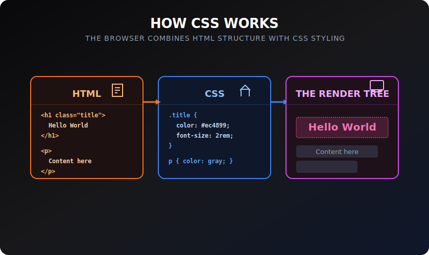

# How CSS Works

> **Lesson Summary:** CSS does not act directly on the HTML file — it acts on the DOM. Understanding how a browser processes a stylesheet, and the three different ways to attach CSS to a document, is the first step to writing CSS that behaves predictably.



## The Browser's CSS Pipeline

When a browser loads a page containing CSS, this is what happens:

1. **HTML is parsed** into the DOM tree (as you learned in the HTML unit)
2. **CSS is fetched** — the browser downloads linked stylesheets, parses `<style>` blocks, and reads `style` attributes
3. **CSSOM is built** — the browser parses all CSS into a parallel tree: the CSS Object Model
4. **Render tree is created** — DOM + CSSOM are combined; each visible node gets its computed styles
5. **Layout** — the browser calculates positions and sizes for every box
6. **Paint** — pixels are drawn to screen

CSS acts on the **DOM**, not the raw HTML file. If JavaScript creates a new element dynamically, CSS rules apply to it immediately — because the DOM changed, and the render tree is always derived from the current DOM.

---

## Three Ways to Apply CSS

### 1. External Stylesheet (always preferred)

A separate `.css` file linked from `<head>`:

```html
<link rel="stylesheet" href="styles.css" />
```

```css
/* styles.css */
h1 {
  color: #1e40af;
}
```

**Why it's preferred:**
- One file styles every page of the site — change once, update everywhere
- Browser caches the stylesheet — subsequent page loads are faster
- Keeps HTML clean (separation of concerns)

### 2. Internal Stylesheet (useful for single-page demos)

CSS in a `<style>` block inside `<head>`:

```html
<head>
  <style>
    h1 {
      color: #1e40af;
    }
  </style>
</head>
```

**When to use:** Single-page prototypes or when embedding standalone HTML that cannot reference external files.

**Downsides:** Cannot be shared across pages; not cached separately; pollutes the HTML.

### 3. Inline Styles (last resort)

A `style` attribute on a specific element:

```html
<h1 style="color: #1e40af; font-size: 2rem;">Page Title</h1>
```

**When inline styles are legitimate:**
- Dynamic styles set by JavaScript (e.g., `element.style.left = pos + 'px'`)
- Email HTML (email clients strip external stylesheets)
- Critical above-the-fold styles in performance-optimised sites

**Why inline styles are otherwise a problem:**
- They have the highest specificity — they override everything else, making bugs very hard to debug
- They cannot be shared or reused
- They tightly couple appearance to HTML structure

> **⚠️ Warning:** Never use inline styles as a general styling strategy. If you find yourself writing `style="..."` on every element, stop and write a CSS rule instead.

---

## The `<link>` Element in Detail

```html
<link rel="stylesheet" href="styles.css" />
```

| Attribute | Value | Purpose |
| :--- | :--- | :--- |
| `rel` | `stylesheet` | Declares the relationship between the document and the linked file |
| `href` | path to `.css` | The URL of the stylesheet — relative or absolute |
| `media` | `print`, `screen` | Optional — applies stylesheet only for certain media |

Multiple stylesheets can be linked — the browser loads them all:

```html
<link rel="stylesheet" href="reset.css" />
<link rel="stylesheet" href="layout.css" />
<link rel="stylesheet" href="theme.css" />
```

They are applied in order — declarations in `theme.css` can override declarations in `reset.css` for the same rule.

---

## Render-Blocking

Stylesheets are **render-blocking** by default: the browser will not paint the page until all linked stylesheets have been downloaded and parsed. This is intentional — painting unstyled content first and then re-painting with styles produces a flash of unstyled content (FOUC).

> **💡 Tip:** For large sites, the performance implication of render-blocking stylesheets is real. Techniques like critical CSS inlining, `media` attribute splitting, and HTTP/2 push exist to address it — but they are advanced topics. For now: link your stylesheet in `<head>`, keep it lean, and ship it quickly.

---

## Key Takeaways

- CSS acts on the **DOM** — not the raw HTML file.
- The browser builds a **CSSOM** from CSS, then combines it with the DOM to create the render tree.
- Three ways to apply CSS: **external** (preferred), **internal** (demos), **inline** (last resort or dynamic JS).
- External stylesheets are linked with `<link rel="stylesheet" href="…">` in `<head>`.
- Stylesheets are **render-blocking** — the browser waits for them before painting.

## Research Questions

> **🔬 Research Question:** What is "critical CSS"? How do some sites inline it directly in `<head>` to improve perceived performance, and what does "above the fold" mean in this context?
>
> *Hint: Search "critical CSS extraction inline performance" and "above the fold rendering".*

> **🔬 Research Question:** CSS has a `@import` rule that lets one stylesheet import another. Why is `@import` considered a performance anti-pattern compared to multiple `<link>` elements?
>
> *Hint: Search "CSS @import vs link performance" and "render-blocking CSS requests".*
