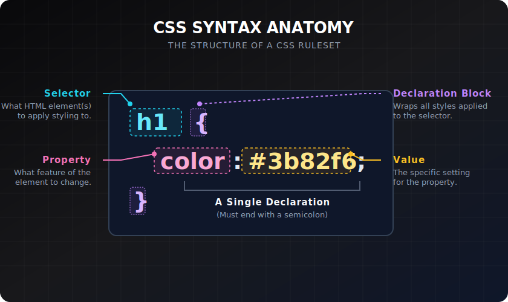

# Syntax & Rules

> **Lesson Summary:** A CSS file is a sequence of rules. Each rule has a selector and a block of declarations. Getting this anatomy right — and understanding shorthands, comments, and common value types — is the prerequisite for everything else in CSS.



## The CSS Rule

Every CSS rule has two parts:

```css
selector {
  property: value;
  property: value;
}
```

- **Selector** — which HTML elements this rule targets
- **Declaration block** — curly braces `{}` containing one or more declarations
- **Declaration** — a `property: value` pair ending with a semicolon `;`

```css
/* A single rule */
p {
  color: #1a1a1a;
  font-size: 1rem;
  line-height: 1.7;
}
```

This rule targets every `<p>` element and sets three properties.

---

## Properties and Values

**Properties** are predefined identifiers — there are hundreds of them. Some examples:

| Property | Controls |
| :--- | :--- |
| `color` | Text colour |
| `background-color` | Background colour |
| `font-size` | Text size |
| `margin` | Space outside the element |
| `padding` | Space inside the element |
| `border` | Element border |
| `width` / `height` | Element dimensions |
| `display` | How the element participates in layout |

**Values** depend on the property:

```css
p {
  color: #ff6b6b;           /* hex colour */
  color: rgb(255, 107, 107); /* RGB colour */
  color: hsl(0, 100%, 71%); /* HSL colour */
  color: red;               /* named colour (limited, avoid in production) */

  font-size: 16px;          /* pixels */
  font-size: 1rem;          /* relative to root font size */
  font-size: 1.25em;        /* relative to parent font size */

  width: 300px;             /* fixed width */
  width: 50%;               /* percentage of parent */
  width: 20rem;             /* rem units */
}
```

> **⚠️ Warning:** An invalid property name or value does not cause an error — the browser silently ignores the entire declaration. If a style isn't applying, check for typos in the property name or an unsupported value.

---

## Multiple Selectors

Apply the same rule to multiple selectors by separating them with commas:

```css
h1,
h2,
h3 {
  font-weight: 700;
  color: #1a1a1a;
}
```

---

## Shorthand Properties

Many properties have **shorthand** forms that set multiple related properties at once:

```css
/* Longhand — four separate declarations */
margin-top: 1rem;
margin-right: 2rem;
margin-bottom: 1rem;
margin-left: 2rem;

/* Shorthand — one declaration: top right bottom left (clockwise) */
margin: 1rem 2rem 1rem 2rem;

/* Two values: vertical horizontal */
margin: 1rem 2rem;

/* One value: all four sides */
margin: 1rem;
```

The same pattern applies to `padding`, `border`, `background`, `font`, and more:

```css
/* border shorthand: width style color */
border: 1px solid #d1d5db;

/* font shorthand: style weight size/line-height family */
font: normal 700 1rem/1.5 'Inter', sans-serif;

/* background shorthand */
background: #1e293b url('bg.png') no-repeat center / cover;
```

> **💡 Tip:** Shorthands reset any sub-properties you don't specify to their defaults. `margin: 1rem 2rem` sets top/bottom to `1rem` and left/right to `2rem`, but it also resets all four if you previously set `margin-top` individually. Be careful with order of declarations.

---

## The `!important` Flag

```css
p {
  color: red !important;
}
```

`!important` overrides any specificity calculation and forces the declaration to win. It is almost always the wrong tool — it makes CSS hard to debug and override.

> **⚠️ Warning:** `!important` is not a solution to a specificity problem. It is a sign that you don't understand why a rule isn't applying. Fix the selector instead. Use `!important` only for overriding third-party styles you cannot change, or for utility classes that must always apply (e.g., `.visually-hidden`).

---

## CSS Comments

```css
/* This is a comment — the browser ignores everything inside */

/* 
  Multi-line comment.
  Use these to section your stylesheet.
*/

h1 {
  color: #1a1a1a; /* dark text for contrast */
}
```

---

## Common Value Types Reference

| Type | Examples | Used for |
| :--- | :--- | :--- |
| `<length>` | `16px`, `1rem`, `2em`, `50%` | Sizes, spacing |
| `<color>` | `#fff`, `rgb(0,0,0)`, `hsl(200,80%,50%)` | Text, backgrounds, borders |
| `<string>` | `'Inter'`, `"bold"` | Font names, content values |
| `<keyword>` | `block`, `flex`, `bold`, `none` | Most properties |
| `<number>` | `1.5`, `0`, `700` | Line-height, opacity, font-weight |
| `<url>` | `url('bg.png')` | Images, fonts |

---

## Key Takeaways

- A CSS rule = **selector** + **declaration block** (property–value pairs).
- Invalid properties or values are silently ignored — typos cause invisible failures.
- Comma-separate selectors to share one rule across multiple element types.
- Shorthand properties set multiple sub-properties at once; unsupplied sub-properties reset to default.
- `!important` is almost always the wrong tool — fix the selector instead.

## Research Questions

> **🔬 Research Question:** CSS has a property called `all`. What does it do, and what values can it take? When would resetting all properties on an element be useful?
>
> *Hint: Search "CSS all property MDN" and "CSS initial inherit unset revert".*

> **🔬 Research Question:** What is a CSS preprocessor (Sass, Less)? What features do they add on top of vanilla CSS, and do modern CSS features (custom properties, nesting) reduce the need for them?
>
> *Hint: Search "CSS Sass vs native CSS features 2024" and "CSS nesting @layer".*
