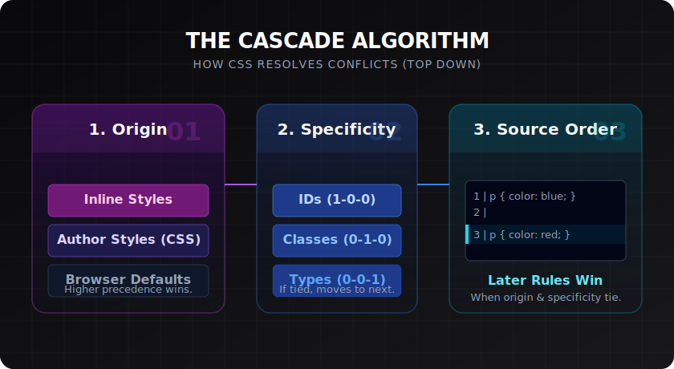

# The Cascade & Inheritance

> **Lesson Summary:** CSS stands for *Cascading* Style Sheets — the cascade is the algorithm that decides which rule wins when two rules could both apply to the same element. Inheritance is the mechanism by which some properties automatically flow from parent to child. Together, these two systems explain most of the "why isn't this working?" moments in CSS.



## Why the Cascade Exists

Multiple CSS rules will frequently target the same element:

```css
/* From a reset stylesheet */
h1 { color: black; }

/* From a component stylesheet */
h1 { color: #1e40af; }

/* Inline on the element */
<h1 style="color: red;">Title</h1>
```

The browser must resolve this conflict. The **cascade** is the algorithm it uses. It evaluates rules in three stages, in order:

1. **Origin** — where did the rule come from?
2. **Specificity** — how precisely does the selector target the element?
3. **Order** — if origin and specificity tie, which rule came last?

---

## Stage 1 — Origin

CSS can come from three sources, ranked by **precedence**:

| Priority | Origin | Example |
| :--- | :--- | :--- |
| Highest | **Inline styles** (on the element) | `style="color: red"` |
| Middle | **Author styles** (your CSS files) | `<link rel="stylesheet" …>` |
| Lowest | **User-agent styles** (browser defaults) | `h1` is bold and large by default |

This is why browsers render `<h1>` as large and bold even with no CSS — the browser has its own default stylesheet. Your author styles override it. Inline styles override your author styles.

> **⚠️ Warning:** `!important` inverts this priority order — an `!important` user-agent rule beats a normal author rule. This is why `!important` cascades are so difficult to reason about. Avoid breaking the natural hierarchy.

---

## Stage 2 — Specificity

When two author-stylesheet rules target the same element, **specificity** decides the winner. Specificity is calculated as a three-part score — think of it as three columns: **(ID, Class, Type)**.

| Selector | IDs | Classes | Types | Score |
| :--- | :---: | :---: | :---: | :---: |
| `p` | 0 | 0 | 1 | 0-0-1 |
| `.intro` | 0 | 1 | 0 | 0-1-0 |
| `p.intro` | 0 | 1 | 1 | 0-1-1 |
| `#hero` | 1 | 0 | 0 | 1-0-0 |
| `#hero p.intro` | 1 | 1 | 1 | 1-1-1 |

The selector with the **higher score wins**, regardless of order:

```css
.intro { color: blue; }   /* 0-1-0 */
p { color: red; }          /* 0-0-1 */
```

A `<p class="intro">` gets `color: blue` — `.intro` has higher specificity than `p`, even though `p` comes second.

### What contributes to specificity?

- **Type selectors** (`p`, `h1`, `div`) — score: 0-0-1 each
- **Class selectors** (`.intro`), **attribute selectors** (`[type="text"]`), **pseudo-classes** (`:hover`) — score: 0-1-0 each
- **ID selectors** (`#hero`) — score: 1-0-0 each
- **Inline styles** — beat all selector-based specificity
- **`!important`** — overrides everything (and should be avoided)

> **💡 Tip:** The pseudo-class `:is()`, `:not()`, and `:has()` take the specificity of their highest-specificity argument. `:where()` always has zero specificity — useful for writing overridable utility styles.

---

## Stage 3 — Order (Source Order)

When origin and specificity are equal, the **last rule wins**:

```css
p { color: blue; }
p { color: red; }
/* Result: red — it comes later */
```

This is why stylesheet order matters when linking multiple files:

```html
<link rel="stylesheet" href="base.css" />
<link rel="stylesheet" href="theme.css" />
<!-- theme.css declarations override base.css for equal-specificity rules -->
```

---

## Inheritance

Some CSS properties are **inherited** — if you set them on a parent element, all descendants receive the same computed value automatically.

Inherited properties are mostly **typographic**:

```css
body {
  font-family: 'Inter', sans-serif;
  font-size: 1rem;
  line-height: 1.7;
  color: #1a1a1a;
}

/* Every <p>, <h1>, <li>, <span>, etc. inherits these values */
/* unless overridden by a more specific rule */
```

**Non-inherited properties** must be set explicitly on each element. Mostly layout and box properties:

| Inherited (by default) | Not inherited (by default) |
| :--- | :--- |
| `color` | `background-color` |
| `font-*` | `border` |
| `line-height` | `margin`, `padding` |
| `text-align` | `width`, `height` |
| `visibility` | `display` |

### Inheritance keywords

Any property can be forced to inherit or reset:

```css
.card {
  color: inherit;     /* Force inherit from parent even if not normally inherited */
  border: inherit;    /* Force inherit a non-inherited property */
  margin: initial;    /* Reset to the property's initial (spec) default */
  padding: unset;     /* Inherit if normally inheritable; initial otherwise */
}
```

---

## Computed Values

When the browser resolves all cascade and inheritance calculations, the final value used for rendering is the **computed value**. You can inspect it in DevTools:

1. Open DevTools → **Elements** panel
2. Click any element
3. Switch to the **Computed** tab

You'll see every CSS property and its resolved value, with an indicator showing which rule won and why. This is your primary debugging tool for cascade problems.

---

## Key Takeaways

- The cascade resolves conflicts in three stages: **origin** → **specificity** → **source order**.
- **Inline styles** > author styles > browser defaults.
- Specificity is a three-column score: **(ID, Class, Type)**. Higher wins.
- When specificity ties, **later rules win**.
- **Inherited properties** (mostly typographic) flow from parent to child automatically.
- **Non-inherited properties** (mostly box/layout) must be set explicitly.
- Use DevTools → **Computed** tab to see which rule actually won on any element.

## Research Questions

> **🔬 Research Question:** What is `@layer` in CSS? How does it add a fourth stage to the cascade above origin/specificity/order, and why was it created?
>
> *Hint: Search "CSS @layer cascade layers MDN" and "CSS cascade layers specificity problem".*

> **🔬 Research Question:** What is "specificity hell" and how does a "low-specificity first" CSS architecture prevent it? Look up the BEM naming convention — how does it avoid specificity conflicts?
>
> *Hint: Search "CSS BEM methodology" and "CSS specificity scalability".*
