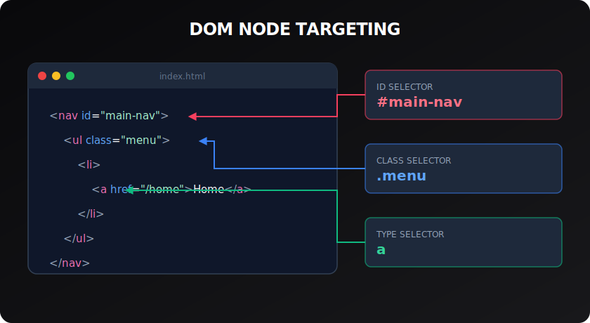

# Type, Class & ID Selectors

> **Lesson Summary:** The three fundamental selector types — type, class, and ID — cover the majority of daily CSS targeting. Getting their semantics right (not just their syntax) prevents specificity problems and keeps stylesheets maintainable.



## Type Selectors

A **type selector** targets all elements of a given HTML tag name:

```css
p    { line-height: 1.7; }
h1   { font-size: 2rem; }
a    { color: #3b82f6; }
img  { max-width: 100%; }
```

Type selectors are the lowest-specificity selectors. They are ideal for **global defaults** — if you want every `<p>` on the site to have a consistent line-height, a type selector is the correct tool.

**Use type selectors for:** Base/reset styles, global defaults, element-level formatting that should apply everywhere.

---

## Class Selectors

A **class selector** targets elements that have the given class name in their `class` attribute:

```css
.card        { border: 1px solid #e5e7eb; border-radius: 8px; }
.btn         { padding: 0.5rem 1.25rem; cursor: pointer; }
.btn-primary { background-color: #3b82f6; color: white; }
.visually-hidden { position: absolute; width: 1px; height: 1px; overflow: hidden; clip: rect(0,0,0,0); }
```

```html
<div class="card">…</div>
<button class="btn btn-primary">Submit</button>
```

**Multiple classes on one element** — space-separated in the `class` attribute. Each class selector in your CSS can independently target the element.

Class selectors are the **primary tool** in any real CSS architecture. They:
- Are reusable (many elements can share a class)
- Have a predictable, moderate specificity (0-1-0)
- Can be composed (`.btn.btn-primary` targets elements with both classes)

> **💡 Tip:** Name classes after what an element **is or does**, not how it looks. `.card-highlighted` is better than `.blue-border`. If you redesign and the border becomes red, `.blue-border` becomes actively misleading.

---

## ID Selectors

An **ID selector** targets the element with the given `id` attribute — which must be unique on the page:

```css
#main-nav     { position: sticky; top: 0; }
#skip-to-main { position: absolute; left: -9999px; }
```

```html
<nav id="main-nav">…</nav>
```

**When to use ID selectors in CSS:** Nearly never. IDs have very high specificity (1-0-0) — they are nearly impossible to override without resorting to `!important`. This makes stylesheets brittle.

**Valid non-CSS uses of `id`:**
- Fragment link targets (`<a href="#section">`)
- `for`/`aria-labelledby` associations
- JavaScript `document.getElementById()`

> **⚠️ Warning:** The high specificity of ID selectors is a trap. Once you style something with `#hero { color: blue }`, overriding it requires another ID selector or `!important`. Use classes instead.

---

## Attribute Selectors

Target elements based on the presence or value of an HTML attribute:

```css
/* Has the attribute */
[disabled] { opacity: 0.5; cursor: not-allowed; }

/* Attribute equals a value */
[type="email"] { border-color: #6366f1; }

/* Attribute contains a word */
[class~="btn"] { cursor: pointer; }

/* Attribute starts with */
[href^="https"] { /* external links */ }

/* Attribute ends with */
[href$=".pdf"]::after { content: " (PDF)"; }

/* Attribute contains substring */
[src*="cdn.example.com"] { /* CDN images */ }
```

Attribute selectors have class-level specificity (0-1-0).

---

## The Universal Selector

`*` matches every element on the page:

```css
/* Common in resets */
*, *::before, *::after {
  box-sizing: border-box;
}
```

Specificity: 0-0-0 (zero). Does not beat anything.

---

## Selector Specificity Summary

| Selector | Score |
| :--- | :--- |
| `*` | 0-0-0 |
| `p` | 0-0-1 |
| `[type="text"]` | 0-1-0 |
| `.card` | 0-1-0 |
| `#hero` | 1-0-0 |
| `style="…"` | beats all above |

---

## Key Takeaways

- **Type selectors** (`p`, `h1`) hit all matching elements — good for global defaults, low specificity.
- **Class selectors** (`.card`) are the primary tool — reusable, composable, moderate specificity.
- **ID selectors** (`#hero`) have very high specificity — avoid in CSS, use for fragment links and JS.
- **Attribute selectors** (`[type="email"]`) target by attribute presence or value — class-level specificity.
- **`*`** (universal selector) matches everything — used in resets, has zero specificity.

## Research Questions

> **🔬 Research Question:** The CSS `:is()` pseudo-class can be used in place of comma-separated selectors. What specificity does `:is(#hero, p)` have? How does this differ from `:where(#hero, p)`?
>
> *Hint: Search "CSS :is() :where() specificity MDN".*

> **🔬 Research Question:** What is a CSS "reset" and what is a CSS "normalize"? What problems do they each solve, and why do most modern projects start with one?
>
> *Hint: Search "CSS reset vs normalize difference" and "modern CSS reset 2024".*
