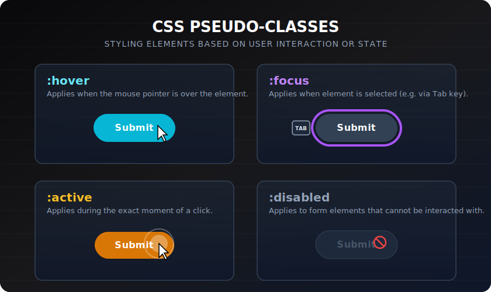

# Pseudo-classes

> **Lesson Summary:** Pseudo-classes let you style elements based on their *state* or *structural position* — without adding extra classes to the HTML. They are how you create hover effects, styled focus outlines, zebra-striped tables, and form validation feedback purely in CSS.



## What Is a Pseudo-class?

A pseudo-class is a keyword added to a selector with a colon `:`. It matches elements based on information that cannot be inferred from the HTML alone — their state, their position in the document, or their relationship to user interaction.

```css
a:hover   { color: #2563eb; }
a:visited { color: #7c3aed; }
```

Pseudo-classes have **class-level specificity** (0-1-0).

---

## User Interaction Pseudo-classes

```css
/* Mouse is hovering over the element */
button:hover {
  background-color: #2563eb;
}

/* Element has keyboard focus */
input:focus {
  outline: 2px solid #3b82f6;
  outline-offset: 2px;
}

/* Focus only via keyboard/sequential navigation (not mouse click) */
button:focus-visible {
  outline: 3px solid #f59e0b;
}

/* Element is being clicked or activated */
button:active {
  transform: scale(0.98);
}

/* Link has been visited */
a:visited {
  color: #7c3aed;
}
```

> **💡 Tip:** Use `:focus-visible` rather than `:focus` for custom focus styles. It applies the style only during keyboard navigation — not when a user clicks a button — which gives keyboard users useful feedback without creating a visible outline on every mouse click.

---

## Form State Pseudo-classes

```css
/* Input has a value that doesn't meet its constraints */
input:invalid { border-color: #ef4444; }

/* Input has a valid value */
input:valid { border-color: #22c55e; }

/* Input or fieldset is disabled */
input:disabled { opacity: 0.5; cursor: not-allowed; }

/* Checkbox or radio is checked */
input[type="checkbox"]:checked + label { font-weight: bold; }

/* Input that has been interacted with (CSS4 — growing support) */
input:user-invalid { border-color: #ef4444; }

/* Input that is required */
input:required { border-left: 3px solid #f59e0b; }

/* Input that is optional (no required attribute) */
input:optional { border-left: 3px solid #d1d5db; }

/* Placeholder shown (field is empty and not focused) */
input:placeholder-shown { background: #fafafa; }
```

---

## Structural / Position Pseudo-classes

These target elements based on their position within their parent:

```css
/* First child of its parent */
li:first-child { font-weight: bold; }

/* Last child of its parent */
li:last-child  { border-bottom: none; }

/* Only child */
li:only-child  { list-style: none; }

/* Nth child — takes a formula or keyword */
tr:nth-child(even) { background: #f9fafb; }  /* zebra stripes */
tr:nth-child(odd)  { background: #ffffff; }
li:nth-child(3)    { color: red; }            /* exactly the 3rd child */
li:nth-child(3n)   { color: red; }            /* every 3rd: 3, 6, 9… */
li:nth-child(3n+1) { color: blue; }           /* 1, 4, 7, 10… */

/* First/last of a specific type (ignores siblings of other types) */
p:first-of-type { font-size: 1.125rem; }
p:last-of-type  { margin-bottom: 0; }
```

### `nth-child` formula: `An+B`

| Formula | Matches |
| :--- | :--- |
| `2n` or `even` | Every even element |
| `2n+1` or `odd` | Every odd element |
| `3n` | Every third: 3, 6, 9… |
| `n+3` | All elements from the 3rd onward |
| `-n+3` | Only the first 3 |

---

## Negation and Logical Pseudo-classes

```css
/* Matches elements that do NOT match the given selector */
li:not(.active) { opacity: 0.7; }
input:not([type="submit"]):not([type="reset"]) { border: 1px solid #d1d5db; }

/* Matches if ANY of the selectors match (like a comma, but as a pseudo-class) */
:is(h1, h2, h3) { line-height: 1.2; }

/* Like :is() but contributes ZERO specificity */
:where(h1, h2, h3) { line-height: 1.2; }

/* Matches if the element CONTAINS a matching descendant */
.card:has(img) { padding: 0; }         /* card with an image — remove padding */
.form:has(input:invalid) { border-color: #ef4444; }  /* form with invalid input */
```

> **💡 Tip:** `:where()` is perfect for writing low-specificity base styles that are easy to override. `:is()` takes the highest specificity of its arguments and is better for writing targeting selectors.

---

## Key Takeaways

- Pseudo-classes style elements based on **state** (hover, focus, checked) or **structural position** (first-child, nth-child).
- All pseudo-classes have class-level specificity (0-1-0).
- Use `:focus-visible` for keyboard focus styles — not `:focus`.
- `:nth-child(An+B)` follows a formula — `even`, `odd`, `3n`, `n+4`, etc.
- `:not()`, `:is()`, `:where()`, `:has()` are powerful logical pseudo-classes.

## Research Questions

> **🔬 Research Question:** What is the difference between `:nth-child()` and `:nth-of-type()`? Write an example where they produce different results on the same HTML.
>
> *Hint: Search "CSS nth-child vs nth-of-type MDN".*

> **🔬 Research Question:** `:has()` is often called the "parent selector" CSS never had. What is its browser support status as of 2025, and what was the technical reason it took so long to implement?
>
> *Hint: Search "CSS :has() performance concerns browser implementation".*
