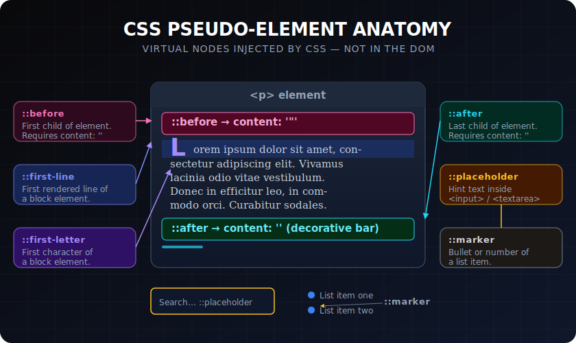

# Pseudo-elements

> **Lesson Summary:** Pseudo-elements target specific *parts* of an element — not the whole element, but a sub-part such as the first line, the first letter, the space before it, or the space after it. They are written with a double colon `::` and are the primary tool for inserting decorative content without touching HTML.



## Pseudo-elements vs. Pseudo-classes

| Concept | Notation | What it targets |
| :--- | :--- | :--- |
| Pseudo-class | `:hover` | The *state* of an element |
| Pseudo-element | `::before` | A *part* of an element |

Pseudo-classes use single colon `:`. Pseudo-elements use double colon `::`. (Single colon `::before` still works for legacy reasons — but `::` is correct.)

---

## `::before` and `::after`

The most important pseudo-elements. They create a **generated content node** — an inline element injected as the first or last child of the targeted element. They exist only in CSS, not in the DOM.

```css
/* Prepend a quote character before blockquotes */
blockquote::before {
  content: '\201C';  /* " — left double quotation mark */
  font-size: 4rem;
  color: #e5e7eb;
  display: block;
  line-height: 1;
}

/* Add a label after required inputs */
.required::after {
  content: ' *';
  color: #ef4444;
  font-weight: bold;
}

/* Decorative horizontal line */
h2::after {
  content: '';
  display: block;
  width: 3rem;
  height: 3px;
  background: #3b82f6;
  margin-top: 0.5rem;
}
```

**The `content` property is mandatory.** Without it, `::before` and `::after` generate nothing — even if all other styles are set. An empty string `content: ''` is valid and useful for decorative shapes.

> **⚠️ Warning:** Content added via `::before`/`::after` is **not in the DOM**. Screen readers may or may not announce it depending on browser and platform. Never use generated content for meaningful text that users must read — use it for decorative characters and shapes only.

---

## `::first-line`

Applies styles to the **first rendered line** of a block element — the exact amount of text that fits on the first line before wrapping:

```css
p::first-line {
  font-variant: small-caps;
  letter-spacing: 0.05em;
}
```

The selection is dynamic — the browser recalculates which text is on the "first line" if the window is resized. Only certain properties can be applied: `font-*`, `color`, `text-decoration`, `letter-spacing`, `word-spacing`.

---

## `::first-letter`

Applies styles to the **first letter** of a block element — classic drop capital effect:

```css
p::first-letter {
  float: left;
  font-size: 3.5rem;
  line-height: 1;
  margin-right: 0.1em;
  font-weight: bold;
  color: #1e40af;
}
```

---

## `::placeholder`

Styles the placeholder text of an `<input>` or `<textarea>`:

```css
input::placeholder {
  color: #9ca3af;
  font-style: italic;
}

input:focus::placeholder {
  opacity: 0;  /* Hide placeholder on focus */
}
```

> **⚠️ Warning:** Placeholder text frequently fails accessibility contrast requirements. Keep it light — it's supplementary hint text, not a label. And never rely on placeholder styling to indicate which field is which — that's `<label>`'s job.

---

## `::selection`

Styles the text currently selected by the user (click-and-drag):

```css
::selection {
  background-color: #bfdbfe;
  color: #1e3a8a;
}

p.code-sample::selection {
  background-color: #fef9c3;
}
```

---

## `::marker`

Styles the bullet or number of a list item:

```css
li::marker {
  color: #3b82f6;
  font-weight: bold;
  font-size: 1.25em;
}

ol li::marker {
  content: counter(list-item) ') ';
}
```

---

## Pseudo-element Specificity

Pseudo-elements have **type-level specificity** (0-0-1) — the same as a type selector:

```css
p::first-line { }  /* 0-0-2 (p = 0-0-1, ::first-line = 0-0-1) */
.intro::before { } /* 0-1-1 (.intro = 0-1-0, ::before = 0-0-1) */
```

---

## Key Takeaways

- Pseudo-elements use `::` (double colon) and target a *part* of an element, not the whole element.
- `::before` and `::after` inject generated content — require `content: ''` to render.
- Generated content is **not in the DOM** — use it for decoration only, not meaningful text.
- `::first-line` and `::first-letter` enable classic typographic effects.
- `::placeholder` styles input placeholder text — keep contrast accessible.
- `::selection` styles highlighted text; `::marker` styles list bullets and numbers.

## Research Questions

> **🔬 Research Question:** Can `::before` and `::after` be applied to replaced elements like `` and `<input>`? Why or why not?
>
> *Hint: Search "CSS ::before ::after replaced elements" and "void elements pseudo-elements".*

> **🔬 Research Question:** What are CSS Counters, and how do they work with `counter-reset`, `counter-increment`, and `content: counter()`? Build a mental model of how a `<ol>` auto-numbering works under the hood.
>
> *Hint: Search "CSS counters MDN" and "CSS counter-reset counter-increment".*
