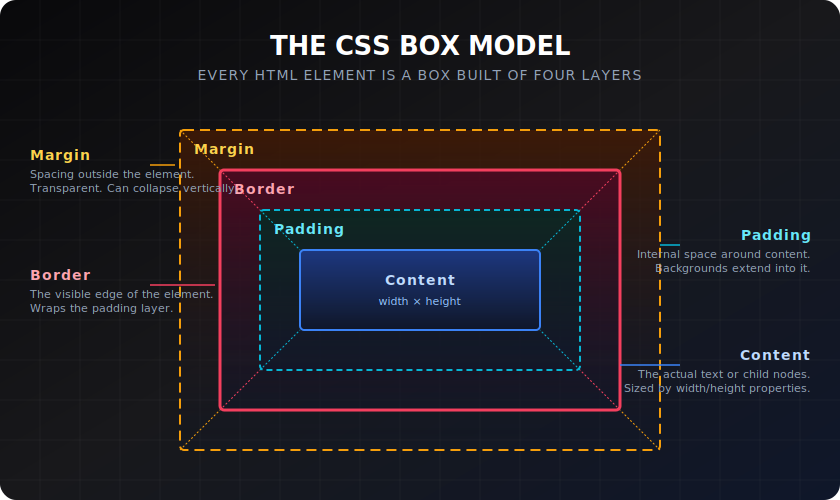

# Content, Padding, Border & Margin

> **Lesson Summary:** Every HTML element is rendered as a rectangular box with four layers of space stacked outward from the centre. These four layers — content, padding, border, and margin — interact to determine every element's size, its internal spacing, and the distance between it and surrounding elements.

Working from inside to outside — each layer wraps around the one inside it:




---

## Content

The **content area** is where text, images, or child elements live. Its dimensions are controlled by `width` and `height`:

```css
.box {
  width: 300px;
  height: 150px;
}
```

Without `box-sizing: border-box` (covered in the next lesson), this sets the content area dimensions — padding and border are *added on top*.

---

## Padding

**Padding** is space between the content and the border. It is inside the element — background colours and images extend into the padding area:

```css
/* All four sides */
padding: 1rem;

/* Vertical | Horizontal */
padding: 1rem 2rem;

/* Top | Right | Bottom | Left */
padding: 1rem 2rem 1.5rem 2rem;

/* Individual sides */
padding-top: 1rem;
padding-right: 2rem;
padding-bottom: 1.5rem;
padding-left: 2rem;
```

**Padding cannot be negative.** You cannot collapse internal space with negative padding.

---

## Border

**Border** is the visible line around the edge of the padding box. It has three sub-properties:

```css
border: 2px solid #1e40af;   /* shorthand: width style color */

/* Individual properties */
border-width: 2px;
border-style: solid;          /* solid | dashed | dotted | double | none */
border-color: #1e40af;

/* Per-side */
border-top: 1px solid #e5e7eb;
border-bottom: 2px solid #1e40af;
border-left: none;
border-right: none;

/* Border radius — rounds corners */
border-radius: 8px;           /* all corners */
border-radius: 4px 8px;      /* top-left/bottom-right | top-right/bottom-left */
border-radius: 50%;           /* circle (if element is square) */
```

---

## Margin

**Margin** is space *outside* the border — between this element and its neighbours. It is transparent — the background does not extend into the margin area:

```css
margin: 1rem;            /* All sides */
margin: 2rem auto;       /* Vertical: 2rem | Horizontal: auto (centres block elements) */
margin-top: 2rem;
margin-bottom: 1rem;
margin-left: auto;
margin-right: auto;      /* margin: 0 auto — classic horizontal centring */

/* Negative margins are valid and sometimes necessary */
margin-top: -1rem;       /* Pulls element upward, overlapping the element above */
```

### Margin Collapsing

**Adjacent vertical margins collapse** — when two block elements are stacked, the space between them is the *larger* of the two margins, not the sum:

```css
.section-top    { margin-bottom: 3rem; }
.section-bottom { margin-top: 2rem; }
/* Gap between them: 3rem, not 5rem */
```

This only happens with vertical (block) margins. Horizontal margins never collapse. Padding never collapses.

> **⚠️ Warning:** Margin collapsing surprises almost every CSS learner. If two elements aren't as far apart as you expect, margin collapsing is usually why. Adding `padding`, `border`, `overflow: hidden`, or using Flexbox/Grid on the container prevents collapsing.

---

## `outline` — Not Part of the Box Model

`outline` is visually similar to `border` but behaves differently:

```css
button:focus {
  outline: 3px solid #3b82f6;
  outline-offset: 2px;
}
```

Key differences:
- Outline **does not take up space** — it does not affect layout
- Outline can be offset from the border with `outline-offset`
- Outline is always rectangular (no `outline-radius` — though some browsers support it)

Outlines are primarily used for **focus styles** precisely because they don't disrupt layout.

---

## DevTools — The Box Model Inspector

Open DevTools → Elements → **Computed** tab. Scroll to the box model diagram at the top. It shows the live `content / padding / border / margin` values for any selected element in a colour-coded diagram. This is your primary debugging tool for spacing issues.

---

## Key Takeaways

- Every element is a box with four layers: **content → padding → border → margin**.
- **Padding** is inside the border — backgrounds extend into it. Cannot be negative.
- **Border** wraps the padding. Uses shorthand: `width style color`.
- **Margin** is outside the border — between this element and others. Can be negative.
- **Margin collapsing** — adjacent vertical block margins collapse to the larger value, not the sum.
- `outline` is like a border but **outside** the box model — it doesn't affect layout.

## Research Questions

> **🔬 Research Question:** What is the difference between `margin: auto` and `width: fit-content`? When would you use each to centre an element?
>
> *Hint: Search "CSS margin auto centering" and "CSS width fit-content intrinsic sizing".*

> **🔬 Research Question:** Margin collapsing only happens in certain conditions — it can be prevented. List three specific CSS properties or contexts that prevent vertical margin collapse.
>
> *Hint: Search "CSS margin collapse prevention" and "block formatting context margin collapse".*
