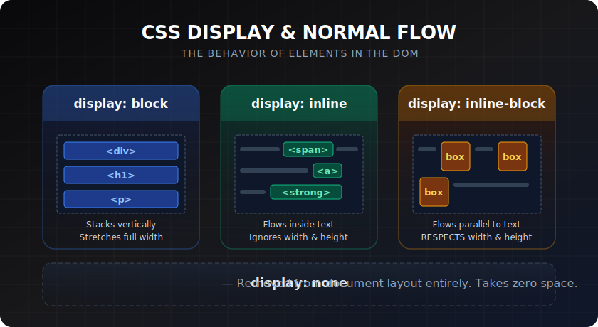

# Display & Normal Flow

> **Lesson Summary:** Before Flexbox and Grid, browsers arranged elements using **normal flow** — the default layout algorithm. Understanding how `block` and `inline` elements behave in that flow is essential context for everything that follows. Every layout system in CSS (Flexbox, Grid, absolute positioning) is fundamentally an override of this default behaviour.



## The `display` Property

The `display` property controls two things:
1. How the element itself participates in layout (its **outer** display type)
2. How its **children** are arranged (its **inner** display type)

```css
display: block;         /* Outer: block. Inner: flow */
display: inline;        /* Outer: inline. Inner: flow */
display: inline-block;  /* Outer: inline. Inner: block */
display: flex;          /* Outer: block. Inner: flex */
display: inline-flex;   /* Outer: inline. Inner: flex */
display: grid;          /* Outer: block. Inner: grid */
display: none;          /* Removed from layout entirely */
```

---

## `display: block`

A **block-level element**:
- Starts on a **new line**
- Stretches to fill the full width of its parent by default
- Respects `width`, `height`, `margin`, and `padding` on all four sides
- Creates vertical stacking

Default block elements: `<div>`, `<p>`, `<h1>`–`<h6>`, `<ul>`, `<ol>`, `<li>`, `<section>`, `<article>`, `<header>`, `<footer>`, `<main>`, `<form>`, `<table>`.

```css
div {
  display: block;   /* This is already the default */
  width: 400px;     /* Works — block respects width */
  margin: 2rem auto; /* Works — centres a fixed-width block */
}
```

---

## `display: inline`

An **inline element**:
- Flows **within text** — does not start a new line
- Width and height are determined by content — `width` and `height` properties are **ignored**
- `margin` and `padding` apply horizontally but **do not push other elements** vertically
- Multiple inline elements sit side by side on the same line until the line wraps

Default inline elements: `<span>`, `<a>`, `<strong>`, `<em>`, `<code>`, `` (technically replaced inline), `<button>`.

```css
span {
  display: inline;   /* Default */
  width: 200px;      /* Ignored — inline elements don't respect width */
  height: 50px;      /* Ignored */
}
```

---

## `display: inline-block`

The hybrid: **inline on the outside, block on the inside**:
- Sits in the text flow (doesn't force a new line)
- **Does** respect `width`, `height`, and vertical `margin`/`padding`

Classic use case — a row of navigation buttons or icon badges:

```css
.badge {
  display: inline-block;
  width: 2rem;
  height: 2rem;
  border-radius: 50%;
  background: #3b82f6;
  line-height: 2rem;
  text-align: center;
  color: white;
}
```

> **⚠️ Warning:** Inline and inline-block elements have a quirk — whitespace in HTML (spaces, newlines between tags) renders as a small gap between them. This can cause unexpected pixel gaps. Flexbox eliminates this problem entirely. For modern layouts, use Flexbox instead of `inline-block`.

---

## `display: none`

Removes the element from layout **entirely**:
- Takes no space in the document
- Is invisible
- Still exists in the DOM (JavaScript can still access it)

```css
.menu { display: none; }     /* Hidden — takes no space */
.menu.open { display: block; } /* Shown — JS adds the .open class */
```

Contrast with `visibility: hidden` — which hides the element visually but **preserves its space** in the layout.

---

## Normal Flow

When you don't apply any layout context (no Flexbox, no Grid, no `position`), elements follow **normal flow**:

1. **Block formatting context:** Block elements stack vertically, separated by margins (which may collapse)
2. **Inline formatting context:** Inline elements line up horizontally within a block container, wrapping to new lines when they reach the container's edge

Normal flow is the baseline. Flexbox, Grid, and `position` properties are layered on top of — or override — this baseline.

---

## Block Formatting Context (BFC)

A **Block Formatting Context** is a self-contained layout region — elements inside it don't interact with margins outside it. Creating a BFC prevents margin collapsing and contains floats.

Triggered by:
- `overflow: hidden` / `auto` / `scroll`
- `display: flow-root` (the modern way — purpose-built for creating a BFC)
- `float: left` / `right`
- `position: absolute` / `fixed`
- Flex and grid containers

```css
/* Modern way to create a BFC without side effects */
.container {
  display: flow-root;
}
```

---

## Key Takeaways

- `display` controls how an element participates in layout (outer) and how it arranges children (inner).
- `block` — stacks vertically, fills width, respects all sizing. Default for structural elements.
- `inline` — flows in text, ignores `width`/`height`, no vertical margin push.
- `inline-block` — sits with text but respects sizing. Use sparingly; Flexbox is usually better.
- `none` — fully removes from layout; `visibility: hidden` hides without removing.
- Normal flow: block elements stack vertically; inline elements wrap horizontally.

## Research Questions

> **🔬 Research Question:** What is `display: contents`? How does it affect the element itself and its children, and what accessibility concerns does it raise?
>
> *Hint: Search "CSS display contents MDN" and "display contents accessibility screen reader".*

> **🔬 Research Question:** The CSS `float` property was historically used for multi-column layouts before Flexbox and Grid existed. What problems did it cause, and what was the "clearfix hack" used to solve them?
>
> *Hint: Search "CSS float clearfix history" and "float layout problems".*
