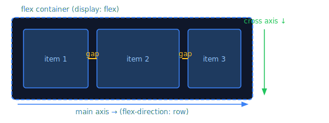

# The Flex Container

> **Lesson Summary:** Flexbox begins with one declaration: `display: flex`. That single property turns an element into a flex container and activates the flex layout model for all its direct children. Every other flex property is configuration of how that layout behaves.



## Activating Flexbox

```css
.container {
  display: flex;        /* Block-level flex container */
}

.container-inline {
  display: inline-flex; /* Inline-level — container sits in text flow */
}
```

Only **direct children** of a flex container become **flex items**. Grandchildren are not affected.

```html
<div class="container">   <!-- flex container -->
  <div class="item">A</div>  <!-- flex item -->
  <div class="item">
    <span>B-inner</span>     <!-- NOT a flex item — grandchild -->
  </div>
  <div class="item">C</div>  <!-- flex item -->
</div>
```

---

## The Main and Cross Axis

Flexbox is one-dimensional: it lays items out along a **main axis**. There is always a perpendicular **cross axis**.

- By default: main axis runs **left → right**, cross axis runs **top → bottom**
- `flex-direction` rotates the axes

```css
flex-direction: row;            /* Default — left to right */
flex-direction: row-reverse;    /* Right to left */
flex-direction: column;         /* Top to bottom */
flex-direction: column-reverse; /* Bottom to top */
```

> **💡 Tip:** When you change `flex-direction: column`, "main axis" becomes vertical and "cross axis" becomes horizontal. This flips the meaning of `justify-content` and `align-items`. Many flex bugs come from forgetting this.

---

## `flex-wrap`

By default, flex items try to fit on a **single line**, shrinking as needed. `flex-wrap` changes this:

```css
flex-wrap: nowrap;       /* Default — single line, items shrink */
flex-wrap: wrap;         /* Items wrap to new lines when they overflow */
flex-wrap: wrap-reverse; /* Wrap but in reverse cross-axis direction */
```

```css
/* A responsive card row that wraps naturally */
.card-grid {
  display: flex;
  flex-wrap: wrap;
  gap: 1.5rem;
}

.card {
  flex: 1 1 280px; /* grow, shrink, basis — covered in Flex Items lesson */
  min-width: 0;
}
```

---

## `gap`

`gap` sets the space between flex items — both in the main axis direction and (when wrapping) between rows:

```css
gap: 1rem;          /* All gaps equal */
gap: 1rem 2rem;     /* Row gap | Column gap */
row-gap: 1rem;      /* Gaps between wrapped rows only */
column-gap: 2rem;   /* Gaps between items only */
```

> **💡 Tip:** Use `gap` instead of margin on items. `gap` only adds space *between* items — not outside the first or last — making it far cleaner than `margin-right` on every item with a `last-child` override.

---

## Container Properties Summary

| Property | Values | What it controls |
| :--- | :--- | :--- |
| `display` | `flex`, `inline-flex` | Activates flex layout |
| `flex-direction` | `row`, `column`, `row-reverse`, `column-reverse` | Direction of the main axis |
| `flex-wrap` | `nowrap`, `wrap`, `wrap-reverse` | Whether items wrap to new lines |
| `gap` | length values | Space between items (and rows when wrapping) |
| `flex-flow` | `<direction> <wrap>` | Shorthand for `flex-direction` + `flex-wrap` |

```css
/* flex-flow shorthand */
flex-flow: row wrap;   /* Same as: flex-direction: row; flex-wrap: wrap; */
```

---

## Key Takeaways

- `display: flex` turns an element into a flex container; its direct children become flex items.
- Items lay out along the **main axis** (`flex-direction` controls which direction).
- By default, all items fit on one line. `flex-wrap: wrap` lets them overflow to new rows.
- `gap` is the correct way to space flex items — no margin hacks needed.

## Research Questions

> **🔬 Research Question:** What is `display: inline-flex` and when would you use it instead of `display: flex`? Give a practical example.
>
> *Hint: Search "CSS inline-flex vs flex use cases" and "flex container inline".*

> **🔬 Research Question:** Flexbox has a writing-mode concept — in a right-to-left language, `flex-direction: row` flows right to left. What CSS property controls text direction, and how does it interact with `flex-direction`?
>
> *Hint: Search "CSS flexbox writing-mode direction RTL" and "CSS logical properties flexbox".*
