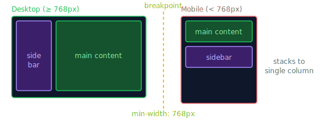

# Media Queries

> **Lesson Summary:** Media queries are CSS conditional blocks — styles inside them only apply when a condition (typically viewport width) is true. They are the primary tool for breakpoint-based layout changes. This lesson covers syntax, the mobile-first strategy, and media features beyond just width.



## Basic Syntax

```css
@media (condition) {
  /* Styles that apply only when condition is true */
}

/* Common: apply when viewport is at least 768px wide */
@media (min-width: 768px) {
  .sidebar { display: block; }
}

/* Apply when viewport is at most 767px wide */
@media (max-width: 767px) {
  .sidebar { display: none; }
}
```

---

## Media Types

```css
@media screen { … }   /* Default — screen-based devices */
@media print { … }    /* Print preview and printing */
@media all { … }      /* All media (default if type omitted) */
```

`print` media queries let you create a clean print stylesheet — hiding navbars, adjusting colours, etc.:

```css
@media print {
  nav, .sidebar, footer { display: none; }
  body { font-size: 11pt; color: black; }
  a::after { content: ' (' attr(href) ')'; }  /* Print URLs after links */
}
```

---

## Mobile-First Strategy

**Desktop-first:** Write styles for desktop first, then override with `max-width` queries for smaller screens.

**Mobile-first:** Write styles for mobile first, then override with `min-width` queries to add complexity at larger sizes.

```css
/* ── Mobile-first (preferred) ────────────────── */

/* Base styles — work on mobile */
.grid {
  display: grid;
  grid-template-columns: 1fr;
  gap: 1rem;
}

/* Tablet (≥ 640px) */
@media (min-width: 640px) {
  .grid {
    grid-template-columns: repeat(2, 1fr);
  }
}

/* Desktop (≥ 1024px) */
@media (min-width: 1024px) {
  .grid {
    grid-template-columns: repeat(3, 1fr);
  }
}
```

**Why mobile-first is better:**
- Mobile code is typically simpler — it's the base
- Browsers on slow mobile connections don't parse unnecessary desktop overrides
- `min-width` cascades naturally — you're adding features, not removing them
- Forces you to prioritise the most constrained experience first

---

## Common Breakpoints

These are widely used reference points — not hard rules:

| Name | `min-width` | Typical target |
| :--- | :--- | :--- |
| sm | 640px | Large phones, small tablets |
| md | 768px | Tablets |
| lg | 1024px | Small laptops |
| xl | 1280px | Desktops |
| 2xl | 1536px | Large monitors |

> **💡 Tip:** Let your content decide the breakpoint — add a breakpoint when the design breaks, not at arbitrary device widths. The best responsive designs use very few media queries.

---

## Logical Operators

```css
/* AND — both conditions must be true */
@media (min-width: 768px) and (max-width: 1023px) {
  /* Only tablet */
}

/* OR — either condition can be true (comma syntax) */
@media (max-width: 640px), (orientation: portrait) {
  /* Mobile or portrait */
}

/* NOT — negates the condition */
@media not (min-width: 768px) {
  /* Same as max-width: 767px */
}
```

Modern range syntax (supported in all modern browsers since 2023):

```css
@media (768px <= width <= 1023px) { … }  /* Between 768 and 1023 */
@media (width >= 768px) { … }            /* Same as min-width: 768px */
```

---

## Media Features Beyond Width

```css
/* Dark/light mode preference */
@media (prefers-color-scheme: dark) { … }
@media (prefers-color-scheme: light) { … }

/* Reduced motion — for users who experience motion sickness */
@media (prefers-reduced-motion: reduce) {
  *, *::before, *::after {
    animation-duration: 0.01ms !important;
    transition-duration: 0.01ms !important;
  }
}

/* Screen orientation */
@media (orientation: portrait) { … }
@media (orientation: landscape) { … }

/* Resolution / pixel density */
@media (min-resolution: 2dppx) { … }  /* Retina/HiDPI */

/* Hover capability (does the device have hover states?) */
@media (hover: none) { … }     /* Touch devices — no hover */
@media (hover: hover) { … }    /* Mouse — hover available */

/* Pointer precision */
@media (pointer: coarse) { … } /* Touch — less precise */
@media (pointer: fine) { … }   /* Mouse — precise */
```

---

## Key Takeaways

- `@media (min-width: Xpx)` — styles apply from X pixels upward.
- Mobile-first: write base styles for mobile, add complexity with `min-width` queries.
- Let content determine breakpoints — not device dimensions.
- `prefers-color-scheme` and `prefers-reduced-motion` are media queries, not just CSS properties.
- Use `(hover: none)` to make touch-only elements larger with easier tap targets.

## Research Questions

> **🔬 Research Question:** What are "container queries" (`@container`) and how do they differ from media queries? Why are they considered more component-friendly?
>
> *Hint: Search "CSS container queries @container MDN 2024" and "container queries vs media queries".*

> **🔬 Research Question:** What is `prefers-reduced-motion` and why is it important? How should your CSS animation/transition code always be structured to respect it?
>
> *Hint: Search "CSS prefers-reduced-motion accessibility WCAG" and "reduced motion pattern".*
